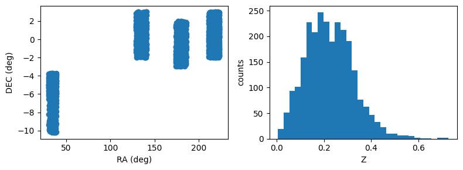
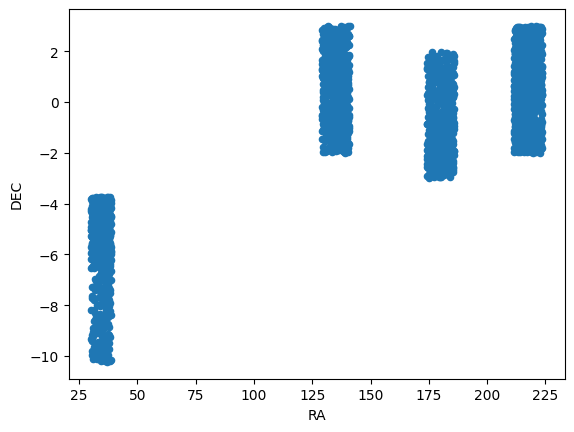

Photo-z Server
==============

Tutorial Notebook 1 - Spec-z Catalogs
-------------------------------------

Contact author: `Julia Gschwend <mailto:julia@linea.org.br>`__

Last verified run: **2024-Jul-04**

Introduction
~~~~~~~~~~~~

Welcome to the PZ Server tutorials. If you are reading this notebooks
for the first time, we recommend to not skip the introduction notebook:
``0_introduction.ipynb`` also available in this same repository.

Imports and Setup
~~~~~~~~~~~~~~~~~

.. code:: ipython3

    from pzserver import PzServer 
    import matplotlib.pyplot as plt
    %reload_ext autoreload 
    %autoreload 2

.. code:: ipython3

    # pz_server = PzServer(token="<your token>", host="pz-dev") # "pz-dev" is the temporary host for test phase  

For convenience, the token can be saved into a file named as
``token.txt`` (which is already listed in the .gitignore file in this
repository).

.. code:: ipython3

    with open('token.txt', 'r') as file:
        token = file.read()
    pz_server = PzServer(token=token, host="pz-dev") # "pz-dev" is the temporary host for test phase  

Product types
~~~~~~~~~~~~~

The PZ Server API provides Python classes with useful methods to handle
particular product types. Let’s recap the product types available:

.. code:: ipython3

    pz_server.display_product_types()

.. raw:: html

    
    <table id="T_b648b">
      <thead>
        <tr>
          <th id="T_b648b_level0_col0" class="col_heading level0 col0" >Product Type</th>
          <th id="T_b648b_level0_col1" class="col_heading level0 col1" >product_type</th>
          <th id="T_b648b_level0_col2" class="col_heading level0 col2" >Description</th>
        </tr>
      </thead>
      <tbody>
        <tr>
          <td id="T_b648b_row0_col0" class="data row0 col0" >Spec-z Catalog</td>
          <td id="T_b648b_row0_col1" class="data row0 col1" >specz_catalog</td>
          <td id="T_b648b_row0_col2" class="data row0 col2" >Catalog of spectroscopic redshifts and positions (usually equatorial coordinates).</td>
        </tr>
        <tr>
          <td id="T_b648b_row1_col0" class="data row1 col0" >Training Set</td>
          <td id="T_b648b_row1_col1" class="data row1 col1" >training_set</td>
          <td id="T_b648b_row1_col2" class="data row1 col2" >Training set for photo-z algorithms (tabular data). It usually contains magnitudes, errors, and true redshifts.</td>
        </tr>
        <tr>
          <td id="T_b648b_row2_col0" class="data row2 col0" >Validation Results</td>
          <td id="T_b648b_row2_col1" class="data row2 col1" >validation_results</td>
          <td id="T_b648b_row2_col2" class="data row2 col2" >Results of a photo-z validation procedure (free format). Usually contains photo-z estimates (single estimates and/or pdf) of a validation set and photo-z validation metrics.</td>
        </tr>
        <tr>
          <td id="T_b648b_row3_col0" class="data row3 col0" >Photo-z Table</td>
          <td id="T_b648b_row3_col1" class="data row3 col1" >photoz_table</td>
          <td id="T_b648b_row3_col2" class="data row3 col2" >Results of a photo-z estimation procedure. If the data is larger than the file upload limit (200MB), the product entry stores only the metadata (instructions on accessing the data should be provided in the description field.</td>
        </tr>
      </tbody>
    </table>

Spec-z Catalogs
---------------

In the context of the PZ Server, Spec-z Catalogs are defined as any
catalog containing spherical equatorial coordinates and spectroscopic
redshift measurements (or, analogously, true redshifts from
simulations). A Spec-z Catalog can include data from a single
spectroscopic survey or a combination of data from several sources. To
be considered as a single Spec-z Catalog, the data should be provided as
a single file to PZ Server’s the upload tool. For multi-survey catalogs,
it is recommended to add the survey name or identification as an extra
column.

Mandatory columns: \* Right ascension [degrees] - ``float`` \*
Declination [degrees] - ``float`` \* Spectroscopic or true redshift -
``float``

Recommended columns: \* Spectroscopic redshift error - ``float`` \*
Quality flag - ``integer``, ``float``, or ``string`` \* Survey name
(recommended for compilations of data from different surveys)

PZ Server Pipelines
^^^^^^^^^^^^^^^^^^^

Spec-z Catalogs can be uploaded by users on PZ Server website or via the
``pzserver`` library. Also, they can be created as the combination of a
list of other Spec-z Catalogs previously registered in the system by the
PZ Sever’s pipeline “Combine Spec-z Catalogs” (under development). Any
catalog built by the pipeline is automaticaly registered as a regular
user-generated data product and has no difference from the uploaded
ones.

Let’s see an example of Spec-z Catalog:

.. code:: ipython3

    gama = pz_server.get_product(14)

.. parsed-literal::

    Connecting to PZ Server...
    Done!

.. code:: ipython3

    gama.display_metadata()

.. raw:: html

    
    <table id="T_e23ef">
      <thead>
        <tr>
          <th id="T_e23ef_level0_col0" class="col_heading level0 col0" >key</th>
          <th id="T_e23ef_level0_col1" class="col_heading level0 col1" >value</th>
        </tr>
      </thead>
      <tbody>
        <tr>
          <td id="T_e23ef_row0_col0" class="data row0 col0" >id</td>
          <td id="T_e23ef_row0_col1" class="data row0 col1" >14</td>
        </tr>
        <tr>
          <td id="T_e23ef_row1_col0" class="data row1 col0" >release</td>
          <td id="T_e23ef_row1_col1" class="data row1 col1" >None</td>
        </tr>
        <tr>
          <td id="T_e23ef_row2_col0" class="data row2 col0" >product_type</td>
          <td id="T_e23ef_row2_col1" class="data row2 col1" >Spec-z Catalog</td>
        </tr>
        <tr>
          <td id="T_e23ef_row3_col0" class="data row3 col0" >uploaded_by</td>
          <td id="T_e23ef_row3_col1" class="data row3 col1" >gschwend</td>
        </tr>
        <tr>
          <td id="T_e23ef_row4_col0" class="data row4 col0" >internal_name</td>
          <td id="T_e23ef_row4_col1" class="data row4 col1" >14_gama_specz_subsample</td>
        </tr>
        <tr>
          <td id="T_e23ef_row5_col0" class="data row5 col0" >product_name</td>
          <td id="T_e23ef_row5_col1" class="data row5 col1" >GAMA spec-z subsample</td>
        </tr>
        <tr>
          <td id="T_e23ef_row6_col0" class="data row6 col0" >official_product</td>
          <td id="T_e23ef_row6_col1" class="data row6 col1" >False</td>
        </tr>
        <tr>
          <td id="T_e23ef_row7_col0" class="data row7 col0" >pz_code</td>
          <td id="T_e23ef_row7_col1" class="data row7 col1" ></td>
        </tr>
        <tr>
          <td id="T_e23ef_row8_col0" class="data row8 col0" >description</td>
          <td id="T_e23ef_row8_col1" class="data row8 col1" >A small subsample of the GAMA DR3 spec-z catalog (Baldry et al. 2018) as an example of a typical spec-z catalog from the literature.</td>
        </tr>
        <tr>
          <td id="T_e23ef_row9_col0" class="data row9 col0" >created_at</td>
          <td id="T_e23ef_row9_col1" class="data row9 col1" >2023-03-29T20:02:45.223568Z</td>
        </tr>
        <tr>
          <td id="T_e23ef_row10_col0" class="data row10 col0" >main_file</td>
          <td id="T_e23ef_row10_col1" class="data row10 col1" >specz_subsample_gama_example.csv</td>
        </tr>
      </tbody>
    </table>

Display basic statistics

.. code:: ipython3

    gama.data.describe()

.. raw:: html

    

    
    <table border="1" class="dataframe">
      <thead>
        <tr style="text-align: right;">
          <th></th>
          <th>ID</th>
          <th>RA</th>
          <th>DEC</th>
          <th>Z</th>
          <th>ERR_Z</th>
          <th>FLAG_DES</th>
        </tr>
      </thead>
      <tbody>
        <tr>
          <th>count</th>
          <td>2.576000e+03</td>
          <td>2576.000000</td>
          <td>2576.000000</td>
          <td>2576.000000</td>
          <td>2576.0</td>
          <td>2576.000000</td>
        </tr>
        <tr>
          <th>mean</th>
          <td>1.105526e+06</td>
          <td>154.526343</td>
          <td>-1.101865</td>
          <td>0.224811</td>
          <td>99.0</td>
          <td>3.949534</td>
        </tr>
        <tr>
          <th>std</th>
          <td>4.006668e+04</td>
          <td>70.783868</td>
          <td>2.995036</td>
          <td>0.102571</td>
          <td>0.0</td>
          <td>0.218947</td>
        </tr>
        <tr>
          <th>...</th>
          <td>...</td>
          <td>...</td>
          <td>...</td>
          <td>...</td>
          <td>...</td>
          <td>...</td>
        </tr>
        <tr>
          <th>50%</th>
          <td>1.103558e+06</td>
          <td>180.140145</td>
          <td>-0.480830</td>
          <td>0.217804</td>
          <td>99.0</td>
          <td>4.000000</td>
        </tr>
        <tr>
          <th>75%</th>
          <td>1.140619e+06</td>
          <td>215.836583</td>
          <td>1.170363</td>
          <td>0.291810</td>
          <td>99.0</td>
          <td>4.000000</td>
        </tr>
        <tr>
          <th>max</th>
          <td>1.176440e+06</td>
          <td>223.497080</td>
          <td>2.998180</td>
          <td>0.728717</td>
          <td>99.0</td>
          <td>4.000000</td>
        </tr>
      </tbody>
    </table>
    
8 rows × 6 columns

    

The spec-z catalog object has a very basic plot method for quick
visualization of catalog properties. For advanced interactive data
visualization tips, we recommend the notebook
`DP02_06b_Interactive_Catalog_Visualization.ipynb <https://github.com/rubin-dp0/tutorial-notebooks/blob/main/DP02_06b_Interactive_Catalog_Visualization.ipynb>`__
from Rubin Observatory’s DP0.2 `tutorial-notebooks
repository <https://github.com/rubin-dp0/tutorial-notebooks/tree/main>`__.

.. code:: ipython3

    gama.plot()

The attribute ``data``, which is a ``DataFrame`` preserves the ``plot``
method from Pandas.

.. code:: ipython3

    gama.data.plot(x="RA", y="DEC", kind="scatter")  

.. parsed-literal::

    <Axes: xlabel='RA', ylabel='DEC'>

--------------

Users feedback
~~~~~~~~~~~~~~

Is something important missing? `Click here to open an issue in the PZ
Server library repository on
GitHub <https://github.com/linea-it/pzserver/issues/new>`__.
