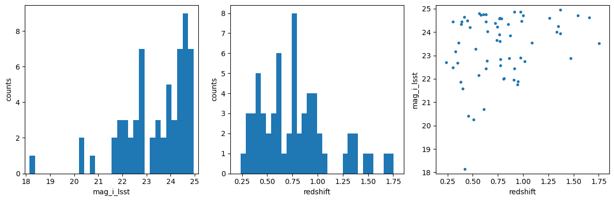

Photo-z Server
==============

Tutorial Notebook 2 - Training Sets
-----------------------------------

Contact author: `Julia Gschwend <mailto:julia@linea.org.br>`__

Last verified run: **2024-Jul-04**

Introduction
~~~~~~~~~~~~

Welcome to the PZ Server tutorials. If you are reading this notebooks
for the first time, we recommend to not skip the introduction notebook:
``0_introduction.ipynb`` also available in this same repository.

Imports and Setup
~~~~~~~~~~~~~~~~~

.. code:: ipython3

    from pzserver import PzServer 
    import matplotlib.pyplot as plt
    %reload_ext autoreload 
    %autoreload 2

.. code:: ipython3

    # pz_server = PzServer(token="<your token>", host="pz-dev") # "pz-dev" is the temporary host for test phase  

For convenience, the token can be saved into a file named as
``token.txt`` (which is already listed in the .gitignore file in this
repository).

.. code:: ipython3

    with open('token.txt', 'r') as file:
        token = file.read()
    pz_server = PzServer(token=token, host="pz-dev") # "pz-dev" is the temporary host for test phase  

Product types
~~~~~~~~~~~~~

The PZ Server API provides Python classes with useful methods to handle
particular product types. Let’s recap the product types available:

.. code:: ipython3

    pz_server.display_product_types()

.. raw:: html

    
    <table id="T_38438">
      <thead>
        <tr>
          <th id="T_38438_level0_col0" class="col_heading level0 col0" >Product Type</th>
          <th id="T_38438_level0_col1" class="col_heading level0 col1" >product_type</th>
          <th id="T_38438_level0_col2" class="col_heading level0 col2" >Description</th>
        </tr>
      </thead>
      <tbody>
        <tr>
          <td id="T_38438_row0_col0" class="data row0 col0" >Spec-z Catalog</td>
          <td id="T_38438_row0_col1" class="data row0 col1" >specz_catalog</td>
          <td id="T_38438_row0_col2" class="data row0 col2" >Catalog of spectroscopic redshifts and positions (usually equatorial coordinates).</td>
        </tr>
        <tr>
          <td id="T_38438_row1_col0" class="data row1 col0" >Training Set</td>
          <td id="T_38438_row1_col1" class="data row1 col1" >training_set</td>
          <td id="T_38438_row1_col2" class="data row1 col2" >Training set for photo-z algorithms (tabular data). It usually contains magnitudes, errors, and true redshifts.</td>
        </tr>
        <tr>
          <td id="T_38438_row2_col0" class="data row2 col0" >Validation Results</td>
          <td id="T_38438_row2_col1" class="data row2 col1" >validation_results</td>
          <td id="T_38438_row2_col2" class="data row2 col2" >Results of a photo-z validation procedure (free format). Usually contains photo-z estimates (single estimates and/or pdf) of a validation set and photo-z validation metrics.</td>
        </tr>
        <tr>
          <td id="T_38438_row3_col0" class="data row3 col0" >Photo-z Table</td>
          <td id="T_38438_row3_col1" class="data row3 col1" >photoz_table</td>
          <td id="T_38438_row3_col2" class="data row3 col2" >Results of a photo-z estimation procedure. If the data is larger than the file upload limit (200MB), the product entry stores only the metadata (instructions on accessing the data should be provided in the description field.</td>
        </tr>
      </tbody>
    </table>

Training Sets
-------------

In the context of the PZ Server, Training Sets are defined as the
product of matching (spatially) a given Spec-z Catalog (single survey or
compilation) to the photometric data, in this case, the LSST Objects
Catalog. The PZ Server API offers a tool called *Training Set Maker* for
users to build customized Training Sets based on the Spec-z Catalogs
available. Please see the companion Jupyter Notebook
``pz_tsm_tutorial.ipynb`` for details.

*Note 1: Commonly the training set is split into two or more subsets for
photo-z validation purposes. If the Training Set owner has previously
defined which objects should belong to each subset (trainining and
validation/test sets), this information must be available as an extra
column in the table or as clear instructions for reproducing the subsets
separation in the data product description.*

*Note 2: The PZ Server only supports catalog-level Training Sets.
Image-based Training Sets, e.g., for deep-learning algorithms, are not
supported yet.*

Mandatory column: \* Spectroscopic (or true) redshift - ``float``

Other expected columns \* Object ID from LSST Objects Catalog -
``integer`` \* Observables: magnitudes (and/or colors, or fluxes) from
LSST Objects Catalog - ``float`` \* Observable errors: magnitude errors
(and/or color errors, or flux errors) from LSST Objects Catalog -
``float`` \* Right ascension [degrees] - ``float`` \* Declination
[degrees] - ``float`` \* Quality Flag - ``integer``, ``float``, or
``string`` \* Subset Flag - ``integer``, ``float``, or ``string``

PZ Server Pipelines
^^^^^^^^^^^^^^^^^^^

Trainind Sets can be uploaded by users on PZ Server website or via the
``pzserver`` library. Also, they can be created as the spatial
cross-matching between a given Spec-z Catalog previously registered in
the system and an Object table from a given LSST Data Release available
in the Brazilian IDAC by the PZ Sever’s pipeline “Training Set Maker”
(under development). Any Training Set built by the pipeline is
automaticaly registered as a regular user-generated data product and has
no difference from the uploaded ones.

.. code:: ipython3

    train_goldenspike = pz_server.get_product(9)

.. parsed-literal::

    Connecting to PZ Server...
    Done!

.. code:: ipython3

    train_goldenspike.display_metadata()

.. raw:: html

    
    <table id="T_2e75f">
      <thead>
        <tr>
          <th id="T_2e75f_level0_col0" class="col_heading level0 col0" >key</th>
          <th id="T_2e75f_level0_col1" class="col_heading level0 col1" >value</th>
        </tr>
      </thead>
      <tbody>
        <tr>
          <td id="T_2e75f_row0_col0" class="data row0 col0" >id</td>
          <td id="T_2e75f_row0_col1" class="data row0 col1" >9</td>
        </tr>
        <tr>
          <td id="T_2e75f_row1_col0" class="data row1 col0" >release</td>
          <td id="T_2e75f_row1_col1" class="data row1 col1" >None</td>
        </tr>
        <tr>
          <td id="T_2e75f_row2_col0" class="data row2 col0" >product_type</td>
          <td id="T_2e75f_row2_col1" class="data row2 col1" >Training Set</td>
        </tr>
        <tr>
          <td id="T_2e75f_row3_col0" class="data row3 col0" >uploaded_by</td>
          <td id="T_2e75f_row3_col1" class="data row3 col1" >gschwend</td>
        </tr>
        <tr>
          <td id="T_2e75f_row4_col0" class="data row4 col0" >internal_name</td>
          <td id="T_2e75f_row4_col1" class="data row4 col1" >9_goldenspike_train_data_hdf5</td>
        </tr>
        <tr>
          <td id="T_2e75f_row5_col0" class="data row5 col0" >product_name</td>
          <td id="T_2e75f_row5_col1" class="data row5 col1" >Goldenspike train data hdf5</td>
        </tr>
        <tr>
          <td id="T_2e75f_row6_col0" class="data row6 col0" >official_product</td>
          <td id="T_2e75f_row6_col1" class="data row6 col1" >False</td>
        </tr>
        <tr>
          <td id="T_2e75f_row7_col0" class="data row7 col0" >pz_code</td>
          <td id="T_2e75f_row7_col1" class="data row7 col1" ></td>
        </tr>
        <tr>
          <td id="T_2e75f_row8_col0" class="data row8 col0" >description</td>
          <td id="T_2e75f_row8_col1" class="data row8 col1" >A mock training set created using the example notebook goldenspike.ipynb available in RAIL's repository.  
    Test upload of files in hdf5 format.</td>
        </tr>
        <tr>
          <td id="T_2e75f_row9_col0" class="data row9 col0" >created_at</td>
          <td id="T_2e75f_row9_col1" class="data row9 col1" >2023-03-29T19:12:59.746096Z</td>
        </tr>
        <tr>
          <td id="T_2e75f_row10_col0" class="data row10 col0" >main_file</td>
          <td id="T_2e75f_row10_col1" class="data row10 col1" >goldenspike_train_data.hdf5</td>
        </tr>
      </tbody>
    </table>

Display basic statistics

.. code:: ipython3

    train_goldenspike.data.describe()

.. raw:: html

    

    
    <table border="1" class="dataframe">
      <thead>
        <tr style="text-align: right;">
          <th></th>
          <th>mag_err_g_lsst</th>
          <th>mag_err_i_lsst</th>
          <th>mag_err_r_lsst</th>
          <th>mag_err_u_lsst</th>
          <th>mag_err_y_lsst</th>
          <th>mag_err_z_lsst</th>
          <th>mag_g_lsst</th>
          <th>mag_i_lsst</th>
          <th>mag_r_lsst</th>
          <th>mag_u_lsst</th>
          <th>mag_y_lsst</th>
          <th>mag_z_lsst</th>
          <th>redshift</th>
        </tr>
      </thead>
      <tbody>
        <tr>
          <th>count</th>
          <td>62.000000</td>
          <td>62.000000</td>
          <td>62.000000</td>
          <td>61.000000</td>
          <td>61.000000</td>
          <td>62.000000</td>
          <td>62.000000</td>
          <td>62.000000</td>
          <td>62.000000</td>
          <td>61.000000</td>
          <td>61.000000</td>
          <td>62.000000</td>
          <td>62.000000</td>
        </tr>
        <tr>
          <th>mean</th>
          <td>0.038182</td>
          <td>0.016165</td>
          <td>0.018770</td>
          <td>0.188050</td>
          <td>0.054682</td>
          <td>0.021478</td>
          <td>24.820000</td>
          <td>23.384804</td>
          <td>24.003970</td>
          <td>25.446008</td>
          <td>22.932354</td>
          <td>23.074481</td>
          <td>0.780298</td>
        </tr>
        <tr>
          <th>std</th>
          <td>0.036398</td>
          <td>0.010069</td>
          <td>0.013750</td>
          <td>0.193747</td>
          <td>0.115875</td>
          <td>0.014961</td>
          <td>1.314112</td>
          <td>1.381587</td>
          <td>1.387358</td>
          <td>1.269277</td>
          <td>1.540284</td>
          <td>1.400673</td>
          <td>0.355365</td>
        </tr>
        <tr>
          <th>...</th>
          <td>...</td>
          <td>...</td>
          <td>...</td>
          <td>...</td>
          <td>...</td>
          <td>...</td>
          <td>...</td>
          <td>...</td>
          <td>...</td>
          <td>...</td>
          <td>...</td>
          <td>...</td>
          <td>...</td>
        </tr>
        <tr>
          <th>50%</th>
          <td>0.028309</td>
          <td>0.013390</td>
          <td>0.016660</td>
          <td>0.133815</td>
          <td>0.034199</td>
          <td>0.018540</td>
          <td>25.069970</td>
          <td>23.748506</td>
          <td>24.470215</td>
          <td>25.577029</td>
          <td>23.293384</td>
          <td>23.514185</td>
          <td>0.764600</td>
        </tr>
        <tr>
          <th>75%</th>
          <td>0.049576</td>
          <td>0.024650</td>
          <td>0.025802</td>
          <td>0.238859</td>
          <td>0.063585</td>
          <td>0.032557</td>
          <td>25.705486</td>
          <td>24.488654</td>
          <td>24.985225</td>
          <td>26.263284</td>
          <td>23.993010</td>
          <td>24.165944</td>
          <td>0.948494</td>
        </tr>
        <tr>
          <th>max</th>
          <td>0.198195</td>
          <td>0.036932</td>
          <td>0.065360</td>
          <td>1.154073</td>
          <td>0.909230</td>
          <td>0.051883</td>
          <td>27.296152</td>
          <td>24.949645</td>
          <td>26.036958</td>
          <td>28.482391</td>
          <td>27.342151</td>
          <td>24.693132</td>
          <td>1.755764</td>
        </tr>
      </tbody>
    </table>
    
8 rows × 13 columns

    

The training set object has a very basic plot method for quick
visualization of catalog properties. For advanced interactive data
visualization tips, we recommend the notebook
`DP02_06b_Interactive_Catalog_Visualization.ipynb <https://github.com/rubin-dp0/tutorial-notebooks/blob/main/DP02_06b_Interactive_Catalog_Visualization.ipynb>`__
from Rubin Observatory’s DP0.2 `tutorial-notebooks
repository <https://github.com/rubin-dp0/tutorial-notebooks/tree/main>`__.

.. code:: ipython3

    train_goldenspike.plot(mag_name="mag_i_lsst")

--------------

Users feedback
~~~~~~~~~~~~~~

Is something important missing? `Click here to open an issue in the PZ
Server library repository on
GitHub <https://github.com/linea-it/pzserver/issues/new>`__.
