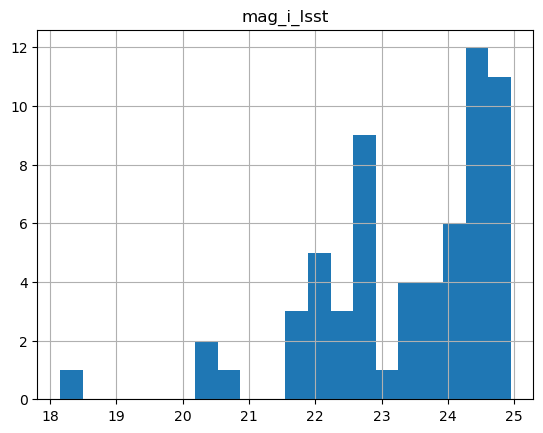

Photo-z Server
==============

Tutorial Notebook
-----------------

Contact author: `Julia Gschwend <mailto:julia@linea.org.br>`__

Last verified run: **2024-Dec-11**

The PZ Server
-------------

.. container::
   :name: introduction

Introduction
~~~~~~~~~~~~

The PZ Server is an online service available for the LSST Community to
host and share lightweight photo-z (PZ) -related data products. The
upload and download of data and metadata can be done at the website
`pz-server.linea.org.br <https://pz-server.linea.org.br/>`__ (during the
development phase, a test environment is available at
`pz-server-dev.linea.org.br <https://pz-server-dev.linea.org.br/>`__).
There, you will find two pages containing a list of data products each:
one for Rubin Observatory Data Management’s official data products and
the other for user-generated data products. **The registered data
products can also be accessed directly from Python code using the PZ
Server’s data access API, as demonstrated below.**

The PZ Server is developed and delivered as part of the in-kind
contribution program BRA-LIN, from LIneA to the Rubin Observatory’s LSST
project. The service is hosted in the Brazilian IDAC, not directly
connected to the `Rubin Science Platform
(RSP) <https://data.lsst.cloud/>`__. However, user authorization
requires the same credentials as RSP. For comprehensive documentation
about the PZ Server, please visit the `PZ Server’s documentation
page <https://linea-it.github.io/pz-lsst-inkind-doc/>`__. There, you
will also find an overview of all LIneA’s contributions related to the
PZ production. The internal documentation of the API functions is
available on the `API’s documentation
page <https://linea-it.github.io/pzserver>`__.

How to upload a data product on the PZ Server website
~~~~~~~~~~~~~~~~~~~~~~~~~~~~~~~~~~~~~~~~~~~~~~~~~~~~~

To upload a data product, click the button **NEW PRODUCT** on the top
left of the **User-generated Data Products** page and fill in the Upload
Form with relevant metadata. Alternatively, the user can
programmatically upload files to the PZ Server via the ``pzserver``
Python Library (described below).

How to download a data product from the PZ Server website
~~~~~~~~~~~~~~~~~~~~~~~~~~~~~~~~~~~~~~~~~~~~~~~~~~~~~~~~~

To download a data product available on the Photo-z Server, go to one of
the two pages by clicking on the card “Rubin Observatory PZ Data
Products” (for official products released by Rubin Data Management Team)
or “User-generated Data Products” (for products uploaded by the members
of LSST community). The **download** button is on the right side of each
data product (each row of the list). Also, there are buttons to
**share**, **remove**, and **edit** the metadata of a given data
product.

.. raw:: html

   

.. raw:: html

   

The PZ Server API (Python library ``pzserver``)
-----------------------------------------------

Installation
~~~~~~~~~~~~

The PZ Server API is avalialble on **pip** as ``pzserver``. To install
the API and its dependencies, type on the Terminal:

::

   $ pip install pzserver 

Or in a notebook code cell:

.. code:: ipython3

    #! pip install pzserver

--------------

OBS: Depending on your Jupyter Lab version, you might need to restart
the kernel to incorporate the new library.

Imports and Setup
~~~~~~~~~~~~~~~~~

.. code:: ipython3

    from pzserver import PzServer 
    import matplotlib.pyplot as plt
    %reload_ext autoreload 
    %autoreload 2

The connection with the PZ Server from Python code is done by an object
of the class ``PzServer``. To get authorization to define an instance of
``PzServer``, the users must provide an **API Token** generated on the
top right menu on the `PZ Server
website <https://pz-server.linea.org.br/>`__ (during the development
phase, on the `test
environment <https://pz-server-dev.linea.org.br/>`__).

.. code:: ipython3

    # pz_server = PzServer(token="<your token>", host="pz-dev") # "pz-dev" is the temporary host for test phase  

For convenience, the token can be saved as ``token.txt`` (which is
already listed in the .gitignore file in this repository).

.. code:: ipython3

    with open('token.txt', 'r') as file:
        token = file.read()
    pz_server = PzServer(token=token, host="pz-dev") # "pz-dev" is the temporary host for test phase  

How to get general info from PZ Server
~~~~~~~~~~~~~~~~~~~~~~~~~~~~~~~~~~~~~~

The object ``pz_server`` created above can provide access to data and
metadata stored in the PZ Server. It also brings additional methods for
users to navigate through the available content. The methods with the
prefix ``get_`` return the result of a query on the PZ Server database
as a Python dictionary and are most useful to be used programmatically
(see details on the `API documentation
page <https://linea-it.github.io/pzserver/html/index.html>`__).
Alternatively, those with the prefix ``display_`` show the results as a
styled `Pandas
DataFrames <https://pandas.pydata.org/docs/reference/api/pandas.DataFrame.html>`__,
optimized for Jupyter Notebook (note: column names might change in the
display version). For instance:

Display the list of product types supported with a short description;

.. code:: ipython3

    pz_server.display_product_types()

.. raw:: html

    
    <table id="T_8705c">
      <thead>
        <tr>
          <th id="T_8705c_level0_col0" class="col_heading level0 col0" >Product Type</th>
          <th id="T_8705c_level0_col1" class="col_heading level0 col1" >product_type</th>
          <th id="T_8705c_level0_col2" class="col_heading level0 col2" >Description</th>
        </tr>
      </thead>
      <tbody>
        <tr>
          <td id="T_8705c_row0_col0" class="data row0 col0" >Spec-z Catalog</td>
          <td id="T_8705c_row0_col1" class="data row0 col1" >specz_catalog</td>
          <td id="T_8705c_row0_col2" class="data row0 col2" >Catalog of spectroscopic redshifts and positions (usually equatorial coordinates).</td>
        </tr>
        <tr>
          <td id="T_8705c_row1_col0" class="data row1 col0" >Training Set</td>
          <td id="T_8705c_row1_col1" class="data row1 col1" >training_set</td>
          <td id="T_8705c_row1_col2" class="data row1 col2" >Training set for photo-z algorithms (tabular data). It usually contains magnitudes, errors, and true redshifts.</td>
        </tr>
        <tr>
          <td id="T_8705c_row2_col0" class="data row2 col0" >Training Results</td>
          <td id="T_8705c_row2_col1" class="data row2 col1" >training_results</td>
          <td id="T_8705c_row2_col2" class="data row2 col2" >Any file(s) resulting from the training of machine learning algorithms (free format). E.g.: output of RAIL inform module estimator_<algorithm>.pkl</td>
        </tr>
        <tr>
          <td id="T_8705c_row3_col0" class="data row3 col0" >Validation Results</td>
          <td id="T_8705c_row3_col1" class="data row3 col1" >validation_results</td>
          <td id="T_8705c_row3_col2" class="data row3 col2" >Results of a photo-z validation procedure (free format). Usually contains photo-z estimates (single estimates and/or pdf) of a validation set and photo-z validation metrics.</td>
        </tr>
        <tr>
          <td id="T_8705c_row4_col0" class="data row4 col0" >Photo-z Table</td>
          <td id="T_8705c_row4_col1" class="data row4 col1" >photoz_table</td>
          <td id="T_8705c_row4_col2" class="data row4 col2" >Results of a photo-z estimation procedure. If the data is larger than the file upload limit (200MB), the product entry stores only the metadata (instructions on accessing the data should be provided in the description field.</td>
        </tr>
      </tbody>
    </table>

Display the list of users who uploaded data products to the server;

.. code:: ipython3

    pz_server.display_users()

.. raw:: html

    
    <table id="T_043b7">
      <thead>
        <tr>
          <th id="T_043b7_level0_col0" class="col_heading level0 col0" >GitHub Username</th>
          <th id="T_043b7_level0_col1" class="col_heading level0 col1" >Name</th>
        </tr>
      </thead>
      <tbody>
        <tr>
          <td id="T_043b7_row0_col0" class="data row0 col0" >admin</td>
          <td id="T_043b7_row0_col1" class="data row0 col1" ></td>
        </tr>
        <tr>
          <td id="T_043b7_row1_col0" class="data row1 col0" >andreiadourado</td>
          <td id="T_043b7_row1_col1" class="data row1 col1" >andreiadourado</td>
        </tr>
        <tr>
          <td id="T_043b7_row2_col0" class="data row2 col0" >Biancasilva9</td>
          <td id="T_043b7_row2_col1" class="data row2 col1" >Silva</td>
        </tr>
        <tr>
          <td id="T_043b7_row3_col0" class="data row3 col0" >bruno-moraes</td>
          <td id="T_043b7_row3_col1" class="data row3 col1" >Moraes</td>
        </tr>
        <tr>
          <td id="T_043b7_row4_col0" class="data row4 col0" >carlosadean</td>
          <td id="T_043b7_row4_col1" class="data row4 col1" >carlosadean</td>
        </tr>
        <tr>
          <td id="T_043b7_row5_col0" class="data row5 col0" >crisingulani</td>
          <td id="T_043b7_row5_col1" class="data row5 col1" >crisingulani</td>
        </tr>
        <tr>
          <td id="T_043b7_row6_col0" class="data row6 col0" >deborajanini</td>
          <td id="T_043b7_row6_col1" class="data row6 col1" >Janini</td>
        </tr>
        <tr>
          <td id="T_043b7_row7_col0" class="data row7 col0" >drewoldag</td>
          <td id="T_043b7_row7_col1" class="data row7 col1" >Drew Oldag</td>
        </tr>
        <tr>
          <td id="T_043b7_row8_col0" class="data row8 col0" >fpcardoso</td>
          <td id="T_043b7_row8_col1" class="data row8 col1" >Cardoso</td>
        </tr>
        <tr>
          <td id="T_043b7_row9_col0" class="data row9 col0" >glaubervila</td>
          <td id="T_043b7_row9_col1" class="data row9 col1" >glaubervila</td>
        </tr>
        <tr>
          <td id="T_043b7_row10_col0" class="data row10 col0" >GloriaFA</td>
          <td id="T_043b7_row10_col1" class="data row10 col1" >Gloria Fonseca Alvarez</td>
        </tr>
        <tr>
          <td id="T_043b7_row11_col0" class="data row11 col0" >gschwend</td>
          <td id="T_043b7_row11_col1" class="data row11 col1" >gschwend</td>
        </tr>
        <tr>
          <td id="T_043b7_row12_col0" class="data row12 col0" >gverde</td>
          <td id="T_043b7_row12_col1" class="data row12 col1" ></td>
        </tr>
        <tr>
          <td id="T_043b7_row13_col0" class="data row13 col0" >hdante</td>
          <td id="T_043b7_row13_col1" class="data row13 col1" >Henrique</td>
        </tr>
        <tr>
          <td id="T_043b7_row14_col0" class="data row14 col0" >HeloisaMengisztki</td>
          <td id="T_043b7_row14_col1" class="data row14 col1" >HeloisaMengisztki</td>
        </tr>
        <tr>
          <td id="T_043b7_row15_col0" class="data row15 col0" >http://cilogon.org/serverE/users/189487</td>
          <td id="T_043b7_row15_col1" class="data row15 col1" >CARDOSO</td>
        </tr>
        <tr>
          <td id="T_043b7_row16_col0" class="data row16 col0" >http://cilogon.org/serverE/users/190300</td>
          <td id="T_043b7_row16_col1" class="data row16 col1" >Singulani</td>
        </tr>
        <tr>
          <td id="T_043b7_row17_col0" class="data row17 col0" >http://cilogon.org/serverE/users/198333</td>
          <td id="T_043b7_row17_col1" class="data row17 col1" >Singulani</td>
        </tr>
        <tr>
          <td id="T_043b7_row18_col0" class="data row18 col0" >iagolops</td>
          <td id="T_043b7_row18_col1" class="data row18 col1" >iagolops</td>
        </tr>
        <tr>
          <td id="T_043b7_row19_col0" class="data row19 col0" >jandsonrj</td>
          <td id="T_043b7_row19_col1" class="data row19 col1" >jandsonrj</td>
        </tr>
        <tr>
          <td id="T_043b7_row20_col0" class="data row20 col0" >leandrops19</td>
          <td id="T_043b7_row20_col1" class="data row20 col1" ></td>
        </tr>
        <tr>
          <td id="T_043b7_row21_col0" class="data row21 col0" >luigilcsilva</td>
          <td id="T_043b7_row21_col1" class="data row21 col1" >luigilcsilva</td>
        </tr>
        <tr>
          <td id="T_043b7_row22_col0" class="data row22 col0" >luigisilva</td>
          <td id="T_043b7_row22_col1" class="data row22 col1" >luigisilva</td>
        </tr>
        <tr>
          <td id="T_043b7_row23_col0" class="data row23 col0" >luiz-nicolaci</td>
          <td id="T_043b7_row23_col1" class="data row23 col1" ></td>
        </tr>
        <tr>
          <td id="T_043b7_row24_col0" class="data row24 col0" >MelissaGraham</td>
          <td id="T_043b7_row24_col1" class="data row24 col1" >Melissa Graham</td>
        </tr>
        <tr>
          <td id="T_043b7_row25_col0" class="data row25 col0" >saraviz</td>
          <td id="T_043b7_row25_col1" class="data row25 col1" >Aviz</td>
        </tr>
        <tr>
          <td id="T_043b7_row26_col0" class="data row26 col0" >singulani</td>
          <td id="T_043b7_row26_col1" class="data row26 col1" ></td>
        </tr>
      </tbody>
    </table>

Display the list of data releases available at the time;

.. code:: ipython3

    pz_server.display_releases()

.. raw:: html

    
    <table id="T_1e219">
      <thead>
        <tr>
          <th id="T_1e219_level0_col0" class="col_heading level0 col0" >Release</th>
          <th id="T_1e219_level0_col1" class="col_heading level0 col1" >Description</th>
        </tr>
      </thead>
      <tbody>
        <tr>
          <td id="T_1e219_row0_col0" class="data row0 col0" >LSST DP0.1</td>
          <td id="T_1e219_row0_col1" class="data row0 col1" >LSST Data Preview 0.1</td>
        </tr>
        <tr>
          <td id="T_1e219_row1_col0" class="data row1 col0" >LSST DP0.2</td>
          <td id="T_1e219_row1_col1" class="data row1 col1" >LSST Data Preview 0.2</td>
        </tr>
      </tbody>
    </table>

--------------

Display all available data products (WARNING: This list can rapidly grow
during the survey’s operation).

.. code:: ipython3

    pz_server.display_products_list() 

.. raw:: html

    
    <table id="T_6e17c">
      <thead>
        <tr>
          <th id="T_6e17c_level0_col0" class="col_heading level0 col0" >id</th>
          <th id="T_6e17c_level0_col1" class="col_heading level0 col1" >internal_name</th>
          <th id="T_6e17c_level0_col2" class="col_heading level0 col2" >product_name</th>
          <th id="T_6e17c_level0_col3" class="col_heading level0 col3" >product_type</th>
          <th id="T_6e17c_level0_col4" class="col_heading level0 col4" >release</th>
          <th id="T_6e17c_level0_col5" class="col_heading level0 col5" >uploaded_by</th>
          <th id="T_6e17c_level0_col6" class="col_heading level0 col6" >official_product</th>
          <th id="T_6e17c_level0_col7" class="col_heading level0 col7" >pz_code</th>
          <th id="T_6e17c_level0_col8" class="col_heading level0 col8" >description</th>
          <th id="T_6e17c_level0_col9" class="col_heading level0 col9" >created_at</th>
        </tr>
      </thead>
      <tbody>
        <tr>
          <td id="T_6e17c_row0_col0" class="data row0 col0" >189</td>
          <td id="T_6e17c_row0_col1" class="data row0 col1" >189_example_upload_via_lib</td>
          <td id="T_6e17c_row0_col2" class="data row0 col2" >example upload via lib</td>
          <td id="T_6e17c_row0_col3" class="data row0 col3" >Spec-z Catalog</td>
          <td id="T_6e17c_row0_col4" class="data row0 col4" >None</td>
          <td id="T_6e17c_row0_col5" class="data row0 col5" >gschwend</td>
          <td id="T_6e17c_row0_col6" class="data row0 col6" >False</td>
          <td id="T_6e17c_row0_col7" class="data row0 col7" >None</td>
          <td id="T_6e17c_row0_col8" class="data row0 col8" >None</td>
          <td id="T_6e17c_row0_col9" class="data row0 col9" >2024-12-11T15:17:18.272001Z</td>
        </tr>
        <tr>
          <td id="T_6e17c_row1_col0" class="data row1 col0" >188</td>
          <td id="T_6e17c_row1_col1" class="data row1 col1" >188_example_upload_via_lib</td>
          <td id="T_6e17c_row1_col2" class="data row1 col2" >example upload via lib</td>
          <td id="T_6e17c_row1_col3" class="data row1 col3" >Spec-z Catalog</td>
          <td id="T_6e17c_row1_col4" class="data row1 col4" >None</td>
          <td id="T_6e17c_row1_col5" class="data row1 col5" >gschwend</td>
          <td id="T_6e17c_row1_col6" class="data row1 col6" >False</td>
          <td id="T_6e17c_row1_col7" class="data row1 col7" >None</td>
          <td id="T_6e17c_row1_col8" class="data row1 col8" >None</td>
          <td id="T_6e17c_row1_col9" class="data row1 col9" >2024-12-11T14:36:24.417710Z</td>
        </tr>
        <tr>
          <td id="T_6e17c_row2_col0" class="data row2 col0" >182</td>
          <td id="T_6e17c_row2_col1" class="data row2 col1" >182_example_tpz_training_results</td>
          <td id="T_6e17c_row2_col2" class="data row2 col2" >Example TPZ Training Results</td>
          <td id="T_6e17c_row2_col3" class="data row2 col3" >Training Results</td>
          <td id="T_6e17c_row2_col4" class="data row2 col4" >LSST DP0.2</td>
          <td id="T_6e17c_row2_col5" class="data row2 col5" >gschwend</td>
          <td id="T_6e17c_row2_col6" class="data row2 col6" >False</td>
          <td id="T_6e17c_row2_col7" class="data row2 col7" ></td>
          <td id="T_6e17c_row2_col8" class="data row2 col8" >Example of RAIL inform (training) results using TPZ.</td>
          <td id="T_6e17c_row2_col9" class="data row2 col9" >2024-12-10T17:08:20.025367Z</td>
        </tr>
        <tr>
          <td id="T_6e17c_row3_col0" class="data row3 col0" >181</td>
          <td id="T_6e17c_row3_col1" class="data row3 col1" >181_example_upload_via_lib</td>
          <td id="T_6e17c_row3_col2" class="data row3 col2" >example upload via lib</td>
          <td id="T_6e17c_row3_col3" class="data row3 col3" >Spec-z Catalog</td>
          <td id="T_6e17c_row3_col4" class="data row3 col4" >None</td>
          <td id="T_6e17c_row3_col5" class="data row3 col5" >gschwend</td>
          <td id="T_6e17c_row3_col6" class="data row3 col6" >False</td>
          <td id="T_6e17c_row3_col7" class="data row3 col7" >None</td>
          <td id="T_6e17c_row3_col8" class="data row3 col8" >None</td>
          <td id="T_6e17c_row3_col9" class="data row3 col9" >2024-12-10T03:01:05.190194Z</td>
        </tr>
        <tr>
          <td id="T_6e17c_row4_col0" class="data row4 col0" >180</td>
          <td id="T_6e17c_row4_col1" class="data row4 col1" >180_example_upload_via_lib</td>
          <td id="T_6e17c_row4_col2" class="data row4 col2" >example upload via lib</td>
          <td id="T_6e17c_row4_col3" class="data row4 col3" >Spec-z Catalog</td>
          <td id="T_6e17c_row4_col4" class="data row4 col4" >None</td>
          <td id="T_6e17c_row4_col5" class="data row4 col5" >gschwend</td>
          <td id="T_6e17c_row4_col6" class="data row4 col6" >False</td>
          <td id="T_6e17c_row4_col7" class="data row4 col7" >None</td>
          <td id="T_6e17c_row4_col8" class="data row4 col8" >None</td>
          <td id="T_6e17c_row4_col9" class="data row4 col9" >2024-12-03T17:20:32.975994Z</td>
        </tr>
        <tr>
          <td id="T_6e17c_row5_col0" class="data row5 col0" >179</td>
          <td id="T_6e17c_row5_col1" class="data row5 col1" >179_singulani_test0015</td>
          <td id="T_6e17c_row5_col2" class="data row5 col2" >singulani_test0015</td>
          <td id="T_6e17c_row5_col3" class="data row5 col3" >Training Set</td>
          <td id="T_6e17c_row5_col4" class="data row5 col4" >LSST DP0.2</td>
          <td id="T_6e17c_row5_col5" class="data row5 col5" >crisingulani</td>
          <td id="T_6e17c_row5_col6" class="data row5 col6" >False</td>
          <td id="T_6e17c_row5_col7" class="data row5 col7" >None</td>
          <td id="T_6e17c_row5_col8" class="data row5 col8" >None</td>
          <td id="T_6e17c_row5_col9" class="data row5 col9" >2024-11-28T16:47:00.649595Z</td>
        </tr>
        <tr>
          <td id="T_6e17c_row6_col0" class="data row6 col0" >178</td>
          <td id="T_6e17c_row6_col1" class="data row6 col1" >178_singulani_test013</td>
          <td id="T_6e17c_row6_col2" class="data row6 col2" >singulani_test013</td>
          <td id="T_6e17c_row6_col3" class="data row6 col3" >Training Set</td>
          <td id="T_6e17c_row6_col4" class="data row6 col4" >LSST DP0.2</td>
          <td id="T_6e17c_row6_col5" class="data row6 col5" >crisingulani</td>
          <td id="T_6e17c_row6_col6" class="data row6 col6" >False</td>
          <td id="T_6e17c_row6_col7" class="data row6 col7" >None</td>
          <td id="T_6e17c_row6_col8" class="data row6 col8" >None</td>
          <td id="T_6e17c_row6_col9" class="data row6 col9" >2024-11-22T18:18:41.216437Z</td>
        </tr>
        <tr>
          <td id="T_6e17c_row7_col0" class="data row7 col0" >174</td>
          <td id="T_6e17c_row7_col1" class="data row7 col1" >174_singulani_test011</td>
          <td id="T_6e17c_row7_col2" class="data row7 col2" >singulani_test011</td>
          <td id="T_6e17c_row7_col3" class="data row7 col3" >Training Set</td>
          <td id="T_6e17c_row7_col4" class="data row7 col4" >LSST DP0.2</td>
          <td id="T_6e17c_row7_col5" class="data row7 col5" >crisingulani</td>
          <td id="T_6e17c_row7_col6" class="data row7 col6" >False</td>
          <td id="T_6e17c_row7_col7" class="data row7 col7" >None</td>
          <td id="T_6e17c_row7_col8" class="data row7 col8" >None</td>
          <td id="T_6e17c_row7_col9" class="data row7 col9" >2024-11-18T16:43:39.346911Z</td>
        </tr>
        <tr>
          <td id="T_6e17c_row8_col0" class="data row8 col0" >155</td>
          <td id="T_6e17c_row8_col1" class="data row8 col1" >155_tsm_test_dp02_object_vs_dp01_truth_random_sample</td>
          <td id="T_6e17c_row8_col2" class="data row8 col2" >TSM_Test_DP02_object_vs_DP01_truth_random_sample</td>
          <td id="T_6e17c_row8_col3" class="data row8 col3" >Training Set</td>
          <td id="T_6e17c_row8_col4" class="data row8 col4" >LSST DP0.2</td>
          <td id="T_6e17c_row8_col5" class="data row8 col5" >luigilcsilva</td>
          <td id="T_6e17c_row8_col6" class="data row8 col6" >False</td>
          <td id="T_6e17c_row8_col7" class="data row8 col7" >None</td>
          <td id="T_6e17c_row8_col8" class="data row8 col8" >None</td>
          <td id="T_6e17c_row8_col9" class="data row8 col9" >2024-10-17T13:57:29.579577Z</td>
        </tr>
        <tr>
          <td id="T_6e17c_row9_col0" class="data row9 col0" >154</td>
          <td id="T_6e17c_row9_col1" class="data row9 col1" >154_tsm_test_dp02_object_vs_dp01_truth_random_sample</td>
          <td id="T_6e17c_row9_col2" class="data row9 col2" >TSM_Test_DP02_object_vs_DP01_truth_random_sample</td>
          <td id="T_6e17c_row9_col3" class="data row9 col3" >Training Set</td>
          <td id="T_6e17c_row9_col4" class="data row9 col4" >LSST DP0.2</td>
          <td id="T_6e17c_row9_col5" class="data row9 col5" >luigilcsilva</td>
          <td id="T_6e17c_row9_col6" class="data row9 col6" >False</td>
          <td id="T_6e17c_row9_col7" class="data row9 col7" >None</td>
          <td id="T_6e17c_row9_col8" class="data row9 col8" >None</td>
          <td id="T_6e17c_row9_col9" class="data row9 col9" >2024-10-17T13:48:17.833884Z</td>
        </tr>
        <tr>
          <td id="T_6e17c_row10_col0" class="data row10 col0" >153</td>
          <td id="T_6e17c_row10_col1" class="data row10 col1" >153_tsm_test_dp02_object_vs_dp01_truth_random_sample</td>
          <td id="T_6e17c_row10_col2" class="data row10 col2" >TSM_Test_DP02_object_vs_DP01_truth_random_sample</td>
          <td id="T_6e17c_row10_col3" class="data row10 col3" >Training Set</td>
          <td id="T_6e17c_row10_col4" class="data row10 col4" >LSST DP0.2</td>
          <td id="T_6e17c_row10_col5" class="data row10 col5" >luigilcsilva</td>
          <td id="T_6e17c_row10_col6" class="data row10 col6" >False</td>
          <td id="T_6e17c_row10_col7" class="data row10 col7" >None</td>
          <td id="T_6e17c_row10_col8" class="data row10 col8" >None</td>
          <td id="T_6e17c_row10_col9" class="data row10 col9" >2024-10-17T13:39:00.003188Z</td>
        </tr>
        <tr>
          <td id="T_6e17c_row11_col0" class="data row11 col0" >152</td>
          <td id="T_6e17c_row11_col1" class="data row11 col1" >152_random_training_set</td>
          <td id="T_6e17c_row11_col2" class="data row11 col2" >random_training_set</td>
          <td id="T_6e17c_row11_col3" class="data row11 col3" >Training Set</td>
          <td id="T_6e17c_row11_col4" class="data row11 col4" >LSST DP0.2</td>
          <td id="T_6e17c_row11_col5" class="data row11 col5" >gschwend</td>
          <td id="T_6e17c_row11_col6" class="data row11 col6" >False</td>
          <td id="T_6e17c_row11_col7" class="data row11 col7" >null</td>
          <td id="T_6e17c_row11_col8" class="data row11 col8" >Training set created with the Training Set Maker pipeline. Science validation yet to be done!</td>
          <td id="T_6e17c_row11_col9" class="data row11 col9" >2024-10-16T00:14:33.426501Z</td>
        </tr>
        <tr>
          <td id="T_6e17c_row12_col0" class="data row12 col0" >148</td>
          <td id="T_6e17c_row12_col1" class="data row12 col1" >148_desi_edr</td>
          <td id="T_6e17c_row12_col2" class="data row12 col2" >DESI EDR</td>
          <td id="T_6e17c_row12_col3" class="data row12 col3" >Spec-z Catalog</td>
          <td id="T_6e17c_row12_col4" class="data row12 col4" >None</td>
          <td id="T_6e17c_row12_col5" class="data row12 col5" >gschwend</td>
          <td id="T_6e17c_row12_col6" class="data row12 col6" >True</td>
          <td id="T_6e17c_row12_col7" class="data row12 col7" ></td>
          <td id="T_6e17c_row12_col8" class="data row12 col8" >Value Added Redshift Summary Catalog filtered to include only galaxies. 
    See https://data.desi.lbl.gov/doc/releases/edr/vac/zcat/ for details.</td>
          <td id="T_6e17c_row12_col9" class="data row12 col9" >2024-10-15T19:53:27.383084Z</td>
        </tr>
        <tr>
          <td id="T_6e17c_row13_col0" class="data row13 col0" >129</td>
          <td id="T_6e17c_row13_col1" class="data row13 col1" >129_random_truth_z</td>
          <td id="T_6e17c_row13_col2" class="data row13 col2" >random truth z</td>
          <td id="T_6e17c_row13_col3" class="data row13 col3" >Spec-z Catalog</td>
          <td id="T_6e17c_row13_col4" class="data row13 col4" >None</td>
          <td id="T_6e17c_row13_col5" class="data row13 col5" >gschwend</td>
          <td id="T_6e17c_row13_col6" class="data row13 col6" >False</td>
          <td id="T_6e17c_row13_col7" class="data row13 col7" ></td>
          <td id="T_6e17c_row13_col8" class="data row13 col8" >random selection of objects from the DP0.1 truth catalog</td>
          <td id="T_6e17c_row13_col9" class="data row13 col9" >2024-09-12T22:05:55.720144Z</td>
        </tr>
        <tr>
          <td id="T_6e17c_row14_col0" class="data row14 col0" >91</td>
          <td id="T_6e17c_row14_col1" class="data row14 col1" >91_example_upload_via_lib</td>
          <td id="T_6e17c_row14_col2" class="data row14 col2" >example upload via lib</td>
          <td id="T_6e17c_row14_col3" class="data row14 col3" >Spec-z Catalog</td>
          <td id="T_6e17c_row14_col4" class="data row14 col4" >None</td>
          <td id="T_6e17c_row14_col5" class="data row14 col5" >gschwend</td>
          <td id="T_6e17c_row14_col6" class="data row14 col6" >False</td>
          <td id="T_6e17c_row14_col7" class="data row14 col7" >None</td>
          <td id="T_6e17c_row14_col8" class="data row14 col8" >None</td>
          <td id="T_6e17c_row14_col9" class="data row14 col9" >2024-07-22T18:44:36.505561Z</td>
        </tr>
        <tr>
          <td id="T_6e17c_row15_col0" class="data row15 col0" >87</td>
          <td id="T_6e17c_row15_col1" class="data row15 col1" >87_None</td>
          <td id="T_6e17c_row15_col2" class="data row15 col2" >truth random</td>
          <td id="T_6e17c_row15_col3" class="data row15 col3" >Spec-z Catalog</td>
          <td id="T_6e17c_row15_col4" class="data row15 col4" >LSST DP0.2</td>
          <td id="T_6e17c_row15_col5" class="data row15 col5" >gschwend</td>
          <td id="T_6e17c_row15_col6" class="data row15 col6" >False</td>
          <td id="T_6e17c_row15_col7" class="data row15 col7" >null</td>
          <td id="T_6e17c_row15_col8" class="data row15 col8" >random selection of objects from the DP0.1 truth catalog</td>
          <td id="T_6e17c_row15_col9" class="data row15 col9" >2024-07-22T15:32:29.933332Z</td>
        </tr>
        <tr>
          <td id="T_6e17c_row16_col0" class="data row16 col0" >86</td>
          <td id="T_6e17c_row16_col1" class="data row16 col1" >86_None</td>
          <td id="T_6e17c_row16_col2" class="data row16 col2" >mock speczs</td>
          <td id="T_6e17c_row16_col3" class="data row16 col3" >Spec-z Catalog</td>
          <td id="T_6e17c_row16_col4" class="data row16 col4" >LSST DP0.2</td>
          <td id="T_6e17c_row16_col5" class="data row16 col5" >gschwend</td>
          <td id="T_6e17c_row16_col6" class="data row16 col6" >False</td>
          <td id="T_6e17c_row16_col7" class="data row16 col7" ></td>
          <td id="T_6e17c_row16_col8" class="data row16 col8" >Spec-zs randomly selected (0.2 percent) from the dp01 truth catalog filtered by truth_type (only galaxies).</td>
          <td id="T_6e17c_row16_col9" class="data row16 col9" >2024-07-22T15:23:52.709801Z</td>
        </tr>
        <tr>
          <td id="T_6e17c_row17_col0" class="data row17 col0" >85</td>
          <td id="T_6e17c_row17_col1" class="data row17 col1" >85_example</td>
          <td id="T_6e17c_row17_col2" class="data row17 col2" >example</td>
          <td id="T_6e17c_row17_col3" class="data row17 col3" >Training Set</td>
          <td id="T_6e17c_row17_col4" class="data row17 col4" >LSST DP0.2</td>
          <td id="T_6e17c_row17_col5" class="data row17 col5" >gschwend</td>
          <td id="T_6e17c_row17_col6" class="data row17 col6" >False</td>
          <td id="T_6e17c_row17_col7" class="data row17 col7" ></td>
          <td id="T_6e17c_row17_col8" class="data row17 col8" >example</td>
          <td id="T_6e17c_row17_col9" class="data row17 col9" >2024-07-22T02:21:58.128939Z</td>
        </tr>
        <tr>
          <td id="T_6e17c_row18_col0" class="data row18 col0" >83</td>
          <td id="T_6e17c_row18_col1" class="data row18 col1" >83_example_upload_via_lib</td>
          <td id="T_6e17c_row18_col2" class="data row18 col2" >example upload via lib</td>
          <td id="T_6e17c_row18_col3" class="data row18 col3" >Spec-z Catalog</td>
          <td id="T_6e17c_row18_col4" class="data row18 col4" >None</td>
          <td id="T_6e17c_row18_col5" class="data row18 col5" >luigilcsilva</td>
          <td id="T_6e17c_row18_col6" class="data row18 col6" >False</td>
          <td id="T_6e17c_row18_col7" class="data row18 col7" >None</td>
          <td id="T_6e17c_row18_col8" class="data row18 col8" >None</td>
          <td id="T_6e17c_row18_col9" class="data row18 col9" >2024-07-12T18:57:01.015290Z</td>
        </tr>
        <tr>
          <td id="T_6e17c_row19_col0" class="data row19 col0" >78</td>
          <td id="T_6e17c_row19_col1" class="data row19 col1" >78_example_upload_via_lib</td>
          <td id="T_6e17c_row19_col2" class="data row19 col2" >example upload via lib</td>
          <td id="T_6e17c_row19_col3" class="data row19 col3" >Spec-z Catalog</td>
          <td id="T_6e17c_row19_col4" class="data row19 col4" >None</td>
          <td id="T_6e17c_row19_col5" class="data row19 col5" >gschwend</td>
          <td id="T_6e17c_row19_col6" class="data row19 col6" >False</td>
          <td id="T_6e17c_row19_col7" class="data row19 col7" >None</td>
          <td id="T_6e17c_row19_col8" class="data row19 col8" >None</td>
          <td id="T_6e17c_row19_col9" class="data row19 col9" >2024-07-04T15:40:29.732156Z</td>
        </tr>
        <tr>
          <td id="T_6e17c_row20_col0" class="data row20 col0" >75</td>
          <td id="T_6e17c_row20_col1" class="data row20 col1" >75_upload_example_1</td>
          <td id="T_6e17c_row20_col2" class="data row20 col2" >upload example 1</td>
          <td id="T_6e17c_row20_col3" class="data row20 col3" >Spec-z Catalog</td>
          <td id="T_6e17c_row20_col4" class="data row20 col4" >None</td>
          <td id="T_6e17c_row20_col5" class="data row20 col5" >gschwend</td>
          <td id="T_6e17c_row20_col6" class="data row20 col6" >False</td>
          <td id="T_6e17c_row20_col7" class="data row20 col7" >None</td>
          <td id="T_6e17c_row20_col8" class="data row20 col8" >None</td>
          <td id="T_6e17c_row20_col9" class="data row20 col9" >2024-06-17T19:36:50.416031Z</td>
        </tr>
        <tr>
          <td id="T_6e17c_row21_col0" class="data row21 col0" >73</td>
          <td id="T_6e17c_row21_col1" class="data row21 col1" >73_tpz_results</td>
          <td id="T_6e17c_row21_col2" class="data row21 col2" >TPZ Results</td>
          <td id="T_6e17c_row21_col3" class="data row21 col3" >Validation Results</td>
          <td id="T_6e17c_row21_col4" class="data row21 col4" >None</td>
          <td id="T_6e17c_row21_col5" class="data row21 col5" >andreiadourado</td>
          <td id="T_6e17c_row21_col6" class="data row21 col6" >False</td>
          <td id="T_6e17c_row21_col7" class="data row21 col7" ></td>
          <td id="T_6e17c_row21_col8" class="data row21 col8" >Results of photoz validation using TPZ lite on simulated training set from DC2 TruthSummary table. Files: 03_run_tpz. html -> jupyter notebook (HTML version) with algorithm train; 04_metrics.html -> jupyter notebook (HTML version) with results analysis; model.pkl -> model generated in the "inform method"; output.hdf5  -> "estimate stage" results (PDFs).</td>
          <td id="T_6e17c_row21_col9" class="data row21 col9" >2024-06-06T23:20:04.439030Z</td>
        </tr>
        <tr>
          <td id="T_6e17c_row22_col0" class="data row22 col0" >72</td>
          <td id="T_6e17c_row22_col1" class="data row22 col1" >72_pzcompute_results_for_qa_validation</td>
          <td id="T_6e17c_row22_col2" class="data row22 col2" >PZ-Compute Results for QA Validation</td>
          <td id="T_6e17c_row22_col3" class="data row22 col3" >Validation Results</td>
          <td id="T_6e17c_row22_col4" class="data row22 col4" >LSST DP0.2</td>
          <td id="T_6e17c_row22_col5" class="data row22 col5" >HeloisaMengisztki</td>
          <td id="T_6e17c_row22_col6" class="data row22 col6" >False</td>
          <td id="T_6e17c_row22_col7" class="data row22 col7" ></td>
          <td id="T_6e17c_row22_col8" class="data row22 col8" >This zip contains two files: validation_set.hdf5 with the data input to run estimate, contains the redshift values so that it can be used as the truth file. And the validation_set_output.hdf5 is the output after running estimate, with the computed photoz for fzboost algorithm.</td>
          <td id="T_6e17c_row22_col9" class="data row22 col9" >2024-06-05T18:57:27.428106Z</td>
        </tr>
        <tr>
          <td id="T_6e17c_row23_col0" class="data row23 col0" >64</td>
          <td id="T_6e17c_row23_col1" class="data row23 col1" >64_training_set_lsst_dp02</td>
          <td id="T_6e17c_row23_col2" class="data row23 col2" >Training set LSST DP0.2</td>
          <td id="T_6e17c_row23_col3" class="data row23 col3" >Training Set</td>
          <td id="T_6e17c_row23_col4" class="data row23 col4" >None</td>
          <td id="T_6e17c_row23_col5" class="data row23 col5" >andreiadourado</td>
          <td id="T_6e17c_row23_col6" class="data row23 col6" >False</td>
          <td id="T_6e17c_row23_col7" class="data row23 col7" ></td>
          <td id="T_6e17c_row23_col8" class="data row23 col8" >Simulated training set from DC2 TruthSummary table. Random data (random_data.hdf5): table with the true magnitudes used to create the simulated set.</td>
          <td id="T_6e17c_row23_col9" class="data row23 col9" >2024-05-21T14:42:47.340619Z</td>
        </tr>
        <tr>
          <td id="T_6e17c_row24_col0" class="data row24 col0" >63</td>
          <td id="T_6e17c_row24_col1" class="data row24 col1" >63_specz_sample</td>
          <td id="T_6e17c_row24_col2" class="data row24 col2" >Spec-z sample LSST DP0.2</td>
          <td id="T_6e17c_row24_col3" class="data row24 col3" >Spec-z Catalog</td>
          <td id="T_6e17c_row24_col4" class="data row24 col4" >None</td>
          <td id="T_6e17c_row24_col5" class="data row24 col5" >andreiadourado</td>
          <td id="T_6e17c_row24_col6" class="data row24 col6" >False</td>
          <td id="T_6e17c_row24_col7" class="data row24 col7" ></td>
          <td id="T_6e17c_row24_col8" class="data row24 col8" >Spec-z sample created from a random fraction of object Ids from Object Table.</td>
          <td id="T_6e17c_row24_col9" class="data row24 col9" >2024-05-21T13:36:19.884481Z</td>
        </tr>
        <tr>
          <td id="T_6e17c_row25_col0" class="data row25 col0" >52</td>
          <td id="T_6e17c_row25_col1" class="data row25 col1" >52_2dflens_public_specz</td>
          <td id="T_6e17c_row25_col2" class="data row25 col2" >2dFLenS Public spec-z</td>
          <td id="T_6e17c_row25_col3" class="data row25 col3" >Spec-z Catalog</td>
          <td id="T_6e17c_row25_col4" class="data row25 col4" >None</td>
          <td id="T_6e17c_row25_col5" class="data row25 col5" >saraviz</td>
          <td id="T_6e17c_row25_col6" class="data row25 col6" >False</td>
          <td id="T_6e17c_row25_col7" class="data row25 col7" ></td>
          <td id="T_6e17c_row25_col8" class="data row25 col8" >Sample containing the 2dFLenS spec-z data contained in the original file Public spec-z compilation</td>
          <td id="T_6e17c_row25_col9" class="data row25 col9" >2024-04-08T14:21:46.577298Z</td>
        </tr>
        <tr>
          <td id="T_6e17c_row26_col0" class="data row26 col0" >51</td>
          <td id="T_6e17c_row26_col1" class="data row26 col1" >51_zcosmos_public_specz</td>
          <td id="T_6e17c_row26_col2" class="data row26 col2" >zCOSMOS Public spec-z</td>
          <td id="T_6e17c_row26_col3" class="data row26 col3" >Spec-z Catalog</td>
          <td id="T_6e17c_row26_col4" class="data row26 col4" >None</td>
          <td id="T_6e17c_row26_col5" class="data row26 col5" >saraviz</td>
          <td id="T_6e17c_row26_col6" class="data row26 col6" >False</td>
          <td id="T_6e17c_row26_col7" class="data row26 col7" ></td>
          <td id="T_6e17c_row26_col8" class="data row26 col8" >Sample containing the zCOSMOS spec-z data contained in the original file Public spec-z compilation</td>
          <td id="T_6e17c_row26_col9" class="data row26 col9" >2024-04-07T23:06:40.185605Z</td>
        </tr>
        <tr>
          <td id="T_6e17c_row27_col0" class="data row27 col0" >50</td>
          <td id="T_6e17c_row27_col1" class="data row27 col1" >50_vipers_public_specz</td>
          <td id="T_6e17c_row27_col2" class="data row27 col2" >VIPERS Public spec-z</td>
          <td id="T_6e17c_row27_col3" class="data row27 col3" >Spec-z Catalog</td>
          <td id="T_6e17c_row27_col4" class="data row27 col4" >None</td>
          <td id="T_6e17c_row27_col5" class="data row27 col5" >saraviz</td>
          <td id="T_6e17c_row27_col6" class="data row27 col6" >False</td>
          <td id="T_6e17c_row27_col7" class="data row27 col7" ></td>
          <td id="T_6e17c_row27_col8" class="data row27 col8" >Sample containing the VIPERS spec-z data contained in the original file Public spec-z compilation</td>
          <td id="T_6e17c_row27_col9" class="data row27 col9" >2024-04-07T23:05:10.825559Z</td>
        </tr>
        <tr>
          <td id="T_6e17c_row28_col0" class="data row28 col0" >49</td>
          <td id="T_6e17c_row28_col1" class="data row28 col1" >49_sdss_dr16_public_specz</td>
          <td id="T_6e17c_row28_col2" class="data row28 col2" >SDSS (DR16) Public spec-z</td>
          <td id="T_6e17c_row28_col3" class="data row28 col3" >Spec-z Catalog</td>
          <td id="T_6e17c_row28_col4" class="data row28 col4" >None</td>
          <td id="T_6e17c_row28_col5" class="data row28 col5" >saraviz</td>
          <td id="T_6e17c_row28_col6" class="data row28 col6" >False</td>
          <td id="T_6e17c_row28_col7" class="data row28 col7" ></td>
          <td id="T_6e17c_row28_col8" class="data row28 col8" >Sample containing the SDSS spec-z data contained in the original file Public spec-z compilation</td>
          <td id="T_6e17c_row28_col9" class="data row28 col9" >2024-04-07T20:14:23.831347Z</td>
        </tr>
        <tr>
          <td id="T_6e17c_row29_col0" class="data row29 col0" >48</td>
          <td id="T_6e17c_row29_col1" class="data row29 col1" >48_saga_public_specz</td>
          <td id="T_6e17c_row29_col2" class="data row29 col2" >SAGA Public spec-z</td>
          <td id="T_6e17c_row29_col3" class="data row29 col3" >Spec-z Catalog</td>
          <td id="T_6e17c_row29_col4" class="data row29 col4" >None</td>
          <td id="T_6e17c_row29_col5" class="data row29 col5" >saraviz</td>
          <td id="T_6e17c_row29_col6" class="data row29 col6" >False</td>
          <td id="T_6e17c_row29_col7" class="data row29 col7" ></td>
          <td id="T_6e17c_row29_col8" class="data row29 col8" >Sample containing the SAGA spec-z data contained in the original file Public spec-z compilation</td>
          <td id="T_6e17c_row29_col9" class="data row29 col9" >2024-04-07T19:39:01.003263Z</td>
        </tr>
        <tr>
          <td id="T_6e17c_row30_col0" class="data row30 col0" >47</td>
          <td id="T_6e17c_row30_col1" class="data row30 col1" >47_glass_public_specz</td>
          <td id="T_6e17c_row30_col2" class="data row30 col2" >GLASS Public spec-z</td>
          <td id="T_6e17c_row30_col3" class="data row30 col3" >Spec-z Catalog</td>
          <td id="T_6e17c_row30_col4" class="data row30 col4" >None</td>
          <td id="T_6e17c_row30_col5" class="data row30 col5" >saraviz</td>
          <td id="T_6e17c_row30_col6" class="data row30 col6" >False</td>
          <td id="T_6e17c_row30_col7" class="data row30 col7" ></td>
          <td id="T_6e17c_row30_col8" class="data row30 col8" >Sample containing the GLASS spec-z data contained in the original file Public spec-z compilation.</td>
          <td id="T_6e17c_row30_col9" class="data row30 col9" >2024-04-07T19:20:41.913016Z</td>
        </tr>
        <tr>
          <td id="T_6e17c_row31_col0" class="data row31 col0" >45</td>
          <td id="T_6e17c_row31_col1" class="data row31 col1" >45_gama_public_specz</td>
          <td id="T_6e17c_row31_col2" class="data row31 col2" >GAMA Public spec-z</td>
          <td id="T_6e17c_row31_col3" class="data row31 col3" >Spec-z Catalog</td>
          <td id="T_6e17c_row31_col4" class="data row31 col4" >None</td>
          <td id="T_6e17c_row31_col5" class="data row31 col5" >saraviz</td>
          <td id="T_6e17c_row31_col6" class="data row31 col6" >False</td>
          <td id="T_6e17c_row31_col7" class="data row31 col7" ></td>
          <td id="T_6e17c_row31_col8" class="data row31 col8" >Sample containing the GAMA spec-z data contained in the original file Public spec-z compilation</td>
          <td id="T_6e17c_row31_col9" class="data row31 col9" >2024-04-03T10:19:00.379907Z</td>
        </tr>
        <tr>
          <td id="T_6e17c_row32_col0" class="data row32 col0" >44</td>
          <td id="T_6e17c_row32_col1" class="data row32 col1" >44_deep2_public_specz</td>
          <td id="T_6e17c_row32_col2" class="data row32 col2" >DEEP2 Public spec-z</td>
          <td id="T_6e17c_row32_col3" class="data row32 col3" >Spec-z Catalog</td>
          <td id="T_6e17c_row32_col4" class="data row32 col4" >None</td>
          <td id="T_6e17c_row32_col5" class="data row32 col5" >saraviz</td>
          <td id="T_6e17c_row32_col6" class="data row32 col6" >False</td>
          <td id="T_6e17c_row32_col7" class="data row32 col7" ></td>
          <td id="T_6e17c_row32_col8" class="data row32 col8" >Sample containing the DEEP2 spec-z data contained in the original file Public spec-z compilation</td>
          <td id="T_6e17c_row32_col9" class="data row32 col9" >2024-03-31T22:10:01.314578Z</td>
        </tr>
        <tr>
          <td id="T_6e17c_row33_col0" class="data row33 col0" >42</td>
          <td id="T_6e17c_row33_col1" class="data row33 col1" >42_3dhst_public_specz</td>
          <td id="T_6e17c_row33_col2" class="data row33 col2" >3DHST Public spec-z</td>
          <td id="T_6e17c_row33_col3" class="data row33 col3" >Spec-z Catalog</td>
          <td id="T_6e17c_row33_col4" class="data row33 col4" >LSST DP0.2</td>
          <td id="T_6e17c_row33_col5" class="data row33 col5" >HeloisaMengisztki</td>
          <td id="T_6e17c_row33_col6" class="data row33 col6" >False</td>
          <td id="T_6e17c_row33_col7" class="data row33 col7" ></td>
          <td id="T_6e17c_row33_col8" class="data row33 col8" >Sample containing the 3DHST spec-z data contained in the original file Public spec-z compilation.</td>
          <td id="T_6e17c_row33_col9" class="data row33 col9" >2024-03-27T23:20:29.545013Z</td>
        </tr>
        <tr>
          <td id="T_6e17c_row34_col0" class="data row34 col0" >41</td>
          <td id="T_6e17c_row34_col1" class="data row34 col1" >41_deimos_10k_public_specz</td>
          <td id="T_6e17c_row34_col2" class="data row34 col2" >DEIMOS 10K Public spec-z</td>
          <td id="T_6e17c_row34_col3" class="data row34 col3" >Spec-z Catalog</td>
          <td id="T_6e17c_row34_col4" class="data row34 col4" >None</td>
          <td id="T_6e17c_row34_col5" class="data row34 col5" >luigilcsilva</td>
          <td id="T_6e17c_row34_col6" class="data row34 col6" >False</td>
          <td id="T_6e17c_row34_col7" class="data row34 col7" ></td>
          <td id="T_6e17c_row34_col8" class="data row34 col8" >Sample containing the DEIMOS 10K spec-z data contained in the original file Public spec-z compilation.</td>
          <td id="T_6e17c_row34_col9" class="data row34 col9" >2024-03-27T19:29:59.552926Z</td>
        </tr>
        <tr>
          <td id="T_6e17c_row35_col0" class="data row35 col0" >33</td>
          <td id="T_6e17c_row35_col1" class="data row35 col1" >33_simple_pz_training_set</td>
          <td id="T_6e17c_row35_col2" class="data row35 col2" >Simple pz training set</td>
          <td id="T_6e17c_row35_col3" class="data row35 col3" >Training Set</td>
          <td id="T_6e17c_row35_col4" class="data row35 col4" >LSST DP0.2</td>
          <td id="T_6e17c_row35_col5" class="data row35 col5" >GloriaFA</td>
          <td id="T_6e17c_row35_col6" class="data row35 col6" >False</td>
          <td id="T_6e17c_row35_col7" class="data row35 col7" ></td>
          <td id="T_6e17c_row35_col8" class="data row35 col8" >Simple training set produced by https://github.com/rubin-dp0/delegate-contributions-dp02/blob/main/photoz/Training_Set_Creation/simple_pz_training_set.ipynb, developed by Melissa Graham.</td>
          <td id="T_6e17c_row35_col9" class="data row35 col9" >2024-02-28T07:00:41.119818Z</td>
        </tr>
        <tr>
          <td id="T_6e17c_row36_col0" class="data row36 col0" >28</td>
          <td id="T_6e17c_row36_col1" class="data row36 col1" >28_dc2_tiny_true_z_sample</td>
          <td id="T_6e17c_row36_col2" class="data row36 col2" >DC2 Tiny true z sample</td>
          <td id="T_6e17c_row36_col3" class="data row36 col3" >Spec-z Catalog</td>
          <td id="T_6e17c_row36_col4" class="data row36 col4" >None</td>
          <td id="T_6e17c_row36_col5" class="data row36 col5" >gschwend</td>
          <td id="T_6e17c_row36_col6" class="data row36 col6" >False</td>
          <td id="T_6e17c_row36_col7" class="data row36 col7" ></td>
          <td id="T_6e17c_row36_col8" class="data row36 col8" >A small sample with 16917 redshifts retrieved from RSP cloud.</td>
          <td id="T_6e17c_row36_col9" class="data row36 col9" >2023-11-29T20:30:26.900286Z</td>
        </tr>
        <tr>
          <td id="T_6e17c_row37_col0" class="data row37 col0" >27</td>
          <td id="T_6e17c_row37_col1" class="data row37 col1" >27_public_training_set_des_dr2</td>
          <td id="T_6e17c_row37_col2" class="data row37 col2" >Public Training Set DES DR2</td>
          <td id="T_6e17c_row37_col3" class="data row37 col3" >Training Set</td>
          <td id="T_6e17c_row37_col4" class="data row37 col4" >None</td>
          <td id="T_6e17c_row37_col5" class="data row37 col5" >gschwend</td>
          <td id="T_6e17c_row37_col6" class="data row37 col6" >False</td>
          <td id="T_6e17c_row37_col7" class="data row37 col7" ></td>
          <td id="T_6e17c_row37_col8" class="data row37 col8" >Result of cross-matching the public spec-z compilation with DES DR2 coadd objects catalog.</td>
          <td id="T_6e17c_row37_col9" class="data row37 col9" >2023-10-17T21:32:21.727199Z</td>
        </tr>
        <tr>
          <td id="T_6e17c_row38_col0" class="data row38 col0" >26</td>
          <td id="T_6e17c_row38_col1" class="data row38 col1" >26_public_specz_compilation</td>
          <td id="T_6e17c_row38_col2" class="data row38 col2" >Public spec-z compilation</td>
          <td id="T_6e17c_row38_col3" class="data row38 col3" >Spec-z Catalog</td>
          <td id="T_6e17c_row38_col4" class="data row38 col4" >None</td>
          <td id="T_6e17c_row38_col5" class="data row38 col5" >gschwend</td>
          <td id="T_6e17c_row38_col6" class="data row38 col6" >False</td>
          <td id="T_6e17c_row38_col7" class="data row38 col7" ></td>
          <td id="T_6e17c_row38_col8" class="data row38 col8" >A compilation of public spectroscopic redshift catalogs collected over the years of operation of the Dark Energy Survey (DES) and systematically grouped by a DES Science Portal tool to form the basis of a training set for photo-z algorithms based on machine learning.</td>
          <td id="T_6e17c_row38_col9" class="data row38 col9" >2023-10-17T21:29:08.341090Z</td>
        </tr>
        <tr>
          <td id="T_6e17c_row39_col0" class="data row39 col0" >14</td>
          <td id="T_6e17c_row39_col1" class="data row39 col1" >14_gama_specz_subsample</td>
          <td id="T_6e17c_row39_col2" class="data row39 col2" >GAMA spec-z subsample</td>
          <td id="T_6e17c_row39_col3" class="data row39 col3" >Spec-z Catalog</td>
          <td id="T_6e17c_row39_col4" class="data row39 col4" >None</td>
          <td id="T_6e17c_row39_col5" class="data row39 col5" >gschwend</td>
          <td id="T_6e17c_row39_col6" class="data row39 col6" >False</td>
          <td id="T_6e17c_row39_col7" class="data row39 col7" ></td>
          <td id="T_6e17c_row39_col8" class="data row39 col8" >A small subsample of the GAMA DR3 spec-z catalog (Baldry et al. 2018) as an example of a typical spec-z catalog from the literature.</td>
          <td id="T_6e17c_row39_col9" class="data row39 col9" >2023-03-29T20:02:45.223568Z</td>
        </tr>
        <tr>
          <td id="T_6e17c_row40_col0" class="data row40 col0" >13</td>
          <td id="T_6e17c_row40_col1" class="data row40 col1" >13_vvds_specz_subsample</td>
          <td id="T_6e17c_row40_col2" class="data row40 col2" >VVDS spec-z subsample</td>
          <td id="T_6e17c_row40_col3" class="data row40 col3" >Spec-z Catalog</td>
          <td id="T_6e17c_row40_col4" class="data row40 col4" >None</td>
          <td id="T_6e17c_row40_col5" class="data row40 col5" >gschwend</td>
          <td id="T_6e17c_row40_col6" class="data row40 col6" >False</td>
          <td id="T_6e17c_row40_col7" class="data row40 col7" ></td>
          <td id="T_6e17c_row40_col8" class="data row40 col8" >A small subsample of the VVDS spec-z catalog (Le Fèvre et al. 2004, Garilli et al. 2008) as an example of a typical spec-z catalog from the literature.</td>
          <td id="T_6e17c_row40_col9" class="data row40 col9" >2023-03-29T19:50:27.593735Z</td>
        </tr>
        <tr>
          <td id="T_6e17c_row41_col0" class="data row41 col0" >12</td>
          <td id="T_6e17c_row41_col1" class="data row41 col1" >12_goldenspike_knn</td>
          <td id="T_6e17c_row41_col2" class="data row41 col2" >Goldenspike KNN</td>
          <td id="T_6e17c_row41_col3" class="data row41 col3" >Validation Results</td>
          <td id="T_6e17c_row41_col4" class="data row41 col4" >None</td>
          <td id="T_6e17c_row41_col5" class="data row41 col5" >gschwend</td>
          <td id="T_6e17c_row41_col6" class="data row41 col6" >False</td>
          <td id="T_6e17c_row41_col7" class="data row41 col7" >KNN</td>
          <td id="T_6e17c_row41_col8" class="data row41 col8" >Results of photoz validation using KNN on a mock test set from the example notebook goldenspike.ipynb available in RAIL's repository.</td>
          <td id="T_6e17c_row41_col9" class="data row41 col9" >2023-03-29T19:49:35.652295Z</td>
        </tr>
        <tr>
          <td id="T_6e17c_row42_col0" class="data row42 col0" >11</td>
          <td id="T_6e17c_row42_col1" class="data row42 col1" >11_goldenspike_flexzboost</td>
          <td id="T_6e17c_row42_col2" class="data row42 col2" >Goldenspike FlexZBoost</td>
          <td id="T_6e17c_row42_col3" class="data row42 col3" >Validation Results</td>
          <td id="T_6e17c_row42_col4" class="data row42 col4" >None</td>
          <td id="T_6e17c_row42_col5" class="data row42 col5" >gschwend</td>
          <td id="T_6e17c_row42_col6" class="data row42 col6" >False</td>
          <td id="T_6e17c_row42_col7" class="data row42 col7" >FlexZBoost</td>
          <td id="T_6e17c_row42_col8" class="data row42 col8" >Results of photoz validation using FlexZBoost on a mock test set from the example notebook goldenspike.ipynb available in RAIL's repository.</td>
          <td id="T_6e17c_row42_col9" class="data row42 col9" >2023-03-29T19:48:34.864629Z</td>
        </tr>
        <tr>
          <td id="T_6e17c_row43_col0" class="data row43 col0" >10</td>
          <td id="T_6e17c_row43_col1" class="data row43 col1" >10_goldenspike_bpz</td>
          <td id="T_6e17c_row43_col2" class="data row43 col2" >Goldenspike BPZ</td>
          <td id="T_6e17c_row43_col3" class="data row43 col3" >Validation Results</td>
          <td id="T_6e17c_row43_col4" class="data row43 col4" >LSST DP0.2</td>
          <td id="T_6e17c_row43_col5" class="data row43 col5" >gschwend</td>
          <td id="T_6e17c_row43_col6" class="data row43 col6" >False</td>
          <td id="T_6e17c_row43_col7" class="data row43 col7" >BPZ</td>
          <td id="T_6e17c_row43_col8" class="data row43 col8" >Results of photoz validation using BPZ on a mock test set from the example notebook goldenspike.ipynb available in RAIL's repository.</td>
          <td id="T_6e17c_row43_col9" class="data row43 col9" >2023-03-29T19:42:04.424990Z</td>
        </tr>
        <tr>
          <td id="T_6e17c_row44_col0" class="data row44 col0" >9</td>
          <td id="T_6e17c_row44_col1" class="data row44 col1" >9_goldenspike_train_data_hdf5</td>
          <td id="T_6e17c_row44_col2" class="data row44 col2" >Goldenspike train data hdf5</td>
          <td id="T_6e17c_row44_col3" class="data row44 col3" >Training Set</td>
          <td id="T_6e17c_row44_col4" class="data row44 col4" >None</td>
          <td id="T_6e17c_row44_col5" class="data row44 col5" >gschwend</td>
          <td id="T_6e17c_row44_col6" class="data row44 col6" >False</td>
          <td id="T_6e17c_row44_col7" class="data row44 col7" ></td>
          <td id="T_6e17c_row44_col8" class="data row44 col8" >A mock training set created using the example notebook goldenspike.ipynb available in RAIL's repository.  
    Test upload of files in hdf5 format.</td>
          <td id="T_6e17c_row44_col9" class="data row44 col9" >2023-03-29T19:12:59.746096Z</td>
        </tr>
        <tr>
          <td id="T_6e17c_row45_col0" class="data row45 col0" >8</td>
          <td id="T_6e17c_row45_col1" class="data row45 col1" >8_goldenspike_train_data_fits</td>
          <td id="T_6e17c_row45_col2" class="data row45 col2" >Goldenspike train data fits</td>
          <td id="T_6e17c_row45_col3" class="data row45 col3" >Training Set</td>
          <td id="T_6e17c_row45_col4" class="data row45 col4" >None</td>
          <td id="T_6e17c_row45_col5" class="data row45 col5" >gschwend</td>
          <td id="T_6e17c_row45_col6" class="data row45 col6" >False</td>
          <td id="T_6e17c_row45_col7" class="data row45 col7" ></td>
          <td id="T_6e17c_row45_col8" class="data row45 col8" >A mock training set created using the example notebook goldenspike.ipynb available in RAIL's repository.  
    Test upload of files in fits format.</td>
          <td id="T_6e17c_row45_col9" class="data row45 col9" >2023-03-29T19:09:12.958883Z</td>
        </tr>
        <tr>
          <td id="T_6e17c_row46_col0" class="data row46 col0" >7</td>
          <td id="T_6e17c_row46_col1" class="data row46 col1" >7_goldenspike_train_data_parquet</td>
          <td id="T_6e17c_row46_col2" class="data row46 col2" >Goldenspike train data parquet</td>
          <td id="T_6e17c_row46_col3" class="data row46 col3" >Training Set</td>
          <td id="T_6e17c_row46_col4" class="data row46 col4" >None</td>
          <td id="T_6e17c_row46_col5" class="data row46 col5" >gschwend</td>
          <td id="T_6e17c_row46_col6" class="data row46 col6" >False</td>
          <td id="T_6e17c_row46_col7" class="data row46 col7" ></td>
          <td id="T_6e17c_row46_col8" class="data row46 col8" >A mock training set created using the example notebook goldenspike.ipynb available in RAIL's repository.  Test upload of files in parquet format.</td>
          <td id="T_6e17c_row46_col9" class="data row46 col9" >2023-03-29T19:06:58.473920Z</td>
        </tr>
        <tr>
          <td id="T_6e17c_row47_col0" class="data row47 col0" >6</td>
          <td id="T_6e17c_row47_col1" class="data row47 col1" >6_simple_training_set</td>
          <td id="T_6e17c_row47_col2" class="data row47 col2" >Simple training set</td>
          <td id="T_6e17c_row47_col3" class="data row47 col3" >Training Set</td>
          <td id="T_6e17c_row47_col4" class="data row47 col4" >LSST DP0.2</td>
          <td id="T_6e17c_row47_col5" class="data row47 col5" >gschwend</td>
          <td id="T_6e17c_row47_col6" class="data row47 col6" >False</td>
          <td id="T_6e17c_row47_col7" class="data row47 col7" ></td>
          <td id="T_6e17c_row47_col8" class="data row47 col8" >A simple example training set created based on the Jupyter notebook simple_pz_training_set.ipynb created by Melissa Graham, available in the repository delegate-contributions-dp02. The file contains coordinates, redshifts, magnitudes, and errors, as an illustration of a typical training set for photo-z algorithms.</td>
          <td id="T_6e17c_row47_col9" class="data row47 col9" >2023-03-23T19:46:48.807872Z</td>
        </tr>
        <tr>
          <td id="T_6e17c_row48_col0" class="data row48 col0" >1</td>
          <td id="T_6e17c_row48_col1" class="data row48 col1" >1_simple_true_z_catalog</td>
          <td id="T_6e17c_row48_col2" class="data row48 col2" >Simple true z catalog</td>
          <td id="T_6e17c_row48_col3" class="data row48 col3" >Spec-z Catalog</td>
          <td id="T_6e17c_row48_col4" class="data row48 col4" >None</td>
          <td id="T_6e17c_row48_col5" class="data row48 col5" >gschwend</td>
          <td id="T_6e17c_row48_col6" class="data row48 col6" >False</td>
          <td id="T_6e17c_row48_col7" class="data row48 col7" ></td>
          <td id="T_6e17c_row48_col8" class="data row48 col8" >A simple example of a spectroscopic (true) redshifts catalog created based on the Jupyter notebook simple_pz_training_set.ipynb created by Melissa Graham, available in the repository delegate-contributions-dp02. The file contains only coordinates and redshifts, as an illustration of a typical spec-z catalog.</td>
          <td id="T_6e17c_row48_col9" class="data row48 col9" >2023-03-23T13:19:32.050795Z</td>
        </tr>
      </tbody>
    </table>

The information about product type, users, and releases shown above can
be used to filter the data products of interest for your search. For
that, the method ``list_products`` receives as an argument a dictionary
mapping the product’s attributes to their values.

.. code:: ipython3

    pz_server.display_products_list(filters={"release": "LSST DP0.2", 
                                     "product_type": "Training Set"})

.. raw:: html

    
    <table id="T_f0cda">
      <thead>
        <tr>
          <th id="T_f0cda_level0_col0" class="col_heading level0 col0" >id</th>
          <th id="T_f0cda_level0_col1" class="col_heading level0 col1" >internal_name</th>
          <th id="T_f0cda_level0_col2" class="col_heading level0 col2" >product_name</th>
          <th id="T_f0cda_level0_col3" class="col_heading level0 col3" >product_type</th>
          <th id="T_f0cda_level0_col4" class="col_heading level0 col4" >release</th>
          <th id="T_f0cda_level0_col5" class="col_heading level0 col5" >uploaded_by</th>
          <th id="T_f0cda_level0_col6" class="col_heading level0 col6" >official_product</th>
          <th id="T_f0cda_level0_col7" class="col_heading level0 col7" >pz_code</th>
          <th id="T_f0cda_level0_col8" class="col_heading level0 col8" >description</th>
          <th id="T_f0cda_level0_col9" class="col_heading level0 col9" >created_at</th>
        </tr>
      </thead>
      <tbody>
        <tr>
          <td id="T_f0cda_row0_col0" class="data row0 col0" >179</td>
          <td id="T_f0cda_row0_col1" class="data row0 col1" >179_singulani_test0015</td>
          <td id="T_f0cda_row0_col2" class="data row0 col2" >singulani_test0015</td>
          <td id="T_f0cda_row0_col3" class="data row0 col3" >Training Set</td>
          <td id="T_f0cda_row0_col4" class="data row0 col4" >LSST DP0.2</td>
          <td id="T_f0cda_row0_col5" class="data row0 col5" >crisingulani</td>
          <td id="T_f0cda_row0_col6" class="data row0 col6" >False</td>
          <td id="T_f0cda_row0_col7" class="data row0 col7" >None</td>
          <td id="T_f0cda_row0_col8" class="data row0 col8" >None</td>
          <td id="T_f0cda_row0_col9" class="data row0 col9" >2024-11-28T16:47:00.649595Z</td>
        </tr>
        <tr>
          <td id="T_f0cda_row1_col0" class="data row1 col0" >178</td>
          <td id="T_f0cda_row1_col1" class="data row1 col1" >178_singulani_test013</td>
          <td id="T_f0cda_row1_col2" class="data row1 col2" >singulani_test013</td>
          <td id="T_f0cda_row1_col3" class="data row1 col3" >Training Set</td>
          <td id="T_f0cda_row1_col4" class="data row1 col4" >LSST DP0.2</td>
          <td id="T_f0cda_row1_col5" class="data row1 col5" >crisingulani</td>
          <td id="T_f0cda_row1_col6" class="data row1 col6" >False</td>
          <td id="T_f0cda_row1_col7" class="data row1 col7" >None</td>
          <td id="T_f0cda_row1_col8" class="data row1 col8" >None</td>
          <td id="T_f0cda_row1_col9" class="data row1 col9" >2024-11-22T18:18:41.216437Z</td>
        </tr>
        <tr>
          <td id="T_f0cda_row2_col0" class="data row2 col0" >174</td>
          <td id="T_f0cda_row2_col1" class="data row2 col1" >174_singulani_test011</td>
          <td id="T_f0cda_row2_col2" class="data row2 col2" >singulani_test011</td>
          <td id="T_f0cda_row2_col3" class="data row2 col3" >Training Set</td>
          <td id="T_f0cda_row2_col4" class="data row2 col4" >LSST DP0.2</td>
          <td id="T_f0cda_row2_col5" class="data row2 col5" >crisingulani</td>
          <td id="T_f0cda_row2_col6" class="data row2 col6" >False</td>
          <td id="T_f0cda_row2_col7" class="data row2 col7" >None</td>
          <td id="T_f0cda_row2_col8" class="data row2 col8" >None</td>
          <td id="T_f0cda_row2_col9" class="data row2 col9" >2024-11-18T16:43:39.346911Z</td>
        </tr>
        <tr>
          <td id="T_f0cda_row3_col0" class="data row3 col0" >155</td>
          <td id="T_f0cda_row3_col1" class="data row3 col1" >155_tsm_test_dp02_object_vs_dp01_truth_random_sample</td>
          <td id="T_f0cda_row3_col2" class="data row3 col2" >TSM_Test_DP02_object_vs_DP01_truth_random_sample</td>
          <td id="T_f0cda_row3_col3" class="data row3 col3" >Training Set</td>
          <td id="T_f0cda_row3_col4" class="data row3 col4" >LSST DP0.2</td>
          <td id="T_f0cda_row3_col5" class="data row3 col5" >luigilcsilva</td>
          <td id="T_f0cda_row3_col6" class="data row3 col6" >False</td>
          <td id="T_f0cda_row3_col7" class="data row3 col7" >None</td>
          <td id="T_f0cda_row3_col8" class="data row3 col8" >None</td>
          <td id="T_f0cda_row3_col9" class="data row3 col9" >2024-10-17T13:57:29.579577Z</td>
        </tr>
        <tr>
          <td id="T_f0cda_row4_col0" class="data row4 col0" >154</td>
          <td id="T_f0cda_row4_col1" class="data row4 col1" >154_tsm_test_dp02_object_vs_dp01_truth_random_sample</td>
          <td id="T_f0cda_row4_col2" class="data row4 col2" >TSM_Test_DP02_object_vs_DP01_truth_random_sample</td>
          <td id="T_f0cda_row4_col3" class="data row4 col3" >Training Set</td>
          <td id="T_f0cda_row4_col4" class="data row4 col4" >LSST DP0.2</td>
          <td id="T_f0cda_row4_col5" class="data row4 col5" >luigilcsilva</td>
          <td id="T_f0cda_row4_col6" class="data row4 col6" >False</td>
          <td id="T_f0cda_row4_col7" class="data row4 col7" >None</td>
          <td id="T_f0cda_row4_col8" class="data row4 col8" >None</td>
          <td id="T_f0cda_row4_col9" class="data row4 col9" >2024-10-17T13:48:17.833884Z</td>
        </tr>
        <tr>
          <td id="T_f0cda_row5_col0" class="data row5 col0" >153</td>
          <td id="T_f0cda_row5_col1" class="data row5 col1" >153_tsm_test_dp02_object_vs_dp01_truth_random_sample</td>
          <td id="T_f0cda_row5_col2" class="data row5 col2" >TSM_Test_DP02_object_vs_DP01_truth_random_sample</td>
          <td id="T_f0cda_row5_col3" class="data row5 col3" >Training Set</td>
          <td id="T_f0cda_row5_col4" class="data row5 col4" >LSST DP0.2</td>
          <td id="T_f0cda_row5_col5" class="data row5 col5" >luigilcsilva</td>
          <td id="T_f0cda_row5_col6" class="data row5 col6" >False</td>
          <td id="T_f0cda_row5_col7" class="data row5 col7" >None</td>
          <td id="T_f0cda_row5_col8" class="data row5 col8" >None</td>
          <td id="T_f0cda_row5_col9" class="data row5 col9" >2024-10-17T13:39:00.003188Z</td>
        </tr>
        <tr>
          <td id="T_f0cda_row6_col0" class="data row6 col0" >152</td>
          <td id="T_f0cda_row6_col1" class="data row6 col1" >152_random_training_set</td>
          <td id="T_f0cda_row6_col2" class="data row6 col2" >random_training_set</td>
          <td id="T_f0cda_row6_col3" class="data row6 col3" >Training Set</td>
          <td id="T_f0cda_row6_col4" class="data row6 col4" >LSST DP0.2</td>
          <td id="T_f0cda_row6_col5" class="data row6 col5" >gschwend</td>
          <td id="T_f0cda_row6_col6" class="data row6 col6" >False</td>
          <td id="T_f0cda_row6_col7" class="data row6 col7" >null</td>
          <td id="T_f0cda_row6_col8" class="data row6 col8" >Training set created with the Training Set Maker pipeline. Science validation yet to be done!</td>
          <td id="T_f0cda_row6_col9" class="data row6 col9" >2024-10-16T00:14:33.426501Z</td>
        </tr>
        <tr>
          <td id="T_f0cda_row7_col0" class="data row7 col0" >85</td>
          <td id="T_f0cda_row7_col1" class="data row7 col1" >85_example</td>
          <td id="T_f0cda_row7_col2" class="data row7 col2" >example</td>
          <td id="T_f0cda_row7_col3" class="data row7 col3" >Training Set</td>
          <td id="T_f0cda_row7_col4" class="data row7 col4" >LSST DP0.2</td>
          <td id="T_f0cda_row7_col5" class="data row7 col5" >gschwend</td>
          <td id="T_f0cda_row7_col6" class="data row7 col6" >False</td>
          <td id="T_f0cda_row7_col7" class="data row7 col7" ></td>
          <td id="T_f0cda_row7_col8" class="data row7 col8" >example</td>
          <td id="T_f0cda_row7_col9" class="data row7 col9" >2024-07-22T02:21:58.128939Z</td>
        </tr>
        <tr>
          <td id="T_f0cda_row8_col0" class="data row8 col0" >33</td>
          <td id="T_f0cda_row8_col1" class="data row8 col1" >33_simple_pz_training_set</td>
          <td id="T_f0cda_row8_col2" class="data row8 col2" >Simple pz training set</td>
          <td id="T_f0cda_row8_col3" class="data row8 col3" >Training Set</td>
          <td id="T_f0cda_row8_col4" class="data row8 col4" >LSST DP0.2</td>
          <td id="T_f0cda_row8_col5" class="data row8 col5" >GloriaFA</td>
          <td id="T_f0cda_row8_col6" class="data row8 col6" >False</td>
          <td id="T_f0cda_row8_col7" class="data row8 col7" ></td>
          <td id="T_f0cda_row8_col8" class="data row8 col8" >Simple training set produced by https://github.com/rubin-dp0/delegate-contributions-dp02/blob/main/photoz/Training_Set_Creation/simple_pz_training_set.ipynb, developed by Melissa Graham.</td>
          <td id="T_f0cda_row8_col9" class="data row8 col9" >2024-02-28T07:00:41.119818Z</td>
        </tr>
        <tr>
          <td id="T_f0cda_row9_col0" class="data row9 col0" >6</td>
          <td id="T_f0cda_row9_col1" class="data row9 col1" >6_simple_training_set</td>
          <td id="T_f0cda_row9_col2" class="data row9 col2" >Simple training set</td>
          <td id="T_f0cda_row9_col3" class="data row9 col3" >Training Set</td>
          <td id="T_f0cda_row9_col4" class="data row9 col4" >LSST DP0.2</td>
          <td id="T_f0cda_row9_col5" class="data row9 col5" >gschwend</td>
          <td id="T_f0cda_row9_col6" class="data row9 col6" >False</td>
          <td id="T_f0cda_row9_col7" class="data row9 col7" ></td>
          <td id="T_f0cda_row9_col8" class="data row9 col8" >A simple example training set created based on the Jupyter notebook simple_pz_training_set.ipynb created by Melissa Graham, available in the repository delegate-contributions-dp02. The file contains coordinates, redshifts, magnitudes, and errors, as an illustration of a typical training set for photo-z algorithms.</td>
          <td id="T_f0cda_row9_col9" class="data row9 col9" >2023-03-23T19:46:48.807872Z</td>
        </tr>
      </tbody>
    </table>

It also works if we type a string pattern that is part of the value. For
instance, just “DP0” instead of “LSST DP0.2”:

.. code:: ipython3

    pz_server.display_products_list(filters={"release": "DP0"})

.. raw:: html

    
    <table id="T_14c98">
      <thead>
        <tr>
          <th id="T_14c98_level0_col0" class="col_heading level0 col0" >id</th>
          <th id="T_14c98_level0_col1" class="col_heading level0 col1" >internal_name</th>
          <th id="T_14c98_level0_col2" class="col_heading level0 col2" >product_name</th>
          <th id="T_14c98_level0_col3" class="col_heading level0 col3" >product_type</th>
          <th id="T_14c98_level0_col4" class="col_heading level0 col4" >release</th>
          <th id="T_14c98_level0_col5" class="col_heading level0 col5" >uploaded_by</th>
          <th id="T_14c98_level0_col6" class="col_heading level0 col6" >official_product</th>
          <th id="T_14c98_level0_col7" class="col_heading level0 col7" >pz_code</th>
          <th id="T_14c98_level0_col8" class="col_heading level0 col8" >description</th>
          <th id="T_14c98_level0_col9" class="col_heading level0 col9" >created_at</th>
        </tr>
      </thead>
      <tbody>
        <tr>
          <td id="T_14c98_row0_col0" class="data row0 col0" >182</td>
          <td id="T_14c98_row0_col1" class="data row0 col1" >182_example_tpz_training_results</td>
          <td id="T_14c98_row0_col2" class="data row0 col2" >Example TPZ Training Results</td>
          <td id="T_14c98_row0_col3" class="data row0 col3" >Training Results</td>
          <td id="T_14c98_row0_col4" class="data row0 col4" >LSST DP0.2</td>
          <td id="T_14c98_row0_col5" class="data row0 col5" >gschwend</td>
          <td id="T_14c98_row0_col6" class="data row0 col6" >False</td>
          <td id="T_14c98_row0_col7" class="data row0 col7" ></td>
          <td id="T_14c98_row0_col8" class="data row0 col8" >Example of RAIL inform (training) results using TPZ.</td>
          <td id="T_14c98_row0_col9" class="data row0 col9" >2024-12-10T17:08:20.025367Z</td>
        </tr>
        <tr>
          <td id="T_14c98_row1_col0" class="data row1 col0" >179</td>
          <td id="T_14c98_row1_col1" class="data row1 col1" >179_singulani_test0015</td>
          <td id="T_14c98_row1_col2" class="data row1 col2" >singulani_test0015</td>
          <td id="T_14c98_row1_col3" class="data row1 col3" >Training Set</td>
          <td id="T_14c98_row1_col4" class="data row1 col4" >LSST DP0.2</td>
          <td id="T_14c98_row1_col5" class="data row1 col5" >crisingulani</td>
          <td id="T_14c98_row1_col6" class="data row1 col6" >False</td>
          <td id="T_14c98_row1_col7" class="data row1 col7" >None</td>
          <td id="T_14c98_row1_col8" class="data row1 col8" >None</td>
          <td id="T_14c98_row1_col9" class="data row1 col9" >2024-11-28T16:47:00.649595Z</td>
        </tr>
        <tr>
          <td id="T_14c98_row2_col0" class="data row2 col0" >178</td>
          <td id="T_14c98_row2_col1" class="data row2 col1" >178_singulani_test013</td>
          <td id="T_14c98_row2_col2" class="data row2 col2" >singulani_test013</td>
          <td id="T_14c98_row2_col3" class="data row2 col3" >Training Set</td>
          <td id="T_14c98_row2_col4" class="data row2 col4" >LSST DP0.2</td>
          <td id="T_14c98_row2_col5" class="data row2 col5" >crisingulani</td>
          <td id="T_14c98_row2_col6" class="data row2 col6" >False</td>
          <td id="T_14c98_row2_col7" class="data row2 col7" >None</td>
          <td id="T_14c98_row2_col8" class="data row2 col8" >None</td>
          <td id="T_14c98_row2_col9" class="data row2 col9" >2024-11-22T18:18:41.216437Z</td>
        </tr>
        <tr>
          <td id="T_14c98_row3_col0" class="data row3 col0" >174</td>
          <td id="T_14c98_row3_col1" class="data row3 col1" >174_singulani_test011</td>
          <td id="T_14c98_row3_col2" class="data row3 col2" >singulani_test011</td>
          <td id="T_14c98_row3_col3" class="data row3 col3" >Training Set</td>
          <td id="T_14c98_row3_col4" class="data row3 col4" >LSST DP0.2</td>
          <td id="T_14c98_row3_col5" class="data row3 col5" >crisingulani</td>
          <td id="T_14c98_row3_col6" class="data row3 col6" >False</td>
          <td id="T_14c98_row3_col7" class="data row3 col7" >None</td>
          <td id="T_14c98_row3_col8" class="data row3 col8" >None</td>
          <td id="T_14c98_row3_col9" class="data row3 col9" >2024-11-18T16:43:39.346911Z</td>
        </tr>
        <tr>
          <td id="T_14c98_row4_col0" class="data row4 col0" >155</td>
          <td id="T_14c98_row4_col1" class="data row4 col1" >155_tsm_test_dp02_object_vs_dp01_truth_random_sample</td>
          <td id="T_14c98_row4_col2" class="data row4 col2" >TSM_Test_DP02_object_vs_DP01_truth_random_sample</td>
          <td id="T_14c98_row4_col3" class="data row4 col3" >Training Set</td>
          <td id="T_14c98_row4_col4" class="data row4 col4" >LSST DP0.2</td>
          <td id="T_14c98_row4_col5" class="data row4 col5" >luigilcsilva</td>
          <td id="T_14c98_row4_col6" class="data row4 col6" >False</td>
          <td id="T_14c98_row4_col7" class="data row4 col7" >None</td>
          <td id="T_14c98_row4_col8" class="data row4 col8" >None</td>
          <td id="T_14c98_row4_col9" class="data row4 col9" >2024-10-17T13:57:29.579577Z</td>
        </tr>
        <tr>
          <td id="T_14c98_row5_col0" class="data row5 col0" >154</td>
          <td id="T_14c98_row5_col1" class="data row5 col1" >154_tsm_test_dp02_object_vs_dp01_truth_random_sample</td>
          <td id="T_14c98_row5_col2" class="data row5 col2" >TSM_Test_DP02_object_vs_DP01_truth_random_sample</td>
          <td id="T_14c98_row5_col3" class="data row5 col3" >Training Set</td>
          <td id="T_14c98_row5_col4" class="data row5 col4" >LSST DP0.2</td>
          <td id="T_14c98_row5_col5" class="data row5 col5" >luigilcsilva</td>
          <td id="T_14c98_row5_col6" class="data row5 col6" >False</td>
          <td id="T_14c98_row5_col7" class="data row5 col7" >None</td>
          <td id="T_14c98_row5_col8" class="data row5 col8" >None</td>
          <td id="T_14c98_row5_col9" class="data row5 col9" >2024-10-17T13:48:17.833884Z</td>
        </tr>
        <tr>
          <td id="T_14c98_row6_col0" class="data row6 col0" >153</td>
          <td id="T_14c98_row6_col1" class="data row6 col1" >153_tsm_test_dp02_object_vs_dp01_truth_random_sample</td>
          <td id="T_14c98_row6_col2" class="data row6 col2" >TSM_Test_DP02_object_vs_DP01_truth_random_sample</td>
          <td id="T_14c98_row6_col3" class="data row6 col3" >Training Set</td>
          <td id="T_14c98_row6_col4" class="data row6 col4" >LSST DP0.2</td>
          <td id="T_14c98_row6_col5" class="data row6 col5" >luigilcsilva</td>
          <td id="T_14c98_row6_col6" class="data row6 col6" >False</td>
          <td id="T_14c98_row6_col7" class="data row6 col7" >None</td>
          <td id="T_14c98_row6_col8" class="data row6 col8" >None</td>
          <td id="T_14c98_row6_col9" class="data row6 col9" >2024-10-17T13:39:00.003188Z</td>
        </tr>
        <tr>
          <td id="T_14c98_row7_col0" class="data row7 col0" >152</td>
          <td id="T_14c98_row7_col1" class="data row7 col1" >152_random_training_set</td>
          <td id="T_14c98_row7_col2" class="data row7 col2" >random_training_set</td>
          <td id="T_14c98_row7_col3" class="data row7 col3" >Training Set</td>
          <td id="T_14c98_row7_col4" class="data row7 col4" >LSST DP0.2</td>
          <td id="T_14c98_row7_col5" class="data row7 col5" >gschwend</td>
          <td id="T_14c98_row7_col6" class="data row7 col6" >False</td>
          <td id="T_14c98_row7_col7" class="data row7 col7" >null</td>
          <td id="T_14c98_row7_col8" class="data row7 col8" >Training set created with the Training Set Maker pipeline. Science validation yet to be done!</td>
          <td id="T_14c98_row7_col9" class="data row7 col9" >2024-10-16T00:14:33.426501Z</td>
        </tr>
        <tr>
          <td id="T_14c98_row8_col0" class="data row8 col0" >87</td>
          <td id="T_14c98_row8_col1" class="data row8 col1" >87_None</td>
          <td id="T_14c98_row8_col2" class="data row8 col2" >truth random</td>
          <td id="T_14c98_row8_col3" class="data row8 col3" >Spec-z Catalog</td>
          <td id="T_14c98_row8_col4" class="data row8 col4" >LSST DP0.2</td>
          <td id="T_14c98_row8_col5" class="data row8 col5" >gschwend</td>
          <td id="T_14c98_row8_col6" class="data row8 col6" >False</td>
          <td id="T_14c98_row8_col7" class="data row8 col7" >null</td>
          <td id="T_14c98_row8_col8" class="data row8 col8" >random selection of objects from the DP0.1 truth catalog</td>
          <td id="T_14c98_row8_col9" class="data row8 col9" >2024-07-22T15:32:29.933332Z</td>
        </tr>
        <tr>
          <td id="T_14c98_row9_col0" class="data row9 col0" >86</td>
          <td id="T_14c98_row9_col1" class="data row9 col1" >86_None</td>
          <td id="T_14c98_row9_col2" class="data row9 col2" >mock speczs</td>
          <td id="T_14c98_row9_col3" class="data row9 col3" >Spec-z Catalog</td>
          <td id="T_14c98_row9_col4" class="data row9 col4" >LSST DP0.2</td>
          <td id="T_14c98_row9_col5" class="data row9 col5" >gschwend</td>
          <td id="T_14c98_row9_col6" class="data row9 col6" >False</td>
          <td id="T_14c98_row9_col7" class="data row9 col7" ></td>
          <td id="T_14c98_row9_col8" class="data row9 col8" >Spec-zs randomly selected (0.2 percent) from the dp01 truth catalog filtered by truth_type (only galaxies).</td>
          <td id="T_14c98_row9_col9" class="data row9 col9" >2024-07-22T15:23:52.709801Z</td>
        </tr>
        <tr>
          <td id="T_14c98_row10_col0" class="data row10 col0" >85</td>
          <td id="T_14c98_row10_col1" class="data row10 col1" >85_example</td>
          <td id="T_14c98_row10_col2" class="data row10 col2" >example</td>
          <td id="T_14c98_row10_col3" class="data row10 col3" >Training Set</td>
          <td id="T_14c98_row10_col4" class="data row10 col4" >LSST DP0.2</td>
          <td id="T_14c98_row10_col5" class="data row10 col5" >gschwend</td>
          <td id="T_14c98_row10_col6" class="data row10 col6" >False</td>
          <td id="T_14c98_row10_col7" class="data row10 col7" ></td>
          <td id="T_14c98_row10_col8" class="data row10 col8" >example</td>
          <td id="T_14c98_row10_col9" class="data row10 col9" >2024-07-22T02:21:58.128939Z</td>
        </tr>
        <tr>
          <td id="T_14c98_row11_col0" class="data row11 col0" >72</td>
          <td id="T_14c98_row11_col1" class="data row11 col1" >72_pzcompute_results_for_qa_validation</td>
          <td id="T_14c98_row11_col2" class="data row11 col2" >PZ-Compute Results for QA Validation</td>
          <td id="T_14c98_row11_col3" class="data row11 col3" >Validation Results</td>
          <td id="T_14c98_row11_col4" class="data row11 col4" >LSST DP0.2</td>
          <td id="T_14c98_row11_col5" class="data row11 col5" >HeloisaMengisztki</td>
          <td id="T_14c98_row11_col6" class="data row11 col6" >False</td>
          <td id="T_14c98_row11_col7" class="data row11 col7" ></td>
          <td id="T_14c98_row11_col8" class="data row11 col8" >This zip contains two files: validation_set.hdf5 with the data input to run estimate, contains the redshift values so that it can be used as the truth file. And the validation_set_output.hdf5 is the output after running estimate, with the computed photoz for fzboost algorithm.</td>
          <td id="T_14c98_row11_col9" class="data row11 col9" >2024-06-05T18:57:27.428106Z</td>
        </tr>
        <tr>
          <td id="T_14c98_row12_col0" class="data row12 col0" >42</td>
          <td id="T_14c98_row12_col1" class="data row12 col1" >42_3dhst_public_specz</td>
          <td id="T_14c98_row12_col2" class="data row12 col2" >3DHST Public spec-z</td>
          <td id="T_14c98_row12_col3" class="data row12 col3" >Spec-z Catalog</td>
          <td id="T_14c98_row12_col4" class="data row12 col4" >LSST DP0.2</td>
          <td id="T_14c98_row12_col5" class="data row12 col5" >HeloisaMengisztki</td>
          <td id="T_14c98_row12_col6" class="data row12 col6" >False</td>
          <td id="T_14c98_row12_col7" class="data row12 col7" ></td>
          <td id="T_14c98_row12_col8" class="data row12 col8" >Sample containing the 3DHST spec-z data contained in the original file Public spec-z compilation.</td>
          <td id="T_14c98_row12_col9" class="data row12 col9" >2024-03-27T23:20:29.545013Z</td>
        </tr>
        <tr>
          <td id="T_14c98_row13_col0" class="data row13 col0" >33</td>
          <td id="T_14c98_row13_col1" class="data row13 col1" >33_simple_pz_training_set</td>
          <td id="T_14c98_row13_col2" class="data row13 col2" >Simple pz training set</td>
          <td id="T_14c98_row13_col3" class="data row13 col3" >Training Set</td>
          <td id="T_14c98_row13_col4" class="data row13 col4" >LSST DP0.2</td>
          <td id="T_14c98_row13_col5" class="data row13 col5" >GloriaFA</td>
          <td id="T_14c98_row13_col6" class="data row13 col6" >False</td>
          <td id="T_14c98_row13_col7" class="data row13 col7" ></td>
          <td id="T_14c98_row13_col8" class="data row13 col8" >Simple training set produced by https://github.com/rubin-dp0/delegate-contributions-dp02/blob/main/photoz/Training_Set_Creation/simple_pz_training_set.ipynb, developed by Melissa Graham.</td>
          <td id="T_14c98_row13_col9" class="data row13 col9" >2024-02-28T07:00:41.119818Z</td>
        </tr>
        <tr>
          <td id="T_14c98_row14_col0" class="data row14 col0" >10</td>
          <td id="T_14c98_row14_col1" class="data row14 col1" >10_goldenspike_bpz</td>
          <td id="T_14c98_row14_col2" class="data row14 col2" >Goldenspike BPZ</td>
          <td id="T_14c98_row14_col3" class="data row14 col3" >Validation Results</td>
          <td id="T_14c98_row14_col4" class="data row14 col4" >LSST DP0.2</td>
          <td id="T_14c98_row14_col5" class="data row14 col5" >gschwend</td>
          <td id="T_14c98_row14_col6" class="data row14 col6" >False</td>
          <td id="T_14c98_row14_col7" class="data row14 col7" >BPZ</td>
          <td id="T_14c98_row14_col8" class="data row14 col8" >Results of photoz validation using BPZ on a mock test set from the example notebook goldenspike.ipynb available in RAIL's repository.</td>
          <td id="T_14c98_row14_col9" class="data row14 col9" >2023-03-29T19:42:04.424990Z</td>
        </tr>
        <tr>
          <td id="T_14c98_row15_col0" class="data row15 col0" >6</td>
          <td id="T_14c98_row15_col1" class="data row15 col1" >6_simple_training_set</td>
          <td id="T_14c98_row15_col2" class="data row15 col2" >Simple training set</td>
          <td id="T_14c98_row15_col3" class="data row15 col3" >Training Set</td>
          <td id="T_14c98_row15_col4" class="data row15 col4" >LSST DP0.2</td>
          <td id="T_14c98_row15_col5" class="data row15 col5" >gschwend</td>
          <td id="T_14c98_row15_col6" class="data row15 col6" >False</td>
          <td id="T_14c98_row15_col7" class="data row15 col7" ></td>
          <td id="T_14c98_row15_col8" class="data row15 col8" >A simple example training set created based on the Jupyter notebook simple_pz_training_set.ipynb created by Melissa Graham, available in the repository delegate-contributions-dp02. The file contains coordinates, redshifts, magnitudes, and errors, as an illustration of a typical training set for photo-z algorithms.</td>
          <td id="T_14c98_row15_col9" class="data row15 col9" >2023-03-23T19:46:48.807872Z</td>
        </tr>
      </tbody>
    </table>

It also allows the search for multiple strings by adding the suffix
``__or`` (two underscores + “or”) to the search key. For instance, to
get spec-z catalogs and training sets in the same search (notice that
filtering is not case-sensitive):

.. code:: ipython3

    pz_server.display_products_list(filters={"product_type__or": ["Spec-z Catalog", "training set"]})

.. raw:: html

    
    <table id="T_0da7a">
      <thead>
        <tr>
          <th id="T_0da7a_level0_col0" class="col_heading level0 col0" >id</th>
          <th id="T_0da7a_level0_col1" class="col_heading level0 col1" >internal_name</th>
          <th id="T_0da7a_level0_col2" class="col_heading level0 col2" >product_name</th>
          <th id="T_0da7a_level0_col3" class="col_heading level0 col3" >product_type</th>
          <th id="T_0da7a_level0_col4" class="col_heading level0 col4" >release</th>
          <th id="T_0da7a_level0_col5" class="col_heading level0 col5" >uploaded_by</th>
          <th id="T_0da7a_level0_col6" class="col_heading level0 col6" >official_product</th>
          <th id="T_0da7a_level0_col7" class="col_heading level0 col7" >pz_code</th>
          <th id="T_0da7a_level0_col8" class="col_heading level0 col8" >description</th>
          <th id="T_0da7a_level0_col9" class="col_heading level0 col9" >created_at</th>
        </tr>
      </thead>
      <tbody>
        <tr>
          <td id="T_0da7a_row0_col0" class="data row0 col0" >189</td>
          <td id="T_0da7a_row0_col1" class="data row0 col1" >189_example_upload_via_lib</td>
          <td id="T_0da7a_row0_col2" class="data row0 col2" >example upload via lib</td>
          <td id="T_0da7a_row0_col3" class="data row0 col3" >Spec-z Catalog</td>
          <td id="T_0da7a_row0_col4" class="data row0 col4" >None</td>
          <td id="T_0da7a_row0_col5" class="data row0 col5" >gschwend</td>
          <td id="T_0da7a_row0_col6" class="data row0 col6" >False</td>
          <td id="T_0da7a_row0_col7" class="data row0 col7" >None</td>
          <td id="T_0da7a_row0_col8" class="data row0 col8" >None</td>
          <td id="T_0da7a_row0_col9" class="data row0 col9" >2024-12-11T15:17:18.272001Z</td>
        </tr>
        <tr>
          <td id="T_0da7a_row1_col0" class="data row1 col0" >188</td>
          <td id="T_0da7a_row1_col1" class="data row1 col1" >188_example_upload_via_lib</td>
          <td id="T_0da7a_row1_col2" class="data row1 col2" >example upload via lib</td>
          <td id="T_0da7a_row1_col3" class="data row1 col3" >Spec-z Catalog</td>
          <td id="T_0da7a_row1_col4" class="data row1 col4" >None</td>
          <td id="T_0da7a_row1_col5" class="data row1 col5" >gschwend</td>
          <td id="T_0da7a_row1_col6" class="data row1 col6" >False</td>
          <td id="T_0da7a_row1_col7" class="data row1 col7" >None</td>
          <td id="T_0da7a_row1_col8" class="data row1 col8" >None</td>
          <td id="T_0da7a_row1_col9" class="data row1 col9" >2024-12-11T14:36:24.417710Z</td>
        </tr>
        <tr>
          <td id="T_0da7a_row2_col0" class="data row2 col0" >181</td>
          <td id="T_0da7a_row2_col1" class="data row2 col1" >181_example_upload_via_lib</td>
          <td id="T_0da7a_row2_col2" class="data row2 col2" >example upload via lib</td>
          <td id="T_0da7a_row2_col3" class="data row2 col3" >Spec-z Catalog</td>
          <td id="T_0da7a_row2_col4" class="data row2 col4" >None</td>
          <td id="T_0da7a_row2_col5" class="data row2 col5" >gschwend</td>
          <td id="T_0da7a_row2_col6" class="data row2 col6" >False</td>
          <td id="T_0da7a_row2_col7" class="data row2 col7" >None</td>
          <td id="T_0da7a_row2_col8" class="data row2 col8" >None</td>
          <td id="T_0da7a_row2_col9" class="data row2 col9" >2024-12-10T03:01:05.190194Z</td>
        </tr>
        <tr>
          <td id="T_0da7a_row3_col0" class="data row3 col0" >180</td>
          <td id="T_0da7a_row3_col1" class="data row3 col1" >180_example_upload_via_lib</td>
          <td id="T_0da7a_row3_col2" class="data row3 col2" >example upload via lib</td>
          <td id="T_0da7a_row3_col3" class="data row3 col3" >Spec-z Catalog</td>
          <td id="T_0da7a_row3_col4" class="data row3 col4" >None</td>
          <td id="T_0da7a_row3_col5" class="data row3 col5" >gschwend</td>
          <td id="T_0da7a_row3_col6" class="data row3 col6" >False</td>
          <td id="T_0da7a_row3_col7" class="data row3 col7" >None</td>
          <td id="T_0da7a_row3_col8" class="data row3 col8" >None</td>
          <td id="T_0da7a_row3_col9" class="data row3 col9" >2024-12-03T17:20:32.975994Z</td>
        </tr>
        <tr>
          <td id="T_0da7a_row4_col0" class="data row4 col0" >179</td>
          <td id="T_0da7a_row4_col1" class="data row4 col1" >179_singulani_test0015</td>
          <td id="T_0da7a_row4_col2" class="data row4 col2" >singulani_test0015</td>
          <td id="T_0da7a_row4_col3" class="data row4 col3" >Training Set</td>
          <td id="T_0da7a_row4_col4" class="data row4 col4" >LSST DP0.2</td>
          <td id="T_0da7a_row4_col5" class="data row4 col5" >crisingulani</td>
          <td id="T_0da7a_row4_col6" class="data row4 col6" >False</td>
          <td id="T_0da7a_row4_col7" class="data row4 col7" >None</td>
          <td id="T_0da7a_row4_col8" class="data row4 col8" >None</td>
          <td id="T_0da7a_row4_col9" class="data row4 col9" >2024-11-28T16:47:00.649595Z</td>
        </tr>
        <tr>
          <td id="T_0da7a_row5_col0" class="data row5 col0" >178</td>
          <td id="T_0da7a_row5_col1" class="data row5 col1" >178_singulani_test013</td>
          <td id="T_0da7a_row5_col2" class="data row5 col2" >singulani_test013</td>
          <td id="T_0da7a_row5_col3" class="data row5 col3" >Training Set</td>
          <td id="T_0da7a_row5_col4" class="data row5 col4" >LSST DP0.2</td>
          <td id="T_0da7a_row5_col5" class="data row5 col5" >crisingulani</td>
          <td id="T_0da7a_row5_col6" class="data row5 col6" >False</td>
          <td id="T_0da7a_row5_col7" class="data row5 col7" >None</td>
          <td id="T_0da7a_row5_col8" class="data row5 col8" >None</td>
          <td id="T_0da7a_row5_col9" class="data row5 col9" >2024-11-22T18:18:41.216437Z</td>
        </tr>
        <tr>
          <td id="T_0da7a_row6_col0" class="data row6 col0" >174</td>
          <td id="T_0da7a_row6_col1" class="data row6 col1" >174_singulani_test011</td>
          <td id="T_0da7a_row6_col2" class="data row6 col2" >singulani_test011</td>
          <td id="T_0da7a_row6_col3" class="data row6 col3" >Training Set</td>
          <td id="T_0da7a_row6_col4" class="data row6 col4" >LSST DP0.2</td>
          <td id="T_0da7a_row6_col5" class="data row6 col5" >crisingulani</td>
          <td id="T_0da7a_row6_col6" class="data row6 col6" >False</td>
          <td id="T_0da7a_row6_col7" class="data row6 col7" >None</td>
          <td id="T_0da7a_row6_col8" class="data row6 col8" >None</td>
          <td id="T_0da7a_row6_col9" class="data row6 col9" >2024-11-18T16:43:39.346911Z</td>
        </tr>
        <tr>
          <td id="T_0da7a_row7_col0" class="data row7 col0" >155</td>
          <td id="T_0da7a_row7_col1" class="data row7 col1" >155_tsm_test_dp02_object_vs_dp01_truth_random_sample</td>
          <td id="T_0da7a_row7_col2" class="data row7 col2" >TSM_Test_DP02_object_vs_DP01_truth_random_sample</td>
          <td id="T_0da7a_row7_col3" class="data row7 col3" >Training Set</td>
          <td id="T_0da7a_row7_col4" class="data row7 col4" >LSST DP0.2</td>
          <td id="T_0da7a_row7_col5" class="data row7 col5" >luigilcsilva</td>
          <td id="T_0da7a_row7_col6" class="data row7 col6" >False</td>
          <td id="T_0da7a_row7_col7" class="data row7 col7" >None</td>
          <td id="T_0da7a_row7_col8" class="data row7 col8" >None</td>
          <td id="T_0da7a_row7_col9" class="data row7 col9" >2024-10-17T13:57:29.579577Z</td>
        </tr>
        <tr>
          <td id="T_0da7a_row8_col0" class="data row8 col0" >154</td>
          <td id="T_0da7a_row8_col1" class="data row8 col1" >154_tsm_test_dp02_object_vs_dp01_truth_random_sample</td>
          <td id="T_0da7a_row8_col2" class="data row8 col2" >TSM_Test_DP02_object_vs_DP01_truth_random_sample</td>
          <td id="T_0da7a_row8_col3" class="data row8 col3" >Training Set</td>
          <td id="T_0da7a_row8_col4" class="data row8 col4" >LSST DP0.2</td>
          <td id="T_0da7a_row8_col5" class="data row8 col5" >luigilcsilva</td>
          <td id="T_0da7a_row8_col6" class="data row8 col6" >False</td>
          <td id="T_0da7a_row8_col7" class="data row8 col7" >None</td>
          <td id="T_0da7a_row8_col8" class="data row8 col8" >None</td>
          <td id="T_0da7a_row8_col9" class="data row8 col9" >2024-10-17T13:48:17.833884Z</td>
        </tr>
        <tr>
          <td id="T_0da7a_row9_col0" class="data row9 col0" >153</td>
          <td id="T_0da7a_row9_col1" class="data row9 col1" >153_tsm_test_dp02_object_vs_dp01_truth_random_sample</td>
          <td id="T_0da7a_row9_col2" class="data row9 col2" >TSM_Test_DP02_object_vs_DP01_truth_random_sample</td>
          <td id="T_0da7a_row9_col3" class="data row9 col3" >Training Set</td>
          <td id="T_0da7a_row9_col4" class="data row9 col4" >LSST DP0.2</td>
          <td id="T_0da7a_row9_col5" class="data row9 col5" >luigilcsilva</td>
          <td id="T_0da7a_row9_col6" class="data row9 col6" >False</td>
          <td id="T_0da7a_row9_col7" class="data row9 col7" >None</td>
          <td id="T_0da7a_row9_col8" class="data row9 col8" >None</td>
          <td id="T_0da7a_row9_col9" class="data row9 col9" >2024-10-17T13:39:00.003188Z</td>
        </tr>
        <tr>
          <td id="T_0da7a_row10_col0" class="data row10 col0" >152</td>
          <td id="T_0da7a_row10_col1" class="data row10 col1" >152_random_training_set</td>
          <td id="T_0da7a_row10_col2" class="data row10 col2" >random_training_set</td>
          <td id="T_0da7a_row10_col3" class="data row10 col3" >Training Set</td>
          <td id="T_0da7a_row10_col4" class="data row10 col4" >LSST DP0.2</td>
          <td id="T_0da7a_row10_col5" class="data row10 col5" >gschwend</td>
          <td id="T_0da7a_row10_col6" class="data row10 col6" >False</td>
          <td id="T_0da7a_row10_col7" class="data row10 col7" >null</td>
          <td id="T_0da7a_row10_col8" class="data row10 col8" >Training set created with the Training Set Maker pipeline. Science validation yet to be done!</td>
          <td id="T_0da7a_row10_col9" class="data row10 col9" >2024-10-16T00:14:33.426501Z</td>
        </tr>
        <tr>
          <td id="T_0da7a_row11_col0" class="data row11 col0" >148</td>
          <td id="T_0da7a_row11_col1" class="data row11 col1" >148_desi_edr</td>
          <td id="T_0da7a_row11_col2" class="data row11 col2" >DESI EDR</td>
          <td id="T_0da7a_row11_col3" class="data row11 col3" >Spec-z Catalog</td>
          <td id="T_0da7a_row11_col4" class="data row11 col4" >None</td>
          <td id="T_0da7a_row11_col5" class="data row11 col5" >gschwend</td>
          <td id="T_0da7a_row11_col6" class="data row11 col6" >True</td>
          <td id="T_0da7a_row11_col7" class="data row11 col7" ></td>
          <td id="T_0da7a_row11_col8" class="data row11 col8" >Value Added Redshift Summary Catalog filtered to include only galaxies. 
    See https://data.desi.lbl.gov/doc/releases/edr/vac/zcat/ for details.</td>
          <td id="T_0da7a_row11_col9" class="data row11 col9" >2024-10-15T19:53:27.383084Z</td>
        </tr>
        <tr>
          <td id="T_0da7a_row12_col0" class="data row12 col0" >129</td>
          <td id="T_0da7a_row12_col1" class="data row12 col1" >129_random_truth_z</td>
          <td id="T_0da7a_row12_col2" class="data row12 col2" >random truth z</td>
          <td id="T_0da7a_row12_col3" class="data row12 col3" >Spec-z Catalog</td>
          <td id="T_0da7a_row12_col4" class="data row12 col4" >None</td>
          <td id="T_0da7a_row12_col5" class="data row12 col5" >gschwend</td>
          <td id="T_0da7a_row12_col6" class="data row12 col6" >False</td>
          <td id="T_0da7a_row12_col7" class="data row12 col7" ></td>
          <td id="T_0da7a_row12_col8" class="data row12 col8" >random selection of objects from the DP0.1 truth catalog</td>
          <td id="T_0da7a_row12_col9" class="data row12 col9" >2024-09-12T22:05:55.720144Z</td>
        </tr>
        <tr>
          <td id="T_0da7a_row13_col0" class="data row13 col0" >91</td>
          <td id="T_0da7a_row13_col1" class="data row13 col1" >91_example_upload_via_lib</td>
          <td id="T_0da7a_row13_col2" class="data row13 col2" >example upload via lib</td>
          <td id="T_0da7a_row13_col3" class="data row13 col3" >Spec-z Catalog</td>
          <td id="T_0da7a_row13_col4" class="data row13 col4" >None</td>
          <td id="T_0da7a_row13_col5" class="data row13 col5" >gschwend</td>
          <td id="T_0da7a_row13_col6" class="data row13 col6" >False</td>
          <td id="T_0da7a_row13_col7" class="data row13 col7" >None</td>
          <td id="T_0da7a_row13_col8" class="data row13 col8" >None</td>
          <td id="T_0da7a_row13_col9" class="data row13 col9" >2024-07-22T18:44:36.505561Z</td>
        </tr>
        <tr>
          <td id="T_0da7a_row14_col0" class="data row14 col0" >87</td>
          <td id="T_0da7a_row14_col1" class="data row14 col1" >87_None</td>
          <td id="T_0da7a_row14_col2" class="data row14 col2" >truth random</td>
          <td id="T_0da7a_row14_col3" class="data row14 col3" >Spec-z Catalog</td>
          <td id="T_0da7a_row14_col4" class="data row14 col4" >LSST DP0.2</td>
          <td id="T_0da7a_row14_col5" class="data row14 col5" >gschwend</td>
          <td id="T_0da7a_row14_col6" class="data row14 col6" >False</td>
          <td id="T_0da7a_row14_col7" class="data row14 col7" >null</td>
          <td id="T_0da7a_row14_col8" class="data row14 col8" >random selection of objects from the DP0.1 truth catalog</td>
          <td id="T_0da7a_row14_col9" class="data row14 col9" >2024-07-22T15:32:29.933332Z</td>
        </tr>
        <tr>
          <td id="T_0da7a_row15_col0" class="data row15 col0" >86</td>
          <td id="T_0da7a_row15_col1" class="data row15 col1" >86_None</td>
          <td id="T_0da7a_row15_col2" class="data row15 col2" >mock speczs</td>
          <td id="T_0da7a_row15_col3" class="data row15 col3" >Spec-z Catalog</td>
          <td id="T_0da7a_row15_col4" class="data row15 col4" >LSST DP0.2</td>
          <td id="T_0da7a_row15_col5" class="data row15 col5" >gschwend</td>
          <td id="T_0da7a_row15_col6" class="data row15 col6" >False</td>
          <td id="T_0da7a_row15_col7" class="data row15 col7" ></td>
          <td id="T_0da7a_row15_col8" class="data row15 col8" >Spec-zs randomly selected (0.2 percent) from the dp01 truth catalog filtered by truth_type (only galaxies).</td>
          <td id="T_0da7a_row15_col9" class="data row15 col9" >2024-07-22T15:23:52.709801Z</td>
        </tr>
        <tr>
          <td id="T_0da7a_row16_col0" class="data row16 col0" >85</td>
          <td id="T_0da7a_row16_col1" class="data row16 col1" >85_example</td>
          <td id="T_0da7a_row16_col2" class="data row16 col2" >example</td>
          <td id="T_0da7a_row16_col3" class="data row16 col3" >Training Set</td>
          <td id="T_0da7a_row16_col4" class="data row16 col4" >LSST DP0.2</td>
          <td id="T_0da7a_row16_col5" class="data row16 col5" >gschwend</td>
          <td id="T_0da7a_row16_col6" class="data row16 col6" >False</td>
          <td id="T_0da7a_row16_col7" class="data row16 col7" ></td>
          <td id="T_0da7a_row16_col8" class="data row16 col8" >example</td>
          <td id="T_0da7a_row16_col9" class="data row16 col9" >2024-07-22T02:21:58.128939Z</td>
        </tr>
        <tr>
          <td id="T_0da7a_row17_col0" class="data row17 col0" >83</td>
          <td id="T_0da7a_row17_col1" class="data row17 col1" >83_example_upload_via_lib</td>
          <td id="T_0da7a_row17_col2" class="data row17 col2" >example upload via lib</td>
          <td id="T_0da7a_row17_col3" class="data row17 col3" >Spec-z Catalog</td>
          <td id="T_0da7a_row17_col4" class="data row17 col4" >None</td>
          <td id="T_0da7a_row17_col5" class="data row17 col5" >luigilcsilva</td>
          <td id="T_0da7a_row17_col6" class="data row17 col6" >False</td>
          <td id="T_0da7a_row17_col7" class="data row17 col7" >None</td>
          <td id="T_0da7a_row17_col8" class="data row17 col8" >None</td>
          <td id="T_0da7a_row17_col9" class="data row17 col9" >2024-07-12T18:57:01.015290Z</td>
        </tr>
        <tr>
          <td id="T_0da7a_row18_col0" class="data row18 col0" >78</td>
          <td id="T_0da7a_row18_col1" class="data row18 col1" >78_example_upload_via_lib</td>
          <td id="T_0da7a_row18_col2" class="data row18 col2" >example upload via lib</td>
          <td id="T_0da7a_row18_col3" class="data row18 col3" >Spec-z Catalog</td>
          <td id="T_0da7a_row18_col4" class="data row18 col4" >None</td>
          <td id="T_0da7a_row18_col5" class="data row18 col5" >gschwend</td>
          <td id="T_0da7a_row18_col6" class="data row18 col6" >False</td>
          <td id="T_0da7a_row18_col7" class="data row18 col7" >None</td>
          <td id="T_0da7a_row18_col8" class="data row18 col8" >None</td>
          <td id="T_0da7a_row18_col9" class="data row18 col9" >2024-07-04T15:40:29.732156Z</td>
        </tr>
        <tr>
          <td id="T_0da7a_row19_col0" class="data row19 col0" >75</td>
          <td id="T_0da7a_row19_col1" class="data row19 col1" >75_upload_example_1</td>
          <td id="T_0da7a_row19_col2" class="data row19 col2" >upload example 1</td>
          <td id="T_0da7a_row19_col3" class="data row19 col3" >Spec-z Catalog</td>
          <td id="T_0da7a_row19_col4" class="data row19 col4" >None</td>
          <td id="T_0da7a_row19_col5" class="data row19 col5" >gschwend</td>
          <td id="T_0da7a_row19_col6" class="data row19 col6" >False</td>
          <td id="T_0da7a_row19_col7" class="data row19 col7" >None</td>
          <td id="T_0da7a_row19_col8" class="data row19 col8" >None</td>
          <td id="T_0da7a_row19_col9" class="data row19 col9" >2024-06-17T19:36:50.416031Z</td>
        </tr>
        <tr>
          <td id="T_0da7a_row20_col0" class="data row20 col0" >64</td>
          <td id="T_0da7a_row20_col1" class="data row20 col1" >64_training_set_lsst_dp02</td>
          <td id="T_0da7a_row20_col2" class="data row20 col2" >Training set LSST DP0.2</td>
          <td id="T_0da7a_row20_col3" class="data row20 col3" >Training Set</td>
          <td id="T_0da7a_row20_col4" class="data row20 col4" >None</td>
          <td id="T_0da7a_row20_col5" class="data row20 col5" >andreiadourado</td>
          <td id="T_0da7a_row20_col6" class="data row20 col6" >False</td>
          <td id="T_0da7a_row20_col7" class="data row20 col7" ></td>
          <td id="T_0da7a_row20_col8" class="data row20 col8" >Simulated training set from DC2 TruthSummary table. Random data (random_data.hdf5): table with the true magnitudes used to create the simulated set.</td>
          <td id="T_0da7a_row20_col9" class="data row20 col9" >2024-05-21T14:42:47.340619Z</td>
        </tr>
        <tr>
          <td id="T_0da7a_row21_col0" class="data row21 col0" >63</td>
          <td id="T_0da7a_row21_col1" class="data row21 col1" >63_specz_sample</td>
          <td id="T_0da7a_row21_col2" class="data row21 col2" >Spec-z sample LSST DP0.2</td>
          <td id="T_0da7a_row21_col3" class="data row21 col3" >Spec-z Catalog</td>
          <td id="T_0da7a_row21_col4" class="data row21 col4" >None</td>
          <td id="T_0da7a_row21_col5" class="data row21 col5" >andreiadourado</td>
          <td id="T_0da7a_row21_col6" class="data row21 col6" >False</td>
          <td id="T_0da7a_row21_col7" class="data row21 col7" ></td>
          <td id="T_0da7a_row21_col8" class="data row21 col8" >Spec-z sample created from a random fraction of object Ids from Object Table.</td>
          <td id="T_0da7a_row21_col9" class="data row21 col9" >2024-05-21T13:36:19.884481Z</td>
        </tr>
        <tr>
          <td id="T_0da7a_row22_col0" class="data row22 col0" >52</td>
          <td id="T_0da7a_row22_col1" class="data row22 col1" >52_2dflens_public_specz</td>
          <td id="T_0da7a_row22_col2" class="data row22 col2" >2dFLenS Public spec-z</td>
          <td id="T_0da7a_row22_col3" class="data row22 col3" >Spec-z Catalog</td>
          <td id="T_0da7a_row22_col4" class="data row22 col4" >None</td>
          <td id="T_0da7a_row22_col5" class="data row22 col5" >saraviz</td>
          <td id="T_0da7a_row22_col6" class="data row22 col6" >False</td>
          <td id="T_0da7a_row22_col7" class="data row22 col7" ></td>
          <td id="T_0da7a_row22_col8" class="data row22 col8" >Sample containing the 2dFLenS spec-z data contained in the original file Public spec-z compilation</td>
          <td id="T_0da7a_row22_col9" class="data row22 col9" >2024-04-08T14:21:46.577298Z</td>
        </tr>
        <tr>
          <td id="T_0da7a_row23_col0" class="data row23 col0" >51</td>
          <td id="T_0da7a_row23_col1" class="data row23 col1" >51_zcosmos_public_specz</td>
          <td id="T_0da7a_row23_col2" class="data row23 col2" >zCOSMOS Public spec-z</td>
          <td id="T_0da7a_row23_col3" class="data row23 col3" >Spec-z Catalog</td>
          <td id="T_0da7a_row23_col4" class="data row23 col4" >None</td>
          <td id="T_0da7a_row23_col5" class="data row23 col5" >saraviz</td>
          <td id="T_0da7a_row23_col6" class="data row23 col6" >False</td>
          <td id="T_0da7a_row23_col7" class="data row23 col7" ></td>
          <td id="T_0da7a_row23_col8" class="data row23 col8" >Sample containing the zCOSMOS spec-z data contained in the original file Public spec-z compilation</td>
          <td id="T_0da7a_row23_col9" class="data row23 col9" >2024-04-07T23:06:40.185605Z</td>
        </tr>
        <tr>
          <td id="T_0da7a_row24_col0" class="data row24 col0" >50</td>
          <td id="T_0da7a_row24_col1" class="data row24 col1" >50_vipers_public_specz</td>
          <td id="T_0da7a_row24_col2" class="data row24 col2" >VIPERS Public spec-z</td>
          <td id="T_0da7a_row24_col3" class="data row24 col3" >Spec-z Catalog</td>
          <td id="T_0da7a_row24_col4" class="data row24 col4" >None</td>
          <td id="T_0da7a_row24_col5" class="data row24 col5" >saraviz</td>
          <td id="T_0da7a_row24_col6" class="data row24 col6" >False</td>
          <td id="T_0da7a_row24_col7" class="data row24 col7" ></td>
          <td id="T_0da7a_row24_col8" class="data row24 col8" >Sample containing the VIPERS spec-z data contained in the original file Public spec-z compilation</td>
          <td id="T_0da7a_row24_col9" class="data row24 col9" >2024-04-07T23:05:10.825559Z</td>
        </tr>
        <tr>
          <td id="T_0da7a_row25_col0" class="data row25 col0" >49</td>
          <td id="T_0da7a_row25_col1" class="data row25 col1" >49_sdss_dr16_public_specz</td>
          <td id="T_0da7a_row25_col2" class="data row25 col2" >SDSS (DR16) Public spec-z</td>
          <td id="T_0da7a_row25_col3" class="data row25 col3" >Spec-z Catalog</td>
          <td id="T_0da7a_row25_col4" class="data row25 col4" >None</td>
          <td id="T_0da7a_row25_col5" class="data row25 col5" >saraviz</td>
          <td id="T_0da7a_row25_col6" class="data row25 col6" >False</td>
          <td id="T_0da7a_row25_col7" class="data row25 col7" ></td>
          <td id="T_0da7a_row25_col8" class="data row25 col8" >Sample containing the SDSS spec-z data contained in the original file Public spec-z compilation</td>
          <td id="T_0da7a_row25_col9" class="data row25 col9" >2024-04-07T20:14:23.831347Z</td>
        </tr>
        <tr>
          <td id="T_0da7a_row26_col0" class="data row26 col0" >48</td>
          <td id="T_0da7a_row26_col1" class="data row26 col1" >48_saga_public_specz</td>
          <td id="T_0da7a_row26_col2" class="data row26 col2" >SAGA Public spec-z</td>
          <td id="T_0da7a_row26_col3" class="data row26 col3" >Spec-z Catalog</td>
          <td id="T_0da7a_row26_col4" class="data row26 col4" >None</td>
          <td id="T_0da7a_row26_col5" class="data row26 col5" >saraviz</td>
          <td id="T_0da7a_row26_col6" class="data row26 col6" >False</td>
          <td id="T_0da7a_row26_col7" class="data row26 col7" ></td>
          <td id="T_0da7a_row26_col8" class="data row26 col8" >Sample containing the SAGA spec-z data contained in the original file Public spec-z compilation</td>
          <td id="T_0da7a_row26_col9" class="data row26 col9" >2024-04-07T19:39:01.003263Z</td>
        </tr>
        <tr>
          <td id="T_0da7a_row27_col0" class="data row27 col0" >47</td>
          <td id="T_0da7a_row27_col1" class="data row27 col1" >47_glass_public_specz</td>
          <td id="T_0da7a_row27_col2" class="data row27 col2" >GLASS Public spec-z</td>
          <td id="T_0da7a_row27_col3" class="data row27 col3" >Spec-z Catalog</td>
          <td id="T_0da7a_row27_col4" class="data row27 col4" >None</td>
          <td id="T_0da7a_row27_col5" class="data row27 col5" >saraviz</td>
          <td id="T_0da7a_row27_col6" class="data row27 col6" >False</td>
          <td id="T_0da7a_row27_col7" class="data row27 col7" ></td>
          <td id="T_0da7a_row27_col8" class="data row27 col8" >Sample containing the GLASS spec-z data contained in the original file Public spec-z compilation.</td>
          <td id="T_0da7a_row27_col9" class="data row27 col9" >2024-04-07T19:20:41.913016Z</td>
        </tr>
        <tr>
          <td id="T_0da7a_row28_col0" class="data row28 col0" >45</td>
          <td id="T_0da7a_row28_col1" class="data row28 col1" >45_gama_public_specz</td>
          <td id="T_0da7a_row28_col2" class="data row28 col2" >GAMA Public spec-z</td>
          <td id="T_0da7a_row28_col3" class="data row28 col3" >Spec-z Catalog</td>
          <td id="T_0da7a_row28_col4" class="data row28 col4" >None</td>
          <td id="T_0da7a_row28_col5" class="data row28 col5" >saraviz</td>
          <td id="T_0da7a_row28_col6" class="data row28 col6" >False</td>
          <td id="T_0da7a_row28_col7" class="data row28 col7" ></td>
          <td id="T_0da7a_row28_col8" class="data row28 col8" >Sample containing the GAMA spec-z data contained in the original file Public spec-z compilation</td>
          <td id="T_0da7a_row28_col9" class="data row28 col9" >2024-04-03T10:19:00.379907Z</td>
        </tr>
        <tr>
          <td id="T_0da7a_row29_col0" class="data row29 col0" >44</td>
          <td id="T_0da7a_row29_col1" class="data row29 col1" >44_deep2_public_specz</td>
          <td id="T_0da7a_row29_col2" class="data row29 col2" >DEEP2 Public spec-z</td>
          <td id="T_0da7a_row29_col3" class="data row29 col3" >Spec-z Catalog</td>
          <td id="T_0da7a_row29_col4" class="data row29 col4" >None</td>
          <td id="T_0da7a_row29_col5" class="data row29 col5" >saraviz</td>
          <td id="T_0da7a_row29_col6" class="data row29 col6" >False</td>
          <td id="T_0da7a_row29_col7" class="data row29 col7" ></td>
          <td id="T_0da7a_row29_col8" class="data row29 col8" >Sample containing the DEEP2 spec-z data contained in the original file Public spec-z compilation</td>
          <td id="T_0da7a_row29_col9" class="data row29 col9" >2024-03-31T22:10:01.314578Z</td>
        </tr>
        <tr>
          <td id="T_0da7a_row30_col0" class="data row30 col0" >42</td>
          <td id="T_0da7a_row30_col1" class="data row30 col1" >42_3dhst_public_specz</td>
          <td id="T_0da7a_row30_col2" class="data row30 col2" >3DHST Public spec-z</td>
          <td id="T_0da7a_row30_col3" class="data row30 col3" >Spec-z Catalog</td>
          <td id="T_0da7a_row30_col4" class="data row30 col4" >LSST DP0.2</td>
          <td id="T_0da7a_row30_col5" class="data row30 col5" >HeloisaMengisztki</td>
          <td id="T_0da7a_row30_col6" class="data row30 col6" >False</td>
          <td id="T_0da7a_row30_col7" class="data row30 col7" ></td>
          <td id="T_0da7a_row30_col8" class="data row30 col8" >Sample containing the 3DHST spec-z data contained in the original file Public spec-z compilation.</td>
          <td id="T_0da7a_row30_col9" class="data row30 col9" >2024-03-27T23:20:29.545013Z</td>
        </tr>
        <tr>
          <td id="T_0da7a_row31_col0" class="data row31 col0" >41</td>
          <td id="T_0da7a_row31_col1" class="data row31 col1" >41_deimos_10k_public_specz</td>
          <td id="T_0da7a_row31_col2" class="data row31 col2" >DEIMOS 10K Public spec-z</td>
          <td id="T_0da7a_row31_col3" class="data row31 col3" >Spec-z Catalog</td>
          <td id="T_0da7a_row31_col4" class="data row31 col4" >None</td>
          <td id="T_0da7a_row31_col5" class="data row31 col5" >luigilcsilva</td>
          <td id="T_0da7a_row31_col6" class="data row31 col6" >False</td>
          <td id="T_0da7a_row31_col7" class="data row31 col7" ></td>
          <td id="T_0da7a_row31_col8" class="data row31 col8" >Sample containing the DEIMOS 10K spec-z data contained in the original file Public spec-z compilation.</td>
          <td id="T_0da7a_row31_col9" class="data row31 col9" >2024-03-27T19:29:59.552926Z</td>
        </tr>
        <tr>
          <td id="T_0da7a_row32_col0" class="data row32 col0" >33</td>
          <td id="T_0da7a_row32_col1" class="data row32 col1" >33_simple_pz_training_set</td>
          <td id="T_0da7a_row32_col2" class="data row32 col2" >Simple pz training set</td>
          <td id="T_0da7a_row32_col3" class="data row32 col3" >Training Set</td>
          <td id="T_0da7a_row32_col4" class="data row32 col4" >LSST DP0.2</td>
          <td id="T_0da7a_row32_col5" class="data row32 col5" >GloriaFA</td>
          <td id="T_0da7a_row32_col6" class="data row32 col6" >False</td>
          <td id="T_0da7a_row32_col7" class="data row32 col7" ></td>
          <td id="T_0da7a_row32_col8" class="data row32 col8" >Simple training set produced by https://github.com/rubin-dp0/delegate-contributions-dp02/blob/main/photoz/Training_Set_Creation/simple_pz_training_set.ipynb, developed by Melissa Graham.</td>
          <td id="T_0da7a_row32_col9" class="data row32 col9" >2024-02-28T07:00:41.119818Z</td>
        </tr>
        <tr>
          <td id="T_0da7a_row33_col0" class="data row33 col0" >28</td>
          <td id="T_0da7a_row33_col1" class="data row33 col1" >28_dc2_tiny_true_z_sample</td>
          <td id="T_0da7a_row33_col2" class="data row33 col2" >DC2 Tiny true z sample</td>
          <td id="T_0da7a_row33_col3" class="data row33 col3" >Spec-z Catalog</td>
          <td id="T_0da7a_row33_col4" class="data row33 col4" >None</td>
          <td id="T_0da7a_row33_col5" class="data row33 col5" >gschwend</td>
          <td id="T_0da7a_row33_col6" class="data row33 col6" >False</td>
          <td id="T_0da7a_row33_col7" class="data row33 col7" ></td>
          <td id="T_0da7a_row33_col8" class="data row33 col8" >A small sample with 16917 redshifts retrieved from RSP cloud.</td>
          <td id="T_0da7a_row33_col9" class="data row33 col9" >2023-11-29T20:30:26.900286Z</td>
        </tr>
        <tr>
          <td id="T_0da7a_row34_col0" class="data row34 col0" >27</td>
          <td id="T_0da7a_row34_col1" class="data row34 col1" >27_public_training_set_des_dr2</td>
          <td id="T_0da7a_row34_col2" class="data row34 col2" >Public Training Set DES DR2</td>
          <td id="T_0da7a_row34_col3" class="data row34 col3" >Training Set</td>
          <td id="T_0da7a_row34_col4" class="data row34 col4" >None</td>
          <td id="T_0da7a_row34_col5" class="data row34 col5" >gschwend</td>
          <td id="T_0da7a_row34_col6" class="data row34 col6" >False</td>
          <td id="T_0da7a_row34_col7" class="data row34 col7" ></td>
          <td id="T_0da7a_row34_col8" class="data row34 col8" >Result of cross-matching the public spec-z compilation with DES DR2 coadd objects catalog.</td>
          <td id="T_0da7a_row34_col9" class="data row34 col9" >2023-10-17T21:32:21.727199Z</td>
        </tr>
        <tr>
          <td id="T_0da7a_row35_col0" class="data row35 col0" >26</td>
          <td id="T_0da7a_row35_col1" class="data row35 col1" >26_public_specz_compilation</td>
          <td id="T_0da7a_row35_col2" class="data row35 col2" >Public spec-z compilation</td>
          <td id="T_0da7a_row35_col3" class="data row35 col3" >Spec-z Catalog</td>
          <td id="T_0da7a_row35_col4" class="data row35 col4" >None</td>
          <td id="T_0da7a_row35_col5" class="data row35 col5" >gschwend</td>
          <td id="T_0da7a_row35_col6" class="data row35 col6" >False</td>
          <td id="T_0da7a_row35_col7" class="data row35 col7" ></td>
          <td id="T_0da7a_row35_col8" class="data row35 col8" >A compilation of public spectroscopic redshift catalogs collected over the years of operation of the Dark Energy Survey (DES) and systematically grouped by a DES Science Portal tool to form the basis of a training set for photo-z algorithms based on machine learning.</td>
          <td id="T_0da7a_row35_col9" class="data row35 col9" >2023-10-17T21:29:08.341090Z</td>
        </tr>
        <tr>
          <td id="T_0da7a_row36_col0" class="data row36 col0" >14</td>
          <td id="T_0da7a_row36_col1" class="data row36 col1" >14_gama_specz_subsample</td>
          <td id="T_0da7a_row36_col2" class="data row36 col2" >GAMA spec-z subsample</td>
          <td id="T_0da7a_row36_col3" class="data row36 col3" >Spec-z Catalog</td>
          <td id="T_0da7a_row36_col4" class="data row36 col4" >None</td>
          <td id="T_0da7a_row36_col5" class="data row36 col5" >gschwend</td>
          <td id="T_0da7a_row36_col6" class="data row36 col6" >False</td>
          <td id="T_0da7a_row36_col7" class="data row36 col7" ></td>
          <td id="T_0da7a_row36_col8" class="data row36 col8" >A small subsample of the GAMA DR3 spec-z catalog (Baldry et al. 2018) as an example of a typical spec-z catalog from the literature.</td>
          <td id="T_0da7a_row36_col9" class="data row36 col9" >2023-03-29T20:02:45.223568Z</td>
        </tr>
        <tr>
          <td id="T_0da7a_row37_col0" class="data row37 col0" >13</td>
          <td id="T_0da7a_row37_col1" class="data row37 col1" >13_vvds_specz_subsample</td>
          <td id="T_0da7a_row37_col2" class="data row37 col2" >VVDS spec-z subsample</td>
          <td id="T_0da7a_row37_col3" class="data row37 col3" >Spec-z Catalog</td>
          <td id="T_0da7a_row37_col4" class="data row37 col4" >None</td>
          <td id="T_0da7a_row37_col5" class="data row37 col5" >gschwend</td>
          <td id="T_0da7a_row37_col6" class="data row37 col6" >False</td>
          <td id="T_0da7a_row37_col7" class="data row37 col7" ></td>
          <td id="T_0da7a_row37_col8" class="data row37 col8" >A small subsample of the VVDS spec-z catalog (Le Fèvre et al. 2004, Garilli et al. 2008) as an example of a typical spec-z catalog from the literature.</td>
          <td id="T_0da7a_row37_col9" class="data row37 col9" >2023-03-29T19:50:27.593735Z</td>
        </tr>
        <tr>
          <td id="T_0da7a_row38_col0" class="data row38 col0" >9</td>
          <td id="T_0da7a_row38_col1" class="data row38 col1" >9_goldenspike_train_data_hdf5</td>
          <td id="T_0da7a_row38_col2" class="data row38 col2" >Goldenspike train data hdf5</td>
          <td id="T_0da7a_row38_col3" class="data row38 col3" >Training Set</td>
          <td id="T_0da7a_row38_col4" class="data row38 col4" >None</td>
          <td id="T_0da7a_row38_col5" class="data row38 col5" >gschwend</td>
          <td id="T_0da7a_row38_col6" class="data row38 col6" >False</td>
          <td id="T_0da7a_row38_col7" class="data row38 col7" ></td>
          <td id="T_0da7a_row38_col8" class="data row38 col8" >A mock training set created using the example notebook goldenspike.ipynb available in RAIL's repository.  
    Test upload of files in hdf5 format.</td>
          <td id="T_0da7a_row38_col9" class="data row38 col9" >2023-03-29T19:12:59.746096Z</td>
        </tr>
        <tr>
          <td id="T_0da7a_row39_col0" class="data row39 col0" >8</td>
          <td id="T_0da7a_row39_col1" class="data row39 col1" >8_goldenspike_train_data_fits</td>
          <td id="T_0da7a_row39_col2" class="data row39 col2" >Goldenspike train data fits</td>
          <td id="T_0da7a_row39_col3" class="data row39 col3" >Training Set</td>
          <td id="T_0da7a_row39_col4" class="data row39 col4" >None</td>
          <td id="T_0da7a_row39_col5" class="data row39 col5" >gschwend</td>
          <td id="T_0da7a_row39_col6" class="data row39 col6" >False</td>
          <td id="T_0da7a_row39_col7" class="data row39 col7" ></td>
          <td id="T_0da7a_row39_col8" class="data row39 col8" >A mock training set created using the example notebook goldenspike.ipynb available in RAIL's repository.  
    Test upload of files in fits format.</td>
          <td id="T_0da7a_row39_col9" class="data row39 col9" >2023-03-29T19:09:12.958883Z</td>
        </tr>
        <tr>
          <td id="T_0da7a_row40_col0" class="data row40 col0" >7</td>
          <td id="T_0da7a_row40_col1" class="data row40 col1" >7_goldenspike_train_data_parquet</td>
          <td id="T_0da7a_row40_col2" class="data row40 col2" >Goldenspike train data parquet</td>
          <td id="T_0da7a_row40_col3" class="data row40 col3" >Training Set</td>
          <td id="T_0da7a_row40_col4" class="data row40 col4" >None</td>
          <td id="T_0da7a_row40_col5" class="data row40 col5" >gschwend</td>
          <td id="T_0da7a_row40_col6" class="data row40 col6" >False</td>
          <td id="T_0da7a_row40_col7" class="data row40 col7" ></td>
          <td id="T_0da7a_row40_col8" class="data row40 col8" >A mock training set created using the example notebook goldenspike.ipynb available in RAIL's repository.  Test upload of files in parquet format.</td>
          <td id="T_0da7a_row40_col9" class="data row40 col9" >2023-03-29T19:06:58.473920Z</td>
        </tr>
        <tr>
          <td id="T_0da7a_row41_col0" class="data row41 col0" >6</td>
          <td id="T_0da7a_row41_col1" class="data row41 col1" >6_simple_training_set</td>
          <td id="T_0da7a_row41_col2" class="data row41 col2" >Simple training set</td>
          <td id="T_0da7a_row41_col3" class="data row41 col3" >Training Set</td>
          <td id="T_0da7a_row41_col4" class="data row41 col4" >LSST DP0.2</td>
          <td id="T_0da7a_row41_col5" class="data row41 col5" >gschwend</td>
          <td id="T_0da7a_row41_col6" class="data row41 col6" >False</td>
          <td id="T_0da7a_row41_col7" class="data row41 col7" ></td>
          <td id="T_0da7a_row41_col8" class="data row41 col8" >A simple example training set created based on the Jupyter notebook simple_pz_training_set.ipynb created by Melissa Graham, available in the repository delegate-contributions-dp02. The file contains coordinates, redshifts, magnitudes, and errors, as an illustration of a typical training set for photo-z algorithms.</td>
          <td id="T_0da7a_row41_col9" class="data row41 col9" >2023-03-23T19:46:48.807872Z</td>
        </tr>
        <tr>
          <td id="T_0da7a_row42_col0" class="data row42 col0" >1</td>
          <td id="T_0da7a_row42_col1" class="data row42 col1" >1_simple_true_z_catalog</td>
          <td id="T_0da7a_row42_col2" class="data row42 col2" >Simple true z catalog</td>
          <td id="T_0da7a_row42_col3" class="data row42 col3" >Spec-z Catalog</td>
          <td id="T_0da7a_row42_col4" class="data row42 col4" >None</td>
          <td id="T_0da7a_row42_col5" class="data row42 col5" >gschwend</td>
          <td id="T_0da7a_row42_col6" class="data row42 col6" >False</td>
          <td id="T_0da7a_row42_col7" class="data row42 col7" ></td>
          <td id="T_0da7a_row42_col8" class="data row42 col8" >A simple example of a spectroscopic (true) redshifts catalog created based on the Jupyter notebook simple_pz_training_set.ipynb created by Melissa Graham, available in the repository delegate-contributions-dp02. The file contains only coordinates and redshifts, as an illustration of a typical spec-z catalog.</td>
          <td id="T_0da7a_row42_col9" class="data row42 col9" >2023-03-23T13:19:32.050795Z</td>
        </tr>
      </tbody>
    </table>

To fetch the results of a search and attribute to a variable, just
change the prefix ``display_`` by ``get_``, like this:

.. code:: ipython3

    search_results = pz_server.get_products_list(filters={"product_type": "results"}) 
    search_results

.. parsed-literal::

    [{'id': 182,
      'release': 1,
      'release_name': 'LSST DP0.2',
      'product_type': 5,
      'product_type_name': 'Training Results',
      'uploaded_by': 'gschwend',
      'is_owner': True,
      'can_delete': True,
      'can_update': True,
      'internal_name': '182_example_tpz_training_results',
      'display_name': 'Example TPZ Training Results',
      'official_product': False,
      'pz_code': '',
      'description': 'Example of RAIL inform (training) results using TPZ.',
      'created_at': '2024-12-10T17:08:20.025367Z',
      'updated_at': '2024-12-10T17:08:42.097879Z',
      'status': 1},
     {'id': 73,
      'release': None,
      'release_name': None,
      'product_type': 3,
      'product_type_name': 'Validation Results',
      'uploaded_by': 'andreiadourado',
      'is_owner': False,
      'can_delete': True,
      'can_update': True,
      'internal_name': '73_tpz_results',
      'display_name': 'TPZ Results',
      'official_product': False,
      'pz_code': '',
      'description': 'Results of photoz validation using TPZ lite on simulated training set from DC2 TruthSummary table. Files: 03_run_tpz. html -> jupyter notebook (HTML version) with algorithm train; 04_metrics.html -> jupyter notebook (HTML version) with results analysis; model.pkl -> model generated in the "inform method"; output.hdf5  -> "estimate stage" results (PDFs).',
      'created_at': '2024-06-06T23:20:04.439030Z',
      'updated_at': '2024-06-13T16:25:49.052608Z',
      'status': 1},
     {'id': 72,
      'release': 1,
      'release_name': 'LSST DP0.2',
      'product_type': 3,
      'product_type_name': 'Validation Results',
      'uploaded_by': 'HeloisaMengisztki',
      'is_owner': False,
      'can_delete': True,
      'can_update': True,
      'internal_name': '72_pzcompute_results_for_qa_validation',
      'display_name': 'PZ-Compute Results for QA Validation',
      'official_product': False,
      'pz_code': '',
      'description': 'This zip contains two files: validation_set.hdf5 with the data input to run estimate, contains the redshift values so that it can be used as the truth file. And the validation_set_output.hdf5 is the output after running estimate, with the computed photoz for fzboost algorithm.',
      'created_at': '2024-06-05T18:57:27.428106Z',
      'updated_at': '2024-06-06T16:22:33.231383Z',
      'status': 1},
     {'id': 12,
      'release': None,
      'release_name': None,
      'product_type': 3,
      'product_type_name': 'Validation Results',
      'uploaded_by': 'gschwend',
      'is_owner': True,
      'can_delete': True,
      'can_update': True,
      'internal_name': '12_goldenspike_knn',
      'display_name': 'Goldenspike KNN',
      'official_product': False,
      'pz_code': 'KNN',
      'description': "Results of photoz validation using KNN on a mock test set from the example notebook goldenspike.ipynb available in RAIL's repository.",
      'created_at': '2023-03-29T19:49:35.652295Z',
      'updated_at': '2023-12-18T16:46:36.422893Z',
      'status': 1},
     {'id': 11,
      'release': None,
      'release_name': None,
      'product_type': 3,
      'product_type_name': 'Validation Results',
      'uploaded_by': 'gschwend',
      'is_owner': True,
      'can_delete': True,
      'can_update': True,
      'internal_name': '11_goldenspike_flexzboost',
      'display_name': 'Goldenspike FlexZBoost',
      'official_product': False,
      'pz_code': 'FlexZBoost',
      'description': "Results of photoz validation using FlexZBoost on a mock test set from the example notebook goldenspike.ipynb available in RAIL's repository.",
      'created_at': '2023-03-29T19:48:34.864629Z',
      'updated_at': '2023-12-18T16:46:36.422893Z',
      'status': 1},
     {'id': 10,
      'release': 1,
      'release_name': 'LSST DP0.2',
      'product_type': 3,
      'product_type_name': 'Validation Results',
      'uploaded_by': 'gschwend',
      'is_owner': True,
      'can_delete': True,
      'can_update': True,
      'internal_name': '10_goldenspike_bpz',
      'display_name': 'Goldenspike BPZ',
      'official_product': False,
      'pz_code': 'BPZ',
      'description': "Results of photoz validation using BPZ on a mock test set from the example notebook goldenspike.ipynb available in RAIL's repository.",
      'created_at': '2023-03-29T19:42:04.424990Z',
      'updated_at': '2023-12-18T16:46:36.422893Z',
      'status': 1}]

How to upload a data product to via Python API (alternative method)
~~~~~~~~~~~~~~~~~~~~~~~~~~~~~~~~~~~~~~~~~~~~~~~~~~~~~~~~~~~~~~~~~~~

As shown above, the default method to upload a data product to the PZ
Server is the upload tool on the PZ Server website. Alternatively, the
``pzserver`` Python library can send data products to the host service.

First, prepare a dictionary with the relevant information about your
data product:

.. code:: ipython3

    data_to_upload = {
        "name":"example upload via lib",
        "product_type": "specz_catalog",  # Product type 
        "release": None, # LSST release, use None if not LSST data 
        "main_file": "example.csv", # full path 
        "auxiliary_files": ["example.html", "example.ipynb"] # full path
    }

.. code:: ipython3

    upload = pz_server.upload(**data_to_upload)  

.. code:: ipython3

    upload.product_id

.. parsed-literal::

    190

How to display the metadata of a data product
~~~~~~~~~~~~~~~~~~~~~~~~~~~~~~~~~~~~~~~~~~~~~

The metadata of a given data product is the information the user
provides on the upload form. This information is attached to the data
product contents and is available for consulting on the PZ Server page
or using this Python API (``pzserver``).

All data products stored on PZ Server are identified by a unique **id**
number or a unique name, a *string* called **internal_name**, which is
created automatically at the moment of the upload by concatenating the
product **id** to the name given by its owner (replacing blank spaces by
“\_“, lowering cases, and removing special characters).

The ``PzServer``\ ’s method ``get_product_metadata()`` returns a
dictionary with the attibutes stored in the PZ Server about a given data
product identified by its **id** or **internal_name**. For use in a
Jupyter notebook, the equivalent ``display_product_metadata()`` shows
the results in a formated table.

.. code:: ipython3

    # pz_server.display_product_metadata(<id (int or str) or internal_name (str)>) 
    # pz_server.display_product_metadata(6) 
    # pz_server.display_product_metadata("6") 
    pz_server.display_product_metadata("6_simple_training_set") 

.. raw:: html

    
    <table id="T_a4092">
      <thead>
        <tr>
          <th id="T_a4092_level0_col0" class="col_heading level0 col0" >key</th>
          <th id="T_a4092_level0_col1" class="col_heading level0 col1" >value</th>
        </tr>
      </thead>
      <tbody>
        <tr>
          <td id="T_a4092_row0_col0" class="data row0 col0" >id</td>
          <td id="T_a4092_row0_col1" class="data row0 col1" >6</td>
        </tr>
        <tr>
          <td id="T_a4092_row1_col0" class="data row1 col0" >release</td>
          <td id="T_a4092_row1_col1" class="data row1 col1" >LSST DP0.2</td>
        </tr>
        <tr>
          <td id="T_a4092_row2_col0" class="data row2 col0" >product_type</td>
          <td id="T_a4092_row2_col1" class="data row2 col1" >Training Set</td>
        </tr>
        <tr>
          <td id="T_a4092_row3_col0" class="data row3 col0" >uploaded_by</td>
          <td id="T_a4092_row3_col1" class="data row3 col1" >gschwend</td>
        </tr>
        <tr>
          <td id="T_a4092_row4_col0" class="data row4 col0" >internal_name</td>
          <td id="T_a4092_row4_col1" class="data row4 col1" >6_simple_training_set</td>
        </tr>
        <tr>
          <td id="T_a4092_row5_col0" class="data row5 col0" >product_name</td>
          <td id="T_a4092_row5_col1" class="data row5 col1" >Simple training set</td>
        </tr>
        <tr>
          <td id="T_a4092_row6_col0" class="data row6 col0" >official_product</td>
          <td id="T_a4092_row6_col1" class="data row6 col1" >False</td>
        </tr>
        <tr>
          <td id="T_a4092_row7_col0" class="data row7 col0" >pz_code</td>
          <td id="T_a4092_row7_col1" class="data row7 col1" ></td>
        </tr>
        <tr>
          <td id="T_a4092_row8_col0" class="data row8 col0" >description</td>
          <td id="T_a4092_row8_col1" class="data row8 col1" >A simple example training set created based on the Jupyter notebook simple_pz_training_set.ipynb created by Melissa Graham, available in the repository delegate-contributions-dp02. The file contains coordinates, redshifts, magnitudes, and errors, as an illustration of a typical training set for photo-z algorithms.</td>
        </tr>
        <tr>
          <td id="T_a4092_row9_col0" class="data row9 col0" >created_at</td>
          <td id="T_a4092_row9_col1" class="data row9 col1" >2023-03-23T19:46:48.807872Z</td>
        </tr>
        <tr>
          <td id="T_a4092_row10_col0" class="data row10 col0" >main_file</td>
          <td id="T_a4092_row10_col1" class="data row10 col1" >simple_pz_training_set.csv</td>
        </tr>
      </tbody>
    </table>

.. container::
   :name: how-to-download-data-products-as-zip-files

   `back to the top <#notebook-contents>`__

How to download data products as .zip files
~~~~~~~~~~~~~~~~~~~~~~~~~~~~~~~~~~~~~~~~~~~

To download any data product stored in the PZ Server, use the
``PzServer``\ ’s method ``download_product`` informing the product’s
**internal_name** and the path to where it will be saved (the default is
the current folder). This method downloads a compressed .zip file, which
contains all the files uploaded by the user, including data, ancillary
files, and description files. The time spent downloading a data product
depends on the internet connection between the user and the host. Let’s
try it with a small data product.

.. code:: ipython3

    pz_server.download_product(14, save_in=".")

.. parsed-literal::

    Connecting to PZ Server...
    File saved as: ./14_gama_specz_subsample_43b93.zip
    Done!

.. container::
   :name: how-to-share-data-products-with-other-rsp-users

   `back to the top <#notebook-contents>`__

How to share data products with other RSP users
~~~~~~~~~~~~~~~~~~~~~~~~~~~~~~~~~~~~~~~~~~~~~~~

All data products uploaded to the PZ Server are immediately available
and visible to all PZ Server users (people with RSP credentials) through
the PZ Server website or via the API. One way to share a data product is
by providing the product’s URL, which leads to the product’s download
page. The URL is composed by the PZ Server website address +
**/products/** + **internal_name**:

https://pz-server.linea.org.br/product/ + **internal_name**

or, if still in the development phase,

https://pz-server-dev.linea.org.br/product/ + **internal_name**

For example:

https://pz-server-dev.linea.org.br/product/6_simple_training_set

WARNING: The URL works only with the **complete internal name**, not
with just the **id** number.

.. container::
   :name: how-to-retrieve-contents-of-data-products-work-on-memory

   `back to the top <#notebook-contents>`__

How to retrieve contents of data products (work on memory)
~~~~~~~~~~~~~~~~~~~~~~~~~~~~~~~~~~~~~~~~~~~~~~~~~~~~~~~~~~

The ``pzserver`` library allows users to retrieve the contents of a
given data product to work on memory using the method ``get_product()``.
This feature is available only for tabular data (product types: **Spec-z
Catalog** and **Training Set**).

By default, the method ``get_product`` returns an object from a
particular class, depending on the product’s type. The classes
``SpeczCatalog`` and ``TrainingSet`` are simple extensions of
``pandas.DataFrame`` (via class composition) with a couple of additional
attributes and methods, such as the attribute ``metadata``, and the
method ``display_metadata()``. Let’s see an example:

.. code:: ipython3

    catalog = pz_server.get_product(8)
    catalog

.. parsed-literal::

    Connecting to PZ Server...
    Done!

.. parsed-literal::

    <pzserver.catalog.TrainingSet at 0x7f0a7b319dd0>

.. code:: ipython3

    catalog.display_metadata()

.. raw:: html

    
    <table id="T_ef752">
      <thead>
        <tr>
          <th id="T_ef752_level0_col0" class="col_heading level0 col0" >key</th>
          <th id="T_ef752_level0_col1" class="col_heading level0 col1" >value</th>
        </tr>
      </thead>
      <tbody>
        <tr>
          <td id="T_ef752_row0_col0" class="data row0 col0" >id</td>
          <td id="T_ef752_row0_col1" class="data row0 col1" >8</td>
        </tr>
        <tr>
          <td id="T_ef752_row1_col0" class="data row1 col0" >release</td>
          <td id="T_ef752_row1_col1" class="data row1 col1" >None</td>
        </tr>
        <tr>
          <td id="T_ef752_row2_col0" class="data row2 col0" >product_type</td>
          <td id="T_ef752_row2_col1" class="data row2 col1" >Training Set</td>
        </tr>
        <tr>
          <td id="T_ef752_row3_col0" class="data row3 col0" >uploaded_by</td>
          <td id="T_ef752_row3_col1" class="data row3 col1" >gschwend</td>
        </tr>
        <tr>
          <td id="T_ef752_row4_col0" class="data row4 col0" >internal_name</td>
          <td id="T_ef752_row4_col1" class="data row4 col1" >8_goldenspike_train_data_fits</td>
        </tr>
        <tr>
          <td id="T_ef752_row5_col0" class="data row5 col0" >product_name</td>
          <td id="T_ef752_row5_col1" class="data row5 col1" >Goldenspike train data fits</td>
        </tr>
        <tr>
          <td id="T_ef752_row6_col0" class="data row6 col0" >official_product</td>
          <td id="T_ef752_row6_col1" class="data row6 col1" >False</td>
        </tr>
        <tr>
          <td id="T_ef752_row7_col0" class="data row7 col0" >pz_code</td>
          <td id="T_ef752_row7_col1" class="data row7 col1" ></td>
        </tr>
        <tr>
          <td id="T_ef752_row8_col0" class="data row8 col0" >description</td>
          <td id="T_ef752_row8_col1" class="data row8 col1" >A mock training set created using the example notebook goldenspike.ipynb available in RAIL's repository.  
    Test upload of files in fits format.</td>
        </tr>
        <tr>
          <td id="T_ef752_row9_col0" class="data row9 col0" >created_at</td>
          <td id="T_ef752_row9_col1" class="data row9 col1" >2023-03-29T19:09:12.958883Z</td>
        </tr>
        <tr>
          <td id="T_ef752_row10_col0" class="data row10 col0" >main_file</td>
          <td id="T_ef752_row10_col1" class="data row10 col1" >goldenspike_train_data.fits</td>
        </tr>
      </tbody>
    </table>

The tabular data is allocated in the attribute ``data``, a
``pandas.DataFrame``.

.. code:: ipython3

    catalog.data

.. raw:: html

    

    
    <table border="1" class="dataframe">
      <thead>
        <tr style="text-align: right;">
          <th></th>
          <th>redshift</th>
          <th>mag_u_lsst</th>
          <th>mag_err_u_lsst</th>
          <th>mag_g_lsst</th>
          <th>mag_err_g_lsst</th>
          <th>mag_r_lsst</th>
          <th>mag_err_r_lsst</th>
          <th>mag_i_lsst</th>
          <th>mag_err_i_lsst</th>
          <th>mag_z_lsst</th>
          <th>mag_err_z_lsst</th>
          <th>mag_y_lsst</th>
          <th>mag_err_y_lsst</th>
        </tr>
      </thead>
      <tbody>
        <tr>
          <th>0</th>
          <td>0.769521</td>
          <td>26.496852</td>
          <td>0.288986</td>
          <td>25.863170</td>
          <td>0.056997</td>
          <td>24.729555</td>
          <td>0.020702</td>
          <td>23.610683</td>
          <td>0.012011</td>
          <td>23.143518</td>
          <td>0.013714</td>
          <td>22.915156</td>
          <td>0.024561</td>
        </tr>
        <tr>
          <th>1</th>
          <td>1.088857</td>
          <td>26.258727</td>
          <td>0.237964</td>
          <td>25.509524</td>
          <td>0.041668</td>
          <td>24.469344</td>
          <td>0.016648</td>
          <td>23.532860</td>
          <td>0.011344</td>
          <td>22.546680</td>
          <td>0.008992</td>
          <td>22.070255</td>
          <td>0.012282</td>
        </tr>
        <tr>
          <th>2</th>
          <td>1.333098</td>
          <td>25.373855</td>
          <td>0.112257</td>
          <td>24.943293</td>
          <td>0.025359</td>
          <td>24.524998</td>
          <td>0.017431</td>
          <td>24.013649</td>
          <td>0.016486</td>
          <td>23.733274</td>
          <td>0.022315</td>
          <td>23.102123</td>
          <td>0.028906</td>
        </tr>
        <tr>
          <th>...</th>
          <td>...</td>
          <td>...</td>
          <td>...</td>
          <td>...</td>
          <td>...</td>
          <td>...</td>
          <td>...</td>
          <td>...</td>
          <td>...</td>
          <td>...</td>
          <td>...</td>
          <td>...</td>
          <td>...</td>
        </tr>
        <tr>
          <th>59</th>
          <td>0.986374</td>
          <td>26.050653</td>
          <td>0.200164</td>
          <td>25.641624</td>
          <td>0.046837</td>
          <td>25.161078</td>
          <td>0.030090</td>
          <td>24.460152</td>
          <td>0.024047</td>
          <td>23.977239</td>
          <td>0.027567</td>
          <td>23.831974</td>
          <td>0.055121</td>
        </tr>
        <tr>
          <th>60</th>
          <td>0.474281</td>
          <td>27.048056</td>
          <td>0.444683</td>
          <td>26.428211</td>
          <td>0.093854</td>
          <td>24.839984</td>
          <td>0.022755</td>
          <td>24.209226</td>
          <td>0.019403</td>
          <td>23.855082</td>
          <td>0.024787</td>
          <td>23.507456</td>
          <td>0.041329</td>
        </tr>
        <tr>
          <th>61</th>
          <td>0.561923</td>
          <td>24.680480</td>
          <td>0.061182</td>
          <td>23.958609</td>
          <td>0.011430</td>
          <td>22.900135</td>
          <td>0.006346</td>
          <td>22.143581</td>
          <td>0.005820</td>
          <td>21.867563</td>
          <td>0.006465</td>
          <td>21.612692</td>
          <td>0.008967</td>
        </tr>
      </tbody>
    </table>
    
62 rows × 13 columns

    

.. code:: ipython3

    type(catalog.data)

.. parsed-literal::

    pandas.core.frame.DataFrame

It preserves the useful methods from ``pandas.DataFrame``, such as:

.. code:: ipython3

    catalog.data.info()

.. parsed-literal::

    <class 'pandas.core.frame.DataFrame'>
    RangeIndex: 62 entries, 0 to 61
    Data columns (total 13 columns):
     #   Column          Non-Null Count  Dtype  
    ---  ------          --------------  -----  
     0   redshift        62 non-null     float64
     1   mag_u_lsst      61 non-null     float64
     2   mag_err_u_lsst  61 non-null     float64
     3   mag_g_lsst      62 non-null     float64
     4   mag_err_g_lsst  62 non-null     float64
     5   mag_r_lsst      62 non-null     float64
     6   mag_err_r_lsst  62 non-null     float64
     7   mag_i_lsst      62 non-null     float64
     8   mag_err_i_lsst  62 non-null     float64
     9   mag_z_lsst      62 non-null     float64
     10  mag_err_z_lsst  62 non-null     float64
     11  mag_y_lsst      61 non-null     float64
     12  mag_err_y_lsst  61 non-null     float64
    dtypes: float64(13)
    memory usage: 6.4 KB

.. code:: ipython3

    catalog.data.describe()

.. raw:: html

    

    
    <table border="1" class="dataframe">
      <thead>
        <tr style="text-align: right;">
          <th></th>
          <th>redshift</th>
          <th>mag_u_lsst</th>
          <th>mag_err_u_lsst</th>
          <th>mag_g_lsst</th>
          <th>mag_err_g_lsst</th>
          <th>mag_r_lsst</th>
          <th>mag_err_r_lsst</th>
          <th>mag_i_lsst</th>
          <th>mag_err_i_lsst</th>
          <th>mag_z_lsst</th>
          <th>mag_err_z_lsst</th>
          <th>mag_y_lsst</th>
          <th>mag_err_y_lsst</th>
        </tr>
      </thead>
      <tbody>
        <tr>
          <th>count</th>
          <td>62.000000</td>
          <td>61.000000</td>
          <td>61.000000</td>
          <td>62.000000</td>
          <td>62.000000</td>
          <td>62.000000</td>
          <td>62.000000</td>
          <td>62.000000</td>
          <td>62.000000</td>
          <td>62.000000</td>
          <td>62.000000</td>
          <td>61.000000</td>
          <td>61.000000</td>
        </tr>
        <tr>
          <th>mean</th>
          <td>0.780298</td>
          <td>25.446008</td>
          <td>0.188050</td>
          <td>24.820000</td>
          <td>0.038182</td>
          <td>24.003970</td>
          <td>0.018770</td>
          <td>23.384804</td>
          <td>0.016165</td>
          <td>23.074481</td>
          <td>0.021478</td>
          <td>22.932354</td>
          <td>0.054682</td>
        </tr>
        <tr>
          <th>std</th>
          <td>0.355365</td>
          <td>1.269277</td>
          <td>0.193747</td>
          <td>1.314112</td>
          <td>0.036398</td>
          <td>1.387358</td>
          <td>0.013750</td>
          <td>1.381587</td>
          <td>0.010069</td>
          <td>1.400673</td>
          <td>0.014961</td>
          <td>1.540284</td>
          <td>0.115875</td>
        </tr>
        <tr>
          <th>...</th>
          <td>...</td>
          <td>...</td>
          <td>...</td>
          <td>...</td>
          <td>...</td>
          <td>...</td>
          <td>...</td>
          <td>...</td>
          <td>...</td>
          <td>...</td>
          <td>...</td>
          <td>...</td>
          <td>...</td>
        </tr>
        <tr>
          <th>50%</th>
          <td>0.764600</td>
          <td>25.577029</td>
          <td>0.133815</td>
          <td>25.069970</td>
          <td>0.028309</td>
          <td>24.470215</td>
          <td>0.016660</td>
          <td>23.748506</td>
          <td>0.013390</td>
          <td>23.514185</td>
          <td>0.018540</td>
          <td>23.293384</td>
          <td>0.034199</td>
        </tr>
        <tr>
          <th>75%</th>
          <td>0.948494</td>
          <td>26.263284</td>
          <td>0.238859</td>
          <td>25.705486</td>
          <td>0.049576</td>
          <td>24.985225</td>
          <td>0.025802</td>
          <td>24.488654</td>
          <td>0.024650</td>
          <td>24.165944</td>
          <td>0.032557</td>
          <td>23.993010</td>
          <td>0.063585</td>
        </tr>
        <tr>
          <th>max</th>
          <td>1.755764</td>
          <td>28.482391</td>
          <td>1.154073</td>
          <td>27.296152</td>
          <td>0.198195</td>
          <td>26.036958</td>
          <td>0.065360</td>
          <td>24.949645</td>
          <td>0.036932</td>
          <td>24.693132</td>
          <td>0.051883</td>
          <td>27.342151</td>
          <td>0.909230</td>
        </tr>
      </tbody>
    </table>
    
8 rows × 13 columns

    

For those who prefer working with ``astropy.Table`` or pure
``pandas.DataFrame``, the method ``get_product()`` gives the flexibility
to choose the output format (``fmt="pandas"`` or ``fmt="astropy"``).

.. code:: ipython3

    dataframe = pz_server.get_product(8, fmt="pandas")
    print(type(dataframe))
    dataframe

.. parsed-literal::

    Connecting to PZ Server...
    <class 'pandas.core.frame.DataFrame'>

.. raw:: html

    

    
    <table border="1" class="dataframe">
      <thead>
        <tr style="text-align: right;">
          <th></th>
          <th>redshift</th>
          <th>mag_u_lsst</th>
          <th>mag_err_u_lsst</th>
          <th>mag_g_lsst</th>
          <th>mag_err_g_lsst</th>
          <th>mag_r_lsst</th>
          <th>mag_err_r_lsst</th>
          <th>mag_i_lsst</th>
          <th>mag_err_i_lsst</th>
          <th>mag_z_lsst</th>
          <th>mag_err_z_lsst</th>
          <th>mag_y_lsst</th>
          <th>mag_err_y_lsst</th>
        </tr>
      </thead>
      <tbody>
        <tr>
          <th>0</th>
          <td>0.769521</td>
          <td>26.496852</td>
          <td>0.288986</td>
          <td>25.863170</td>
          <td>0.056997</td>
          <td>24.729555</td>
          <td>0.020702</td>
          <td>23.610683</td>
          <td>0.012011</td>
          <td>23.143518</td>
          <td>0.013714</td>
          <td>22.915156</td>
          <td>0.024561</td>
        </tr>
        <tr>
          <th>1</th>
          <td>1.088857</td>
          <td>26.258727</td>
          <td>0.237964</td>
          <td>25.509524</td>
          <td>0.041668</td>
          <td>24.469344</td>
          <td>0.016648</td>
          <td>23.532860</td>
          <td>0.011344</td>
          <td>22.546680</td>
          <td>0.008992</td>
          <td>22.070255</td>
          <td>0.012282</td>
        </tr>
        <tr>
          <th>2</th>
          <td>1.333098</td>
          <td>25.373855</td>
          <td>0.112257</td>
          <td>24.943293</td>
          <td>0.025359</td>
          <td>24.524998</td>
          <td>0.017431</td>
          <td>24.013649</td>
          <td>0.016486</td>
          <td>23.733274</td>
          <td>0.022315</td>
          <td>23.102123</td>
          <td>0.028906</td>
        </tr>
        <tr>
          <th>...</th>
          <td>...</td>
          <td>...</td>
          <td>...</td>
          <td>...</td>
          <td>...</td>
          <td>...</td>
          <td>...</td>
          <td>...</td>
          <td>...</td>
          <td>...</td>
          <td>...</td>
          <td>...</td>
          <td>...</td>
        </tr>
        <tr>
          <th>59</th>
          <td>0.986374</td>
          <td>26.050653</td>
          <td>0.200164</td>
          <td>25.641624</td>
          <td>0.046837</td>
          <td>25.161078</td>
          <td>0.030090</td>
          <td>24.460152</td>
          <td>0.024047</td>
          <td>23.977239</td>
          <td>0.027567</td>
          <td>23.831974</td>
          <td>0.055121</td>
        </tr>
        <tr>
          <th>60</th>
          <td>0.474281</td>
          <td>27.048056</td>
          <td>0.444683</td>
          <td>26.428211</td>
          <td>0.093854</td>
          <td>24.839984</td>
          <td>0.022755</td>
          <td>24.209226</td>
          <td>0.019403</td>
          <td>23.855082</td>
          <td>0.024787</td>
          <td>23.507456</td>
          <td>0.041329</td>
        </tr>
        <tr>
          <th>61</th>
          <td>0.561923</td>
          <td>24.680480</td>
          <td>0.061182</td>
          <td>23.958609</td>
          <td>0.011430</td>
          <td>22.900135</td>
          <td>0.006346</td>
          <td>22.143581</td>
          <td>0.005820</td>
          <td>21.867563</td>
          <td>0.006465</td>
          <td>21.612692</td>
          <td>0.008967</td>
        </tr>
      </tbody>
    </table>
    
62 rows × 13 columns

    

.. code:: ipython3

    table = pz_server.get_product(8, fmt="astropy")
    print(type(table))
    table

.. parsed-literal::

    Connecting to PZ Server...
    <class 'astropy.table.table.Table'>

.. raw:: html

    
<i>Table length=62</i>
    <table id="table139682446262480" class="table-striped table-bordered table-condensed">
    <thead><tr><th>redshift</th><th>mag_u_lsst</th><th>mag_err_u_lsst</th><th>mag_g_lsst</th><th>mag_err_g_lsst</th><th>mag_r_lsst</th><th>mag_err_r_lsst</th><th>mag_i_lsst</th><th>mag_err_i_lsst</th><th>mag_z_lsst</th><th>mag_err_z_lsst</th><th>mag_y_lsst</th><th>mag_err_y_lsst</th></tr></thead>
    <thead><tr><th>float64</th><th>float64</th><th>float64</th><th>float64</th><th>float64</th><th>float64</th><th>float64</th><th>float64</th><th>float64</th><th>float64</th><th>float64</th><th>float64</th><th>float64</th></tr></thead>
    <tr><td>0.7695210576057434</td><td>26.49685173335998</td><td>0.28898640164514966</td><td>25.863170180148593</td><td>0.0569968492513252</td><td>24.72955523266535</td><td>0.020702469899475762</td><td>23.610683261247523</td><td>0.012011391457007867</td><td>23.14351797933142</td><td>0.013714272888189844</td><td>22.915156068508104</td><td>0.02456124411372624</td></tr>
    <tr><td>1.0888570547103882</td><td>26.25872690364715</td><td>0.23796354746659837</td><td>25.50952422860369</td><td>0.041667922409552444</td><td>24.46934448716597</td><td>0.016647621314186963</td><td>23.532859983884297</td><td>0.011343729522451391</td><td>22.546679503178662</td><td>0.008992167497723039</td><td>22.070255473243666</td><td>0.01228199507795122</td></tr>
    <tr><td>1.3330978155136108</td><td>25.373855139450704</td><td>0.11225669597772256</td><td>24.94329329099596</td><td>0.025358932801191274</td><td>24.52499778455543</td><td>0.01743053515568277</td><td>24.01364895511997</td><td>0.016486310070442982</td><td>23.73327434921557</td><td>0.022315314171620415</td><td>23.102123362449476</td><td>0.028905678864388565</td></tr>
    <tr><td>0.721265435218811</td><td>25.99409631118909</td><td>0.1908826681547846</td><td>25.61777238197774</td><td>0.045858038831305514</td><td>25.005785747799642</td><td>0.026268063533916104</td><td>24.371285501987305</td><td>0.022273920520691406</td><td>24.221670678108204</td><td>0.034167014800438315</td><td>24.065810802830256</td><td>0.06782119456710035</td></tr>
    <tr><td>0.5086992383003235</td><td>23.45564492849768</td><td>0.021183649676627364</td><td>22.154983461483162</td><td>0.005456197651685896</td><td>20.854221072900675</td><td>0.005054305345075906</td><td>20.25151778574991</td><td>0.005043240089602512</td><td>19.987932992458255</td><td>0.005076700720766547</td><td>19.7531794486966</td><td>0.00522219293990742</td></tr>
    <tr><td>1.654597520828247</td><td>25.577029312797993</td><td>0.1338145411656938</td><td>25.357190234659992</td><td>0.036422068466217185</td><td>24.985364097317376</td><td>0.025805305576530817</td><td>24.619865947930514</td><td>0.027629428515503464</td><td>24.31542705984716</td><td>0.03711719103644559</td><td>23.99301047249068</td><td>0.06358486650868432</td></tr>
    <tr><td>0.6302117109298706</td><td>26.29456973098354</td><td>0.24508980808616634</td><td>25.661960742379378</td><td>0.04768867750224801</td><td>24.970350788516424</td><td>0.025470686194542756</td><td>24.44359540978862</td><td>0.023705065840900583</td><td>24.38252568961461</td><td>0.03938805593592655</td><td>24.27431455145406</td><td>0.08154556925795062</td></tr>
    <tr><td>0.9446004629135132</td><td>23.04439144957979</td><td>0.01520055564490648</td><td>22.859827028976415</td><td>0.006358416100559978</td><td>22.392031080275324</td><td>0.005598497145960838</td><td>21.763171712833255</td><td>0.005443871002437149</td><td>21.315606488304542</td><td>0.005611256900621502</td><td>21.078853697855322</td><td>0.006819135385098381</td></tr>
    <tr><td>0.785059928894043</td><td>26.10350506888941</td><td>0.20920946155191722</td><td>25.640570562466237</td><td>0.046793502527176206</td><td>25.224572910770192</td><td>0.031816876817820854</td><td>24.570714814956105</td><td>0.026469463529125777</td><td>24.44276676325899</td><td>0.041547464844769</td><td>24.36359719897942</td><td>0.08821825914170406</td></tr>
    <tr><td>...</td><td>...</td><td>...</td><td>...</td><td>...</td><td>...</td><td>...</td><td>...</td><td>...</td><td>...</td><td>...</td><td>...</td><td>...</td></tr>
    <tr><td>1.3468643426895142</td><td>25.799056669111714</td><td>0.16183582800185503</td><td>25.172747798870194</td><td>0.030969628744991953</td><td>24.73176896763009</td><td>0.020741528746953675</td><td>24.24588972463209</td><td>0.020013745398497446</td><td>23.87326184529821</td><td>0.025181136250533236</td><td>23.301751883351493</td><td>0.034452507469982616</td></tr>
    <tr><td>0.9497920870780945</td><td>23.69882557052796</td><td>0.026003860754992805</td><td>23.42078468199699</td><td>0.008110795059243107</td><td>22.710885142422338</td><td>0.005998309477644766</td><td>21.896858815109162</td><td>0.005550891391829063</td><td>21.27308173264384</td><td>0.005570915565717193</td><td>21.040724684461797</td><td>0.006716225485067447</td></tr>
    <tr><td>0.7403952479362488</td><td>25.443020428241766</td><td>0.11919338915656763</td><td>24.960899785834137</td><td>0.025748364844749856</td><td>24.37755640900205</td><td>0.015447104969121968</td><td>23.64996369229125</td><td>0.012370124053356303</td><td>23.551387592243383</td><td>0.01911789566400906</td><td>23.447021025450375</td><td>0.03917395554632945</td></tr>
    <tr><td>0.9094947576522827</td><td>23.47539996365302</td><td>0.021535240070639578</td><td>23.342457978167225</td><td>0.0077817484631403306</td><td>22.761771226542443</td><td>0.0060823223178512</td><td>21.944599210682128</td><td>0.0055950363419199995</td><td>21.445133373289764</td><td>0.005752266599951927</td><td>21.230035191915672</td><td>0.007284651334311665</td></tr>
    <tr><td>0.9731865525245667</td><td>24.915322792667247</td><td>0.07520573265330482</td><td>24.460645127806607</td><td>0.016865228377118156</td><td>23.660006166694796</td><td>0.009149925971566488</td><td>22.893359188501577</td><td>0.00761678230670769</td><td>22.41079286888505</td><td>0.00829697412050601</td><td>27.34215088878518</td><td>0.9092302567884765</td></tr>
    <tr><td>0.6099322438240051</td><td>24.6012726318867</td><td>0.05706459847822567</td><td>23.09359402404072</td><td>0.006932587215462636</td><td>21.69608131308399</td><td>0.005195645207561415</td><td>20.69557037495898</td><td>0.005082744472086711</td><td>20.38720846897639</td><td>0.005140138024108047</td><td>20.12785634011939</td><td>0.00540364900110484</td></tr>
    <tr><td>0.9768770933151245</td><td>--</td><td>--</td><td>26.84622073667464</td><td>0.13506185165217507</td><td>25.7092891194238</td><td>0.04886766832783457</td><td>24.866576205074942</td><td>0.03431791453068037</td><td>24.048870122903367</td><td>0.029349601464304948</td><td>23.78405588758275</td><td>0.052825335046252773</td></tr>
    <tr><td>0.9863744974136353</td><td>26.050653283784623</td><td>0.20016426980075472</td><td>25.641624009646335</td><td>0.04683719015216041</td><td>25.161078181218834</td><td>0.030089536757067062</td><td>24.460152414129137</td><td>0.024046729003518723</td><td>23.977239003621</td><td>0.027566781051099783</td><td>23.831973618634528</td><td>0.05512066706093889</td></tr>
    <tr><td>0.4742807149887085</td><td>27.048056087407986</td><td>0.4446825063577354</td><td>26.428211280519175</td><td>0.09385433945963481</td><td>24.83998360318214</td><td>0.02275493531289512</td><td>24.2092260174936</td><td>0.01940261275081239</td><td>23.855082243159934</td><td>0.02478730171099941</td><td>23.507455929574288</td><td>0.041328512368478044</td></tr>
    <tr><td>0.5619226694107056</td><td>24.680479530543163</td><td>0.061181531929665633</td><td>23.958608997973702</td><td>0.01142956636817526</td><td>22.900134967933102</td><td>0.006345869773581998</td><td>22.143580633270624</td><td>0.005819630970810428</td><td>21.867562849329406</td><td>0.006465480863342269</td><td>21.61269159453626</td><td>0.008966510628950788</td></tr>
    </table>

--------------

Next, let’s explore specific features for each product type…

Spec-z Catalogs
---------------

In the context of the PZ Server, Spec-z Catalogs are defined as any
catalog containing spherical equatorial coordinates and spectroscopic
redshift measurements (or, analogously, true redshifts from
simulations). A Spec-z Catalog can include data from a single
spectroscopic survey or a combination of data from several sources. To
be considered a single Spec-z Catalog, the data should be provided as a
single file to PZ Server’s upload tool. For multi-survey catalogs,
adding the survey name or identification as an extra column is
recommended.

Mandatory columns: \* Right ascension [degrees] - ``float`` \*
Declination [degrees] - ``float`` \* Spectroscopic or true redshift -
``float``

Recommended columns: \* Spectroscopic redshift error - ``float`` \*
Quality flag - ``integer``, ``float``, or ``string`` \* Survey name
(recommended for compilations of data from different surveys)

Let’s see an example of Spec-z Catalog:

.. code:: ipython3

    gama = pz_server.get_product(14)

.. parsed-literal::

    Connecting to PZ Server...
    Done!

.. code:: ipython3

    gama.display_metadata()

.. raw:: html

    
    <table id="T_a68c4">
      <thead>
        <tr>
          <th id="T_a68c4_level0_col0" class="col_heading level0 col0" >key</th>
          <th id="T_a68c4_level0_col1" class="col_heading level0 col1" >value</th>
        </tr>
      </thead>
      <tbody>
        <tr>
          <td id="T_a68c4_row0_col0" class="data row0 col0" >id</td>
          <td id="T_a68c4_row0_col1" class="data row0 col1" >14</td>
        </tr>
        <tr>
          <td id="T_a68c4_row1_col0" class="data row1 col0" >release</td>
          <td id="T_a68c4_row1_col1" class="data row1 col1" >None</td>
        </tr>
        <tr>
          <td id="T_a68c4_row2_col0" class="data row2 col0" >product_type</td>
          <td id="T_a68c4_row2_col1" class="data row2 col1" >Spec-z Catalog</td>
        </tr>
        <tr>
          <td id="T_a68c4_row3_col0" class="data row3 col0" >uploaded_by</td>
          <td id="T_a68c4_row3_col1" class="data row3 col1" >gschwend</td>
        </tr>
        <tr>
          <td id="T_a68c4_row4_col0" class="data row4 col0" >internal_name</td>
          <td id="T_a68c4_row4_col1" class="data row4 col1" >14_gama_specz_subsample</td>
        </tr>
        <tr>
          <td id="T_a68c4_row5_col0" class="data row5 col0" >product_name</td>
          <td id="T_a68c4_row5_col1" class="data row5 col1" >GAMA spec-z subsample</td>
        </tr>
        <tr>
          <td id="T_a68c4_row6_col0" class="data row6 col0" >official_product</td>
          <td id="T_a68c4_row6_col1" class="data row6 col1" >False</td>
        </tr>
        <tr>
          <td id="T_a68c4_row7_col0" class="data row7 col0" >pz_code</td>
          <td id="T_a68c4_row7_col1" class="data row7 col1" ></td>
        </tr>
        <tr>
          <td id="T_a68c4_row8_col0" class="data row8 col0" >description</td>
          <td id="T_a68c4_row8_col1" class="data row8 col1" >A small subsample of the GAMA DR3 spec-z catalog (Baldry et al. 2018) as an example of a typical spec-z catalog from the literature.</td>
        </tr>
        <tr>
          <td id="T_a68c4_row9_col0" class="data row9 col0" >created_at</td>
          <td id="T_a68c4_row9_col1" class="data row9 col1" >2023-03-29T20:02:45.223568Z</td>
        </tr>
        <tr>
          <td id="T_a68c4_row10_col0" class="data row10 col0" >main_file</td>
          <td id="T_a68c4_row10_col1" class="data row10 col1" >specz_subsample_gama_example.csv</td>
        </tr>
      </tbody>
    </table>

The attribute ``data``, which is a ``DataFrame`` preserves the ``plot``
method from Pandas.

Display basic statistics

.. code:: ipython3

    gama.data.describe()

.. raw:: html

    

    
    <table border="1" class="dataframe">
      <thead>
        <tr style="text-align: right;">
          <th></th>
          <th>ID</th>
          <th>RA</th>
          <th>DEC</th>
          <th>Z</th>
          <th>ERR_Z</th>
          <th>FLAG_DES</th>
        </tr>
      </thead>
      <tbody>
        <tr>
          <th>count</th>
          <td>2.576000e+03</td>
          <td>2576.000000</td>
          <td>2576.000000</td>
          <td>2576.000000</td>
          <td>2576.0</td>
          <td>2576.000000</td>
        </tr>
        <tr>
          <th>mean</th>
          <td>1.105526e+06</td>
          <td>154.526343</td>
          <td>-1.101865</td>
          <td>0.224811</td>
          <td>99.0</td>
          <td>3.949534</td>
        </tr>
        <tr>
          <th>std</th>
          <td>4.006668e+04</td>
          <td>70.783868</td>
          <td>2.995036</td>
          <td>0.102571</td>
          <td>0.0</td>
          <td>0.218947</td>
        </tr>
        <tr>
          <th>...</th>
          <td>...</td>
          <td>...</td>
          <td>...</td>
          <td>...</td>
          <td>...</td>
          <td>...</td>
        </tr>
        <tr>
          <th>50%</th>
          <td>1.103558e+06</td>
          <td>180.140145</td>
          <td>-0.480830</td>
          <td>0.217804</td>
          <td>99.0</td>
          <td>4.000000</td>
        </tr>
        <tr>
          <th>75%</th>
          <td>1.140619e+06</td>
          <td>215.836583</td>
          <td>1.170363</td>
          <td>0.291810</td>
          <td>99.0</td>
          <td>4.000000</td>
        </tr>
        <tr>
          <th>max</th>
          <td>1.176440e+06</td>
          <td>223.497080</td>
          <td>2.998180</td>
          <td>0.728717</td>
          <td>99.0</td>
          <td>4.000000</td>
        </tr>
      </tbody>
    </table>
    
8 rows × 6 columns

    

.. code:: ipython3

    gama.data.plot(x="RA", y="DEC", kind="scatter")  

.. parsed-literal::

    <Axes: xlabel='RA', ylabel='DEC'>

.. code:: ipython3

    gama.data.hist('Z')

.. parsed-literal::

    array([[<Axes: title={'center': 'Z'}>]], dtype=object)

Training Sets
-------------

In the context of the PZ Server, Training Sets are defined as the
product of matching (spatially) a given Spec-z Catalog (single survey or
compilation) to the photometric data, in this case, the LSST Objects
Catalog. The PZ Server API offers a Training Set Maker tool that allows
users to build customized Training Sets based on the available Spec-z
Catalogs (details below).

*Note 1: Training sets are commonly split into two or more subsets for
photo-z validation purposes. If the Training Set owner has previously
defined which objects should belong to each subset (training and
validation/test sets), this information must be available as an extra
column in the table or as clear instructions for reproducing the subset
separation in the data product description.*

*Note 2: The PZ Server only supports catalog-level Training Sets.
Image-based Training Sets, e.g., for deep-learning algorithms, are not
supported yet.*

Mandatory column: \* Spectroscopic (or true) redshift - ``float``

Other expected columns \* Object ID from LSST Objects Catalog -
``integer`` \* Observables: magnitudes (and/or colors, or fluxes) from
LSST Objects Catalog - ``float`` \* Observable errors: magnitude errors
(and/or color errors, or flux errors) from LSST Objects Catalog -
``float`` \* Right ascension [degrees] - ``float`` \* Declination
[degrees] - ``float`` \* Quality Flag - ``integer``, ``float``, or
``string`` \* Subset Flag - ``integer``, ``float``, or ``string``

For example:

.. code:: ipython3

    train_goldenspike = pz_server.get_product(9)

.. parsed-literal::

    Connecting to PZ Server...
    Done!

.. code:: ipython3

    train_goldenspike.display_metadata()

.. raw:: html

    
    <table id="T_cb2c0">
      <thead>
        <tr>
          <th id="T_cb2c0_level0_col0" class="col_heading level0 col0" >key</th>
          <th id="T_cb2c0_level0_col1" class="col_heading level0 col1" >value</th>
        </tr>
      </thead>
      <tbody>
        <tr>
          <td id="T_cb2c0_row0_col0" class="data row0 col0" >id</td>
          <td id="T_cb2c0_row0_col1" class="data row0 col1" >9</td>
        </tr>
        <tr>
          <td id="T_cb2c0_row1_col0" class="data row1 col0" >release</td>
          <td id="T_cb2c0_row1_col1" class="data row1 col1" >None</td>
        </tr>
        <tr>
          <td id="T_cb2c0_row2_col0" class="data row2 col0" >product_type</td>
          <td id="T_cb2c0_row2_col1" class="data row2 col1" >Training Set</td>
        </tr>
        <tr>
          <td id="T_cb2c0_row3_col0" class="data row3 col0" >uploaded_by</td>
          <td id="T_cb2c0_row3_col1" class="data row3 col1" >gschwend</td>
        </tr>
        <tr>
          <td id="T_cb2c0_row4_col0" class="data row4 col0" >internal_name</td>
          <td id="T_cb2c0_row4_col1" class="data row4 col1" >9_goldenspike_train_data_hdf5</td>
        </tr>
        <tr>
          <td id="T_cb2c0_row5_col0" class="data row5 col0" >product_name</td>
          <td id="T_cb2c0_row5_col1" class="data row5 col1" >Goldenspike train data hdf5</td>
        </tr>
        <tr>
          <td id="T_cb2c0_row6_col0" class="data row6 col0" >official_product</td>
          <td id="T_cb2c0_row6_col1" class="data row6 col1" >False</td>
        </tr>
        <tr>
          <td id="T_cb2c0_row7_col0" class="data row7 col0" >pz_code</td>
          <td id="T_cb2c0_row7_col1" class="data row7 col1" ></td>
        </tr>
        <tr>
          <td id="T_cb2c0_row8_col0" class="data row8 col0" >description</td>
          <td id="T_cb2c0_row8_col1" class="data row8 col1" >A mock training set created using the example notebook goldenspike.ipynb available in RAIL's repository.  
    Test upload of files in hdf5 format.</td>
        </tr>
        <tr>
          <td id="T_cb2c0_row9_col0" class="data row9 col0" >created_at</td>
          <td id="T_cb2c0_row9_col1" class="data row9 col1" >2023-03-29T19:12:59.746096Z</td>
        </tr>
        <tr>
          <td id="T_cb2c0_row10_col0" class="data row10 col0" >main_file</td>
          <td id="T_cb2c0_row10_col1" class="data row10 col1" >goldenspike_train_data.hdf5</td>
        </tr>
      </tbody>
    </table>

Display basic statistics

.. code:: ipython3

    train_goldenspike.data.describe()

.. raw:: html

    

    
    <table border="1" class="dataframe">
      <thead>
        <tr style="text-align: right;">
          <th></th>
          <th>mag_err_g_lsst</th>
          <th>mag_err_i_lsst</th>
          <th>mag_err_r_lsst</th>
          <th>mag_err_u_lsst</th>
          <th>mag_err_y_lsst</th>
          <th>mag_err_z_lsst</th>
          <th>mag_g_lsst</th>
          <th>mag_i_lsst</th>
          <th>mag_r_lsst</th>
          <th>mag_u_lsst</th>
          <th>mag_y_lsst</th>
          <th>mag_z_lsst</th>
          <th>redshift</th>
        </tr>
      </thead>
      <tbody>
        <tr>
          <th>count</th>
          <td>62.000000</td>
          <td>62.000000</td>
          <td>62.000000</td>
          <td>61.000000</td>
          <td>61.000000</td>
          <td>62.000000</td>
          <td>62.000000</td>
          <td>62.000000</td>
          <td>62.000000</td>
          <td>61.000000</td>
          <td>61.000000</td>
          <td>62.000000</td>
          <td>62.000000</td>
        </tr>
        <tr>
          <th>mean</th>
          <td>0.038182</td>
          <td>0.016165</td>
          <td>0.018770</td>
          <td>0.188050</td>
          <td>0.054682</td>
          <td>0.021478</td>
          <td>24.820000</td>
          <td>23.384804</td>
          <td>24.003970</td>
          <td>25.446008</td>
          <td>22.932354</td>
          <td>23.074481</td>
          <td>0.780298</td>
        </tr>
        <tr>
          <th>std</th>
          <td>0.036398</td>
          <td>0.010069</td>
          <td>0.013750</td>
          <td>0.193747</td>
          <td>0.115875</td>
          <td>0.014961</td>
          <td>1.314112</td>
          <td>1.381587</td>
          <td>1.387358</td>
          <td>1.269277</td>
          <td>1.540284</td>
          <td>1.400673</td>
          <td>0.355365</td>
        </tr>
        <tr>
          <th>...</th>
          <td>...</td>
          <td>...</td>
          <td>...</td>
          <td>...</td>
          <td>...</td>
          <td>...</td>
          <td>...</td>
          <td>...</td>
          <td>...</td>
          <td>...</td>
          <td>...</td>
          <td>...</td>
          <td>...</td>
        </tr>
        <tr>
          <th>50%</th>
          <td>0.028309</td>
          <td>0.013390</td>
          <td>0.016660</td>
          <td>0.133815</td>
          <td>0.034199</td>
          <td>0.018540</td>
          <td>25.069970</td>
          <td>23.748506</td>
          <td>24.470215</td>
          <td>25.577029</td>
          <td>23.293384</td>
          <td>23.514185</td>
          <td>0.764600</td>
        </tr>
        <tr>
          <th>75%</th>
          <td>0.049576</td>
          <td>0.024650</td>
          <td>0.025802</td>
          <td>0.238859</td>
          <td>0.063585</td>
          <td>0.032557</td>
          <td>25.705486</td>
          <td>24.488654</td>
          <td>24.985225</td>
          <td>26.263284</td>
          <td>23.993010</td>
          <td>24.165944</td>
          <td>0.948494</td>
        </tr>
        <tr>
          <th>max</th>
          <td>0.198195</td>
          <td>0.036932</td>
          <td>0.065360</td>
          <td>1.154073</td>
          <td>0.909230</td>
          <td>0.051883</td>
          <td>27.296152</td>
          <td>24.949645</td>
          <td>26.036958</td>
          <td>28.482391</td>
          <td>27.342151</td>
          <td>24.693132</td>
          <td>1.755764</td>
        </tr>
      </tbody>
    </table>
    
8 rows × 13 columns

    

.. code:: ipython3

    train_goldenspike.data.hist('redshift', bins=20)

.. parsed-literal::

    array([[<Axes: title={'center': 'redshift'}>]], dtype=object)

.. code:: ipython3

    train_goldenspike.data.hist('mag_i_lsst', bins=20)

.. parsed-literal::

    array([[<Axes: title={'center': 'mag_i_lsst'}>]], dtype=object)

Training and Validation Results
-------------------------------

The results of training or validating PZ algorithms can not be loaded
into memory directly but can be downloaded to the local work directory.

.. code:: ipython3

    pz_server.download_product("182_example_tpz_training_results", save_in=".") 

.. parsed-literal::

    Connecting to PZ Server...
    File saved as: ./182_example_tpz_training_results_fd535.zip
    Done!

PZ Server Pipelines (under development)
---------------------------------------

Spec-z Catalogs and Training Sets can be created using the
cross-matching pipelines available on the PZ Server. Any catalog built
by the pipeline is automatically registered as a regular user-generated
data product and is the same as the uploaded ones.

--------------

User feedback
-------------

Is something important missing? `Click here to open an issue in the PZ
Server library repository on
GitHub <https://github.com/linea-it/pzserver/issues/new>`__.
